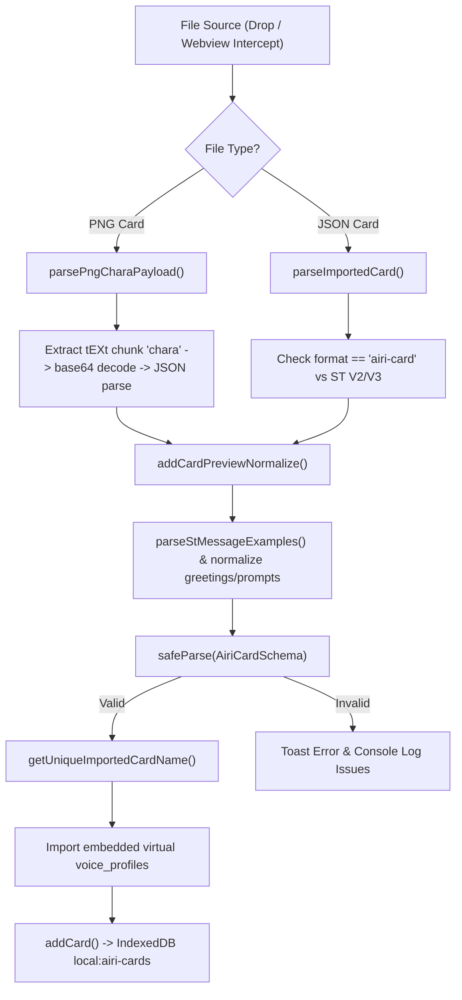

# AIRI Character Card Architecture & Import/Export Specification

A comprehensive design catalog documenting character card specifications, schema definitions (`AiriCard` and `AiriExtension`), import/export pipelines, PNG chunk manipulation, Electron webview download interception, upstream (`moeru-ai/airi:main`) ZIP packaging, and the proposed **AIRI Card Package Spec v2** multi-model specification.

---

## 1. Overview & Core Architecture

In AIRI, a **Character Card** (`AiriCard`) serves as the primary portable definition for an AI persona. It encapsulates:

1. **Identity & Core Prompting**: Character name, nickname, version, greetings, creator notes, personality, scenario, system prompt, and example message dialogues.
2. **Module Configurations**: Active LLM provider & model (Consciousness), TTS provider, model, voice ID & effects (Speech), and active background.
3. **Display & Manifestation**: 2D/3D display model links (VRM, Live2D, Spine, MMD), expressions, parameter mappings, and active outfits.
4. **Behavioral Systems**: Acting prompts, proactivity/heartbeats, dream state/journaling, short-term memory budgets, and concept-based visual assets.

AIRI cards extend the community standard **Character Card Spec V2 / V3** (from `@proj-airi/ccc`), storing custom AIRI-specific features inside `extensions.airi` (`AiriExtension`).

### Key File Locations

| Component | Path | Description |
| :--- | :--- | :--- |
| **Card UI Page** | [`packages/stage-pages/src/pages/settings/airi-card/index.vue`](file:///Users/richardpinedo/Projects.nosync/airi/airi_dasilva333/packages/stage-pages/src/pages/settings/airi-card/index.vue) | Main card management, drag-and-drop import, JSON/PNG export handlers |
| **Import Wizard** | [`packages/stage-pages/src/pages/settings/airi-card/components/CardImportWizard.vue`](file:///Users/richardpinedo/Projects.nosync/airi/airi_dasilva333/packages/stage-pages/src/pages/settings/airi-card/components/CardImportWizard.vue) | Webview download import wizard modal |
| **Card Store** | [`packages/stage-ui/src/stores/modules/airi-card.ts`](file:///Users/richardpinedo/Projects.nosync/airi/airi_dasilva333/packages/stage-ui/src/stores/modules/airi-card.ts) | Pinia store managing local IndexedDB persistence (`local:airi-cards`) |
| **Card Schema & Types** | [`packages/stage-ui/src/types/card.schema.ts`](file:///Users/richardpinedo/Projects.nosync/airi/airi_dasilva333/packages/stage-ui/src/types/card.schema.ts) | Valibot runtime schema (`AiriCardSchema`) |
| **Data Catalog Doc** | [`docs/data-catalog.md`](file:///Users/richardpinedo/Projects.nosync/airi/airi_dasilva333/docs/data-catalog.md) | Storage layer reference detailing `AiriCard` and `AiriExtension` |
| **Download Interceptor** | [`apps/stage-tamagotchi/src/main/index.ts`](file:///Users/richardpinedo/Projects.nosync/airi/airi_dasilva333/apps/stage-tamagotchi/src/main/index.ts) | Electron main process interceptor for webview card downloads |
| **Upstream Import/Export Service** | Upstream-only `packages/stage-ui/src/services/airi-card-import-export.ts` (PR #1998, **not present in this fork** — only `services/speech/*` exists locally) | Upstream `moeru-ai/airi:main` ZIP package service. All `FORMAT` / `manifestSchema` / `sanitizeAiri` / `cardFromCharacterCard` / `MODEL_EXT` / `AiriCardPackageError` symbols below are upstream-claimed, zero local matches. Do not fetch `upstream` remote without explicit user authorization (fork safety). |

---

## 2. Card Schema & `AiriExtension` Definitions

AIRI Character Cards extend the base `Card` structure:

```typescript
interface AiriCard extends Card {
  extensions: {
    airi: AiriExtension
  } & Card['extensions']
  updatedAt?: number
  createdAt?: number
}
```

### Base `Card` Fields (SillyTavern / CCC V2/V3 Spec)

- `name`: Character display name.
- `nickname`: Optional custom user-defined display name.
- `version`: Character version string (e.g. `"1.0.0"`).
- `greetings`: Array of greeting strings (`greetings[0]` is initial greeting; `greetings.slice(1)` are alternate greetings).
- `notes`: Creator notes.
- `description`: Short character summary.
- `personality`: Personality traits and descriptions.
- `scenario`: Current setting and scenario context.
- `systemPrompt`: Core system instructions injected into LLM context.
- `tags`: Array of string tags for filtering.
- `messageExample`: Array of dialogue arrays (`Message[][]`) formatted as `{{user}}: ...` and `{{char}}: ...`.

### `AiriExtension` Structure

The `AiriExtension` interface in [`packages/stage-ui/src/stores/modules/airi-card.ts`](file:///Users/richardpinedo/Projects.nosync/airi/airi_dasilva333/packages/stage-ui/src/stores/modules/airi-card.ts#L121) defines AIRI's rich capability set:

```typescript
interface AiriExtension {
  modules: {
    consciousness: { provider: string, model: string, moduleConfigs?: Record<string, any> }
    speech: { provider: string, model: string, voice_id: string, pitch?: number, rate?: number, ssml?: boolean, language?: string }
    vrm?: { source?: 'file' | 'url', file?: string, url?: string }
    live2d?: { source?: 'file' | 'url', file?: string, url?: string, activeExpressions?: Record<string, number>, modelParameters?: Record<string, number> }
    displayModelId?: string
    activeBackgroundId?: string | null
    active_expressions?: Record<string, number>
  }
  acting?: {
    modelExpressionPrompt: string
    speechExpressionPrompt: string
    speechMannerismPrompt: string
    idleAnimations?: string[]
  }
  artistry?: {
    provider?: string
    model?: string
    promptPrefix?: string
    widgetInstruction?: string
    spawnMode?: 'bg' | 'widget' | 'inline' | 'bg_widget'
    options?: Record<string, any>
    autonomousEnabled?: boolean
  }
  generation?: CharacterGenerationConfig
  outfits?: AiriOutfit[]
  agents: { [key: string]: { prompt: string, enabled?: boolean } }
  heartbeats?: HeartbeatConfig
  dreamState?: DreamStateConfig
  shortTermMemory?: ShortTermMemoryConfig
  groundingEnabled?: boolean
  visual_assets?: Record<string, {
    description: string
    prompt?: string
    isBase?: boolean
    artistry?: { provider?: string, model?: string, options?: Record<string, any> }
    manifestation?: { modelId?: string, mood?: string, backgroundId?: string, active_expressions?: Record<string, number> }
    speech?: { provider?: string, model?: string, voice_id?: string }
  }>
  voice_profiles?: VoiceProfile[]
}
```

---

## 3. Fork Implementation Architecture (`dasilva333/airi`)

The fork architecture prioritizes **ecosystem interoperability** (SillyTavern, Chubb, JannyAI), **untruncated feature preservation**, and **live stage visual rendering**.



### 3.1 PNG tEXt Chunking & SillyTavern Spec V2

- **Export (`exportCardPng`)**: Converts card metadata to SillyTavern V2 format (`buildCharaCardV2`), embeds compatibility probes (`sillytavernCompatibilityProbe`), encodes payload as UTF-8 base64, computes an IEEE 802.3 CRC32 checksum, and injects a `tEXt` chunk with keyword `'chara'` prior to the PNG `IEND` chunk (`injectPngTextChunk`).
- **Import (`parsePngCharaPayload`)**: Scans PNG binary chunks starting at offset 8, locates `tEXt` chunks with keyword `'chara'`, base64-decodes the string payload, and parses JSON.

### 3.2 AIRI JSON Format (v1)

- **Export (`exportCard`)**: Encapsulates the card in `{ format: 'airi-card', version: 1, card }`.
- **Import (`parseImportedCard`)**: Detects `format === 'airi-card'` wrapper or unwraps raw ST V2/V3 JSON structures.

### 3.3 Live Canvas Snapshot & Frame Rendering

When exporting a PNG card, `composeCardExportPng()` captures a live rendered preview of the active VRM or Live2D model (`loadVrmModelPreview` / `loadLive2DModelPreview`) with current active expressions and outfits. The snapshot is composited into a fixed 925×1436 framed canvas using `card-export-frame.png`.

### 3.4 Electron Webview Download Interceptor

In [`apps/stage-tamagotchi/src/main/index.ts`](file:///Users/richardpinedo/Projects.nosync/airi/airi_dasilva333/apps/stage-tamagotchi/src/main/index.ts#L235):
- Listens to `session.defaultSession.on('will-download')` for `webview` triggers.
- Intercepts `.png` or `.json` card files downloaded from discovery sites (JannyAI, JanitorAI, Chub AI, Risu Realm, DataCat), saves to temp directory, and sends IPC event `'chara-card-downloaded'`.
- In `index.vue`, `handleCharaCardDownloaded()` converts the payload and launches `CardImportWizard.vue`.

### 3.5 Voice Profile & Asset Embedding

During export (`getCardWithExportedBackground`), referenced virtual voice profiles are embedded into `card.extensions.airi.voice_profiles`, and the active scene background is converted to a base64 Data URL (`preferredBackgroundDataUrl`). Upon import, missing voice profiles are auto-registered in `speechStore`.

---

## 4. Upstream Main Architecture (`moeru-ai/airi:main`)

Upstream main (`moeru-ai/airi:main` PR #1998, commit `5aa44aedd`) introduced a **ZIP archive package format** (`.zip`) implemented in upstream-only `packages/stage-ui/src/services/airi-card-import-export.ts`.
> NOTICE: That service file does **not** exist in this fork (`packages/stage-ui/src/services/*` only contains `speech/*`). Section 4 documents upstream behavior from the PR description for export-compatibility targeting only. Source wins over this doc where they disagree.

### 4.1 ZIP Archive Format & `manifest.json` v1

Upstream packages character cards as a compressed `.zip` archive containing:

```
card-package.zip/
├── manifest.json            # Package manifest (format version & path index)
├── card.json                # CCv3 Character Card specification
└── models/
    └── body-model.vrm       # (Optional) Single bundled display model binary
```

#### Upstream `manifest.json` (Version 1):
> CORRECTION (2026-09-28 audit): the `format` below was previously mis-copied as `"airi-card-package"`. Upstream validates `literal('airi-character-card')` (see §4.3) — v1 exports MUST use `"airi-character-card"`.
```json
{
  "format": "airi-character-card",
  "version": 1,
  "createdAt": "2026-07-27T00:00:00.000Z",
  "card": {
    "path": "card.json",
    "spec": "chara_card_v3"
  },
  "resources": {
    "displayModel": {
      "format": "vrm",
      "name": "character_model.vrm",
      "path": "models/body-model.vrm"
    }
  }
}
```

### 4.2 CCv3 `card.json` Structure & Codec (`@proj-airi/ccc`)

Upstream exports `card.json` adhering strictly to **Character Card Spec V3 (CCv3)** using the `@proj-airi/ccc` codec.

> CORRECTION (2026-09-28 audit): the codec file is **not** `characterCardV3.ts`. Local entry points are `packages/ccc/src/export/json.ts` (`exportToJSON(card): CharacterCardV3`), types in `packages/ccc/src/export/types/character_card_v3.ts`, re-exported via `packages/ccc/src/export/index.ts` (`export type * as ccv3`). ZIP `card.json` MUST be built with `exportToJSON()`, not hand-rolled (current `use-card-export.ts` only has `buildCharaCardV2` for PNG/CCv2).

In upstream's implementation (upstream-claimed, unverified locally — no local `manifestSchema`/envelope validator found):
- **Envelope Validation**: Validates `spec: 'chara_card_v3'` and numeric regex for `spec_version` (`/^\d+(?:\.\d+)*$/`), classifying versions into `older`, `current`, or `newer`.
- **Open Unknown Field Preservation**: Uses Valibot `objectWithRest({}, unknown())` on all envelopes, entries, and extension schemas. When reading and round-tripping cards, unknown fields from other frontends (e.g. SillyTavern, Chub, Agnai) or future spec versions are preserved without silent truncation.
- **CCv3 Standard Assets Array (`assets: Asset[]`)**: Declares standard assets accompanying the card:
  ```typescript
  export interface Asset {
    type: string // e.g. 'icon', 'expression', 'outfit', 'audio'
    uri: string // e.g. 'ccdefault:', relative path, or data URI
    name: string // asset identifier
    ext: string // file extension (png, vrm, wav, etc.)
  }
  ```
- **Embedded Character Book / Lorebook (`character_book: CharacterBook`)**:
  Supports standard World Info entries with keys, secondary keys, content, priority, insertion order, selective matching, and position flags (`before_char` / `after_char`).
- **Standard Community Extensions (`extensions`)**:
  Carries `depth_prompt` (`depth`, `prompt`, `role`), `fav`, `talkativeness`, and `world` alongside `extensions.airi`.

```json
{
  "spec": "chara_card_v3",
  "spec_version": "3.0",
  "data": {
    "name": "Kokoa",
    "description": "...",
    "personality": "...",
    "scenario": "...",
    "first_mes": "Hello!",
    "alternate_greetings": [],
    "group_only_greetings": [],
    "mes_example": "",
    "creator_notes": "",
    "creator_notes_multilingual": {},
    "system_prompt": "...",
    "post_history_instructions": "...",
    "tags": [],
    "creator": "",
    "character_version": "1.0.0",
    "source": [],
    "creation_date": 1700000000,
    "modification_date": 1700000100,
    "assets": [
      {
        "type": "icon",
        "uri": "ccdefault:",
        "name": "main",
        "ext": "png"
      }
    ],
    "character_book": {
      "name": "World Lore",
      "entries": []
    },
    "extensions": {
      "depth_prompt": {
        "depth": 4,
        "prompt": "",
        "role": "system"
      },
      "airi": {
        "modules": {
          "consciousness": { "provider": "openai", "model": "gpt-4o" },
          "speech": { "provider": "elevenlabs", "model": "eleven_multilingual_v2", "voice_id": "alloy" },
          "displayModelId": "display-model-xyz"
        }
      }
    }
  }
}
```

### 4.3 Upstream Import Handler Nuances & Validation Rules

When upstream imports a character package via `importAiriCardPackage({ file, displayModelsStore })`, it executes a strict multi-step validation sequence. Any violation throws an `AiriCardPackageError` (`code: 'missing-file' | 'invalid-file'`):

1. **Exact Manifest Format String (`format: "airi-character-card"`)**:
   - ⚠️ **Critical Discrepancy**: Upstream's manifest format constant is:
     ```typescript
     const FORMAT = 'airi-character-card' // NOT 'airi-card-package'
     const VERSION = 1
     const CARD_PATH = 'card.json'
     const MANIFEST_PATH = 'manifest.json'
     ```
   - In `manifestSchema`, `format` is validated using `literal('airi-character-card')`. If the manifest specifies `"airi-card-package"`, upstream's `readJsonFile(zip, MANIFEST_PATH, manifestSchema)` will fail Valibot parsing and reject the zip with `invalid-file`.
   - Therefore, when exporting for upstream compatibility, `manifest.json` **MUST** declare `"format": "airi-character-card"`.

2. **Card Specification & Version Constraints**:
   - `manifest.card.path` must strictly be `"card.json"`.
   - `manifest.card.spec` must strictly be `"chara_card_v3"`.
   - In `card.json`:
     - `spec` must be strictly `literal('chara_card_v3')`.
     - `spec_version` must be strictly `literal('3.0')`.

3. **Display Model Whitelist & Binary Paths**:
   - `resources.displayModel.path` must point to an existing entry in the ZIP (typically `models/body-model.<ext>`).
   - `resources.displayModel.format` is validated against a strict picklist of four **format literals** (not file extensions):
     ```typescript
     picklist(['live2d-zip', 'spine-zip', 'tachie-zip', 'vrm'])
     ```
   - > CORRECTION (2026-09-28 audit): `CardExportDialog.vue:displayModelInfo` currently maps Live2D/Spine to a generic `upstreamFilename: body-model.zip`. That is wrong for v1 — it MUST emit `body-model.<ext>` with matching literal `live2d-zip` / `spine-zip` (`vrm` → `body-model.vrm`). Never emit `tachie-zip` (unsupported in this fork, no `DisplayModelFormat` member).
   - `resources.displayModel.name` is the original model file name (e.g. `nan0.vrm`).
   - Upstream imports the model by reading the binary ArrayBuffer, instantiating `new File([data], resource.name)`, and calling `await displayModelsStore.addDisplayModel(resource.format, file)` (local signature: `addDisplayModel(format: DisplayModelFormat, file: File)`).
   - The resulting newly generated store ID is injected as the character's `displayModelId`.

4. **Sanitization & Whitelist Stripping (`sanitizeAiri`)**:
   - Upstream deliberately passes the imported card through `cardFromCharacterCard(cardJson, displayModelId)` and `sanitizeAiri()`.
   - **Allowed in upstream**:
     - `name`, `nickname`, `version` (defaults to `'1.0.0'`), `description`, `personality`, `scenario`, `first_mes`, `alternate_greetings`, `creator_notes`, `system_prompt`, `post_history_instructions`.
     - `modules.consciousness`: `{ provider, model }`
     - `modules.vision`: `{ provider, model }`
     - `modules.speech`: `{ provider, model, voice_id }`
     - `modules.displayModelId`: The newly imported model ID.
     - `modules.artistry`: `{ provider, model, promptPrefix, widgetInstruction, spawnMode, options, autonomousEnabled, autonomousThreshold }`
   - **Stripped upon import into upstream**:
     - `acting` (acting cues, expression prompts, mannerisms).
     - `agents` (custom subagent configurations).
     - `outfits` (modular outfit variants).
     - `voice_profiles` (bundled custom virtual voice profiles).
     - `visual_assets` and `active_concepts`.
     - `cognition`, `dreamState`, `shortTermMemory`, `screenWatching`, and `eventLedger`.
     - Scene background bindings (`activeBackgroundId`).
   - *Implication for our export generator*: When exporting in `moeru-ai Standard (v1)` mode, we should match upstream's clean schema directly. When exporting in `dasilva333 Extended (v2)` mode, we retain all advanced blocks inside `extensions.airi`, while ensuring the root `card.json` still remains valid CCv3 so upstream can still parse the base persona cleanly.

### 4.4 Model Storage Formats & Engine Compatibility (VRM, Live2D, Spine, MMD, Tachie)

In accordance with [`docs/data-catalog.md`](./data-catalog.md) (§3.2) and `packages/stage-ui/src/stores/display-models.ts`, models are stored and handled as follows:

1. **Storage Mechanics in `dasilva333/airi`**:
   - **Persistence**: Model records are stored in IndexedDB via `localforage` under keys `display-model-{nanoid}` (loader filters out `*-textures` suffix keys; in-memory `displayModelCache` holds max 3 + `MODEL_ID_ALIASES` + builtin presets).
   - **Retrieval API (2026-09-28 audit)**: there is **no** `getDisplayModelFile()`. Call `await loadDisplayModelsFromIndexedDB()` then `await getDisplayModel(id)` (returns `DisplayModelFile | DisplayModelURL | DisplayModelCloud | preset`) plus `getDisplayModelTextures(id)` for MMD. Handle the union: `type === 'file'` → `toRaw(model.file)` (binary safety: never `JSON.stringify` a `File`/`Blob` proxy); `type === 'url'` → `fetch(url)`; `Cloud`/preset → skip bundling. `tryRewrapModelFile()` may re-wrap stored blobs into `File`.
   - **Binary format**:
     - **VRM** (`DisplayModelFormat.VRM`): Single `.vrm` binary `File` object stored directly.
     - **Live2D** (`DisplayModelFormat.Live2dZip`): A single `.zip` file containing `model3.json`, `.moc3`, textures, motions, and physics.
     - **Spine 2D** (`DisplayModelFormat.SpineZip`): A single `.zip` file containing `.skel` / `.json`, `.atlas`, and texture `.png`s.
     - **MMD** (`DisplayModelFormat.PMXZip` / `PMXDirectory`): **Split storage architecture**. The root model file (`.pmx`) is stored under `display-model-{nanoid}`, while all texture files (`MmdTextureFile[]`) are separated and persisted under a secondary IndexedDB key `${id}-textures` (see `addDisplayModelWithTextures`, `getDisplayModelTextures`).

2. **Why MMD (`pmx-zip`) is Excluded from Card Export Packaging**:
   - In upstream `moeru-ai/airi:main`, MMD is **not supported at all** in their export/import service (`MODEL_EXT` only defines `vrm`, `live2d-zip`, `spine-zip`, and `tachie-zip`).
   - In our fork, MMD models were decomposed upon initial import into separate IndexedDB keys (`${id}` for the PMX binary and `${id}-textures` for an array of individual texture files).
   - Rebuilding an MMD archive requires dynamically stitching the PMX and arbitrary loose texture files back into a single valid zip on export. Because of this complexity and lack of upstream parity, MMD export is currently unsupported. If a character is bound to an MMD model, the exporter warns that MMD bundling is disabled and exports only the character card metadata and other assets.

3. **Explicit Clarification: No Tachie in `dasilva333/airi`**:
   - Upstream includes `tachie-zip` in `MODEL_EXT` (a legacy visual-novel sprite format).
   - **`dasilva333/airi` does NOT support Tachie**. Our avatar manifestation architecture focuses exclusively on the four supported engines (VRM, Live2D, Spine, and MMD) plus the Unity C# companion (`apps/stage-mate`).
   - **Agent Invariant**: Never attempt to wire, parse, or export `tachie-zip` models in this fork.

### 4.5 Upstream UI/UX Constraints

- **No Export Options / Modal**: Upstream exporting in `CardDetailDialog.vue` triggers `exportAiriCardPackage()` instantly with no user choices.
- > CORRECTION (2026-09-28 audit): local `CardDetailDialog.vue` has **no** ZIP export — its only model reference is `manifestation.modelId` (:238). ZIP/PNG/JSON export UI lives in `CardExportDialog.vue` (zip/png/json segments; ZIP button currently a placeholder toast, PNG/JSON wired via `use-card-export.ts`).
- **No Opt-Out Mechanism**: Users cannot opt out of including the display model if it exists locally.
- **No Copyright Warning**: Offers no licensing or redistribution prompts for restricted 3D/2D models.

---

## 5. Comparative Analysis & Tradeoff Matrix

| Feature / Dimension | Upstream (`moeru-ai/airi:main`) | Current Fork (`dasilva333/airi`) |
| :--- | :--- | :--- |
| **Package Extension** | `.zip` | `.png` (SillyTavern V2) / `.json` (AIRI v1) / `.zip` (in progress — `CardExportDialog.vue` ZIP tab renders, `exportCardZip` not yet wired) |
| **Display Model Support** | Bundles 1 local display model binary | Live stage canvas snapshot frame rendering + ZIP bundling (VRM/Live2D/Spine; MMD excluded) |
| **Multi-Model Support** | Single model (`displayModelId`) only | Multi-model capable (visual assets, outfits, manifestations; v2 manifest `displayModels[]`) |
| **Extension Data** | Whitelist sanitized (strips custom fields) | Full schema preservation via Valibot (v2); sanitized CCv3 for v1 |
| **Voice Profiles** | Basic provider/model strings | Embeds virtual voice profiles into package (`voices/*.json`, localStorage `settings/speech/voice-profiles` source) |
| **Webview Interception** | File picker only (`.zip`) | Electron main process `will-download` interceptor |
| **Export UI UX** | Single instant action button | `CardExportDialog.vue` modal (ZIP/PNG/JSON segments, flavor + asset toggles + live file-tree preview) |

---

## 6. Future Architecture: AIRI Package Spec v2 & Export UI Design

To achieve full upstream interoperability while supporting your fork's multi-model architecture, clean asset storage, and copyright controls, we propose **AIRI Card Package Spec v2**.

### 6.1 ZIP Package Spec v2 Directory Layout

```
my-character-card.zip
├── manifest.json            # Version 2 package manifest with multi-model array
├── card.json                # CCv3 card metadata via exportToJSON() (clean references, no inline base64 blobs)
├── cover.png                # Framed card cover image (via composeCardExportPng())
├── background.png           # (Optional) Scene background image (backgroundStore blob; builtin URLs must be fetch-to-blob first)
├── README.md                # (Optional) Character info, model credits, & fork compatibility
├── models/
│   ├── base_model.vrm       # Primary display model (vrm | live2d-zip | spine-zip only; MMD/tachie excluded)
│   └── casual_outfit.zip    # Secondary Live2D outfit / manifestation
├── voices/
│   └── custom_voice.json    # Embedded virtual-audio-studio profile (from localStorage settings/speech/voice-profiles, deduped)
└── memories/                # (Optional; LOCKED 2026-09-28: full pillars, export-only, 1 GB zip cap)
    ├── chat_sessions.json   # Full session records (meta + messages), NOT index metas
    └── memory.json          # airi-memory:v2 shape filtered to character: STMM + LTMM + lifetime (per universe) + echo
```
> NOTICE: `memories/` was missing from this spec but `CardExportDialog.vue` already previews `memories/chat_sessions.json` when `includeMemories` is on. Spec updated to match UI plus locked scope (all five memory sources, export-only, v2 importer §7 must tolerate absence for older zips).

### 6.2 Spec v2 `manifest.json` Definition

```json
{
  "format": "airi-card-package",
  "version": 2,
  "generator": "AIRI Fork (dasilva333)",
  "createdAt": "2026-07-27T00:00:00.000Z",
  "card": {
    "path": "card.json",
    "spec": "chara_card_v3"
  },
  "resources": {
    "cardImage": { "path": "cover.png" },
    "backgroundImage": { "path": "background.png", "title": "Cozy Room" },
    "displayModels": [
      { "id": "primary", "format": "vrm", "name": "base_model.vrm", "path": "models/base_model.vrm", "role": "base" },
      { "id": "casual_outfit", "format": "live2d-zip", "name": "casual_outfit.zip", "path": "models/casual_outfit.zip", "role": "manifestation" }
    ],
    "voiceProfiles": [
      { "id": "voice-1", "path": "voices/custom_voice.json" }
    ],
    "memories": {
      "chatSessions": { "path": "memories/chat_sessions.json" },
      "memory": { "path": "memories/memory.json" }
    }
  }
}
```

### 6.3 Multi-Model & Clean Asset Bundling

- **No Base64 Bloat**: Cover images and background photos are written as clean binary files (`cover.png`, `background.png`) rather than bloated inline base64 strings inside JSON metadata. Concretely: strip `preferredBackgroundDataUrl` / inline `voice_profiles` bloat from `card.json` before `exportToJSON()`; emit binaries separately (v1 strips them entirely per upstream whitelist).
- **Multi-Model Manifest Array**: Supports mapping multiple models per card (e.g., base VRM model + alternative Live2D outfits + manifestation models).
- **Archiver (2026-09-28 audit)**: use **`jszip`** (`jszip: catalog` in `stage-ui` + `stage-pages` package.json; already used by `display-models.ts`, `utils/data-vault/archive.ts`). `fflate` is transitive-only — do not add it. `JSZip.generateAsync({ type: 'blob' })` + existing `downloadBlob()` helper in `use-card-export.ts`.
- **Asset wiring**: model via `getDisplayModel()` (no `getDisplayModelFile()` exists); background via `backgroundStore.entries.get(id).blob`; voices via `speechStore.savedVoiceProfiles` filtered to `virtual-audio-studio` refs from `modules.speech` + `visual_assets.*.speech`; cover via `composeCardExportPng(activeCoverImageUrl)` (dialog 4-tier: selfie → model preview → author icon → letter monogram).
- **v2 compatibility warning**: `format: "airi-card-package"` intentionally fails upstream `literal('airi-character-card')` validation — v2 is fork-only until a v2 importer ships. v1 MUST stay parseable as clean CCv3 (only base persona + primary model).

### 6.4 Export Configuration Modal UX (Option B — implemented as `CardExportDialog.vue`)

Implemented (ZIP tab renders; ZIP generation pending `exportCardZip`): flavor `v2 Extended` / `v1 Standard`, toggles `includeModels` / `includeBackground` / `includeVoiceProfiles` / `includeCoverFrame` / `includeMemories` / `generateReadme`, live archive-structure preview, cover-art 4-tier picker, compatibility chips. Original mock below for history:

```
+-------------------------------------------------------------+
| Export Character Card Package                               |
+-------------------------------------------------------------+
| Package Format:                                             |
| (•) AIRI Extended Package (ZIP v2) - Multi-model & Assets   |
| ( ) Upstream Main Compatible (ZIP v1)                       |
| ( ) SillyTavern Portable PNG (.png)                         |
| ( ) Standalone AIRI JSON (.json)                            |
|                                                             |
| Include Assets & Options:                                   |
| [x] Include Display Model(s) (2 models selected)            |
|     ⚠️ Ensure you have redistribution rights for model files |
| [x] Include Scene Background Image (Cozy Room)              |
| [x] Include Virtual Voice Profiles                          |
| [x] Include Rendered Card Frame Cover                       |
| [x] Generate README.md with model credits & compatibility   |
|                                                             |
| [ Cancel ]                                 [ Export Package ]|
+-------------------------------------------------------------+
```

### 6.5 Legal, Copyright & Opt-Out Controls

The modal includes opt-out checkboxes and clear notices:
- **Model Copyright Protection**: Allows users to opt out of bundling 3D/2D models if licensing forbids redistribution.
- **Privacy & Size Control**: Allows opting out of large background images or sensitive voice configurations.

### 6.6 Auto-Generated `README.md` & Compatibility Matrix

When `[x] Generate README.md` is enabled, the exporter auto-generates a human-readable `README.md` inside the ZIP archive:

```markdown
# Character: Kokoa

This character card package was created using AIRI.

## Compatibility
- **AIRI Fork (dasilva333)**: Full support for multi-model loading, custom acting prompts, voice profiles, and visual manifestations.
- **AIRI Upstream (moeru-ai/airi)**: Compatible (primary display model and core CCv3 persona fields imported).
- **SillyTavern / CCv3 Readers**: Import `card.json` directly.

## Assets & Credits
- **Primary Model**: `models/base_model.vrm`
- **Background**: `background.png` (Cozy Room)
```

---

## 7. Import Pipeline Backwards & Forwards Compatibility (PROPOSAL — no ZIP inspector exists locally yet)

To maintain complete compatibility across all versions (all ZIP rows below are unimplemented; PNG/JSON rows exist):

1. **File Picker Input**: `<InputFile accept=".zip,.json,.png">`.
2. **ZIP Inspector**:
   - Reads `manifest.json`.
   - If `version: 1` (Upstream Main): Processes single display model + CCv3 fields.
   - If `version: 2` (AIRI Extended): Processes multi-model array + separate cover/background assets + full `AiriExtension` schema.
   - If no `manifest.json`: Falls back to searching for `card.json` or character PNGs inside the ZIP.
3. **PNG Inspector**: Processes SillyTavern `tEXt` chunk `'chara'`.
4. **JSON Inspector**: Processes AIRI v1 JSON or CCv2/v3 JSON.

## Relevant Skills

- [[airi-card-editor-wizard]]
- [[airi-card-schema]]
- [[airi-modular-outfits-system]]
