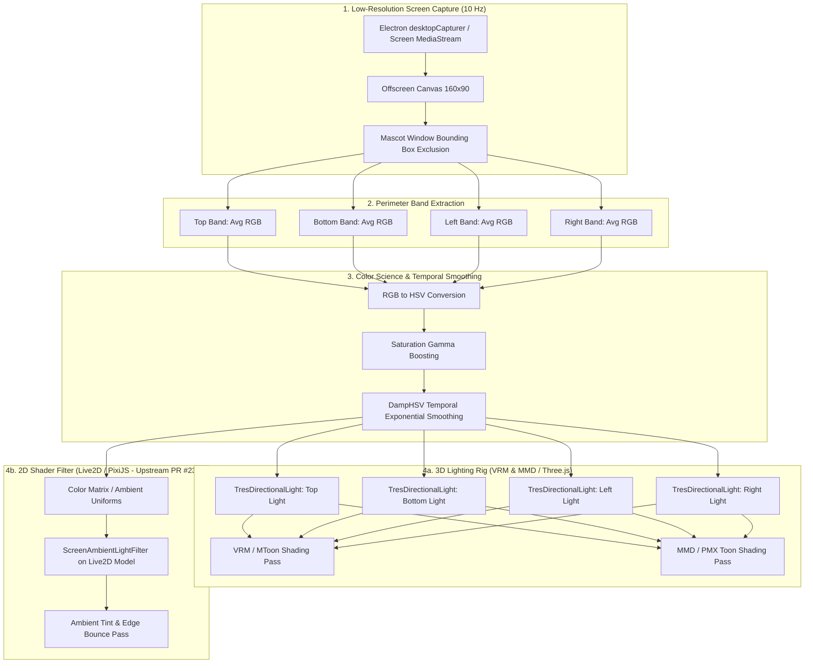

# Design Specification: Dynamic Desktop Ambient Lighting (Screen Bounce) for 3D (VRM & MMD) and 2D (Live2D)

## 1. Overview & Motivation

When a desktop mascot renders over a transparent desktop window, standard static lighting often makes the character look "pasted on" or detached from the desktop environment. In real-world lighting, desktop monitors and active applications cast strong localized ambient light onto nearby physical objects.

This document specifies the architecture, mathematical model, and implementation roadmap for **Dynamic Desktop Ambient Lighting** across AIRI's avatar runtimes:
1. **3D Avatars (VRM & MMD)**: Driving real-time 4-point directional lighting rigs in Three.js (`@proj-airi/stage-ui-three` and `@proj-airi/stage-ui-mmd`).
2. **2D Avatars (Live2D Extension)**: Driving a real-time WebGL/PixiJS post-processing shader filter (`@proj-airi/stage-ui-live2d`), adopting and integrating the upstream pattern established in **PR #2391** (`feat(stage-*): add screen ambient light`).

```
                   [ 🖥️ Top Screen Band (Menu Bar / Active App Header) ]
                                          │
                                          ▼
                                   [ topLight (0, 3, 0) ]
                                         ↓
 [ 🖥️ Left Screen Band ] ──► [ leftLight (-3, 0, 0) ]   👩 3D/2D Model   [ rightLight (3, 0, 0) ] ◄── [ 🖥️ Right Screen Band ]
                                         ↑
                                  [ bottomLight (0, -3, 0) ]
                                          ▲
                                          │
                      [ 🖥️ Bottom Screen Band (Dock / Taskbar) ]
```

---

## 2. Core Architecture & Data Pipeline



---

## 3. Mathematical Models & Color Science

### 3.1 Mascot Exclusion & Band Geometry
Sampling a low-resolution ($160 \times 90$) framebuffer prevents GPU/CPU bottlenecks. To avoid feedback loops (where the mascot samples its own rendered pixels), the screen coordinates of the mascot window are masked out:

$$\text{Margin} = \text{clamp}\left(12 \times \frac{\text{captureHeight}}{\text{virtualHeight}}, 0, \text{captureHeight}\right)$$

The 4 perimeter sampling bands are calculated as:
* **Top Band**: $y \in [0, \max(0, y_{\text{mascot}} - \text{bandThickness})]$
* **Bottom Band**: $y \in [\min(\text{height} - \text{bandThickness}, y_{\text{mascot\_bottom}}), \text{height}]$
* **Left Band**: $x \in [\max(0, x_{\text{mascot}} - \text{bandThickness}), x_{\text{mascot}}]$
* **Right Band**: $x \in [x_{\text{mascot\_right}}, \min(\text{width}, x_{\text{mascot\_right}} + \text{bandThickness})]$

### 3.2 Saturation Gamma Boosting
Neutral grays and whites produce soft illumination, while vibrant user interface elements (e.g. YouTube video, syntax highlighting, vibrant wallpaper) produce intense, directional color bounce:

$$I = \text{lerp}\left(I_{\min}, I_{\max}, S^{\gamma}\right)$$

Where:
* $I_{\min} = 0.35$ (baseline ambient fill intensity)
* $I_{\max} = 1.20$ (maximum vibrant color punch)
* $\gamma = 1.30$ (saturation gamma exponent)
* $S = \text{Saturation} \in [0.0, 1.0]$

### 3.3 Temporal Exponential Smoothing with Angular Hue Wrapping
To prevent abrupt flickering during rapid screen changes (e.g. video playback or window switching), targets are smoothed using delta-time exponential dampening:

$$\alpha = 1 - \exp\left(-\frac{\Delta t}{\tau}\right) \quad \text{where } \tau = 0.05 + 1.5 \cdot \text{smoothingFactor}$$

Because Hue is circular ($0.0 \equiv 1.0$), angular shortest-path delta is used to prevent color jumps across the $0^\circ / 360^\circ$ seam:

$$\Delta h = \text{normalizeAngle}\left(h_{\text{target}} - h_{\text{current}}\right)$$
$$h_{\text{next}} = \left(h_{\text{current}} + \alpha \cdot \Delta h\right) \pmod{1.0}$$
$$s_{\text{next}} = \text{lerp}(s_{\text{current}}, s_{\text{target}}, \alpha)$$
$$v_{\text{next}} = \text{lerp}(v_{\text{current}}, v_{\text{target}}, \alpha)$$

---

## 4. Three.js Scene Integration

### 4.1 Lighting Rig in `ThreeScene.vue`
In `@proj-airi/stage-ui-three`, four dedicated unshadowed directional lights are positioned around the avatar:

```html
<!-- Dynamic Desktop Ambient Bounce Lights -->
<TresDirectionalLight
  v-if="ambientBounceEnabled"
  :color="ambientTopColor"
  :intensity="ambientTopIntensity"
  :position="[0, 3, 0.5]"
/>
<TresDirectionalLight
  v-if="ambientBounceEnabled"
  :color="ambientBottomColor"
  :intensity="ambientBottomIntensity"
  :position="[0, -3, 0.5]"
/>
<TresDirectionalLight
  v-if="ambientBounceEnabled"
  :color="ambientLeftColor"
  :intensity="ambientLeftIntensity"
  :position="[-3, 1, 0.5]"
/>
<TresDirectionalLight
  v-if="ambientBounceEnabled"
  :color="ambientRightColor"
  :intensity="ambientRightIntensity"
  :position="[3, 1, 0.5]"
/>
```

### 4.2 Interaction with MToon / `VRMToonMaterial`
VRM's MToon shader naturally supports multiple directional lights:
1. **Key Direct Light**: Provides primary facial and frontal key illumination.
2. **Left/Right Bounce**: Colors the toon rim and indirect shade boundaries according to the apps flanking the character.
3. **Bottom Bounce**: Picks up the taskbar/dock color, giving soft under-chin/feet grounding.

### 4.3 MMD Scene Integration & Shading Feasibility
Like VRM, AIRI's MMD pipeline (`@proj-airi/stage-ui-mmd` / `packages/stage-ui-mmd/src/components/scenes/MMD.vue`) runs entirely on Three.js:
- **Shared Scene Graph**: `MMD.vue` manages an underlying Three.js scene, camera, and render loop powered by `MMDLoader` and `MMDAnimationHelper`.
- **Zero-Shader-Rewrite Feasibility**: MMD PMX materials (`MeshToonMaterial`, `MeshPhongMaterial`, or custom PMX toon shaders) natively receive Three.js directional lights (`THREE.DirectionalLight`).
- **Direct Drop-in**: The exact same 4-point directional bounce rig (`topLight`, `bottomLight`, `leftLight`, `rightLight`) configured for `ThreeScene.vue` can be mounted in `MMD.vue`, illuminating MMD models with real-time desktop color bounce with zero material modifications.

---

## 5. Cross-Engine Extension: 2D Live2D Ambient Lighting (Upstream PR #2391)

While 3D models (VRM & MMD) respond directly to scene light sources via vertex normals, 2D avatars present a different challenge:

### 5.1 3D vs. 2D Lighting Paradigm
* **3D (VRM & MMD)**: Meshes have 3D normals, depth buffers, and complex toon shaders that natively sample scene lights.
* **2D (Live2D Cubism)**: Models consist of flat 2D sprite meshes rendered via WebGL / PixiJS. They possess no 3D surface normals or depth buffers and cannot interact with Three.js directional light objects.

### 5.2 Upstream Reference Architecture: PR #2391
Upstream PR [#2391](https://github.com/moeru-ai/airi/pull/2391) (`feat(stage-*): add screen ambient light`, authored by `@chiba233`) introduces an elegant post-processing solution specifically for Live2D:
1. **PixiJS WebGL Shader Filter**: Implements `ScreenAmbientLightFilter` in `packages/stage-ui-live2d/src/filters/screen-ambient-light.ts` (+644 lines), applying dynamic ambient tinting, screen color bleed, and luminance adaptation directly to the Live2D model texture.
2. **Model Lifecycle Binding**: Bound into `packages/stage-ui-live2d/src/components/scenes/live2d/Model.vue` to update uniform parameters during frame rendering, with clean disposal on unmount to prevent GPU texture leakage.
3. **Shared Sampling & Environment Calculation**: Encapsulated in `packages/stage-shared/src/screen-ambient-light/sampling.ts` and `environment.ts`, computing dominant color, display luminance, and edge bounds.

### 5.3 Unified Sampling Core Strategy
To avoid running duplicate screen capture loops, AIRI can deploy a single unified capture & perimeter extraction service (`useScreenAmbientLight` / `packages/stage-shared/src/screen-ambient-light/`):
* **Dual Output Dispatch**:
  * **When VRM or MMD is active**: The extracted 4-band HSV colors drive the Three.js 4-point directional lighting rig in `ThreeScene.vue` / `MMD.vue`.
  * **When Live2D is active**: The extracted ambient environment parameters drive the PixiJS `ScreenAmbientLightFilter` uniforms on the `Live2DModel`.
  * **When Spine is active**: Future 2D lighting can reuse the same filter uniforms as Live2D.

---

## 6. Web & Non-Electron Fallbacks

When running in browser environments without OS desktop screen capture permissions (`stage-web` or `stage-pocket`):
* **Stage Scenery Fallback**: The probe automatically samples the active background image loaded in `useBackgroundStore().activeBackground`.
* **Quadrant Sampling**: The background image canvas is sliced into Top/Bottom/Left/Right quadrants to generate consistent scene-matched lighting across both 3D lights and 2D filters.

---

## 7. Settings & Control Customizer Schema

| Key | Type | Default | Description |
| :--- | :--- | :--- | :--- |
| `ambientScreenLightEnabled` | `boolean` | `false` | Master toggle for dynamic desktop bounce lighting (VRM, MMD, Live2D). |
| `ambientScreenLightSmoothing` | `number` | `0.85` | Exponential smoothing factor ($0.0 \to 1.0$). |
| `ambientScreenLightIntensity` | `number` | `1.0` | Global multiplier for ambient bounce intensity. |
| `ambientScreenLightCaptureHz` | `number` | `10` | Screen sampling frequency (Hz). |

---

## 8. Implementation File Roadmap

| Phase | Path | Purpose |
| :--- | :--- | :--- |
| **Phase 1 (3D Core)** | `packages/stage-shared/src/screen-ambient-light/` | **NEW/PORT**: Unified desktop screen capture, mask exclusion, and color science sampling engine. |
| **Phase 1 (VRM)** | `packages/stage-ui-three/src/components/ThreeScene.vue` | **MODIFY**: Mount the 4 directional bounce lights and bind to sampling refs. |
| **Phase 2 (MMD)** | `packages/stage-ui-mmd/src/components/scenes/MMD.vue` | **MODIFY**: Mount the 4 directional bounce lights in MMD Three.js scene (full 3D parity with VRM). |
| **Phase 3 (Live2D)** | `packages/stage-ui-live2d/src/filters/screen-ambient-light.ts` | **PORT (PR #2391)**: PixiJS WebGL shader filter applying ambient tint and luminance to Live2D. |
| **Phase 3 (Live2D)** | `packages/stage-ui-live2d/src/components/scenes/live2d/Model.vue` | **PORT (PR #2391)**: Attach filter to Live2D model instance with lifecycle disposal. |
| **Phase 4 (UI/Settings)** | `packages/stage-ui/src/stores/settings/stage.ts` | **MODIFY**: Add settings schema keys for cross-model ambient bounce lighting. |
| **Phase 4 (UI/Settings)** | `packages/stage-ui/src/constants/control-customizer.ts` | **MODIFY**: Add toggle entry in Control Strip Customizer under `stage-lighting`. |
| **Phase 4 (i18n)** | `packages/i18n/src/locales/en/settings.yaml` | **MODIFY**: Add localized strings for ambient screen lighting controls. |
