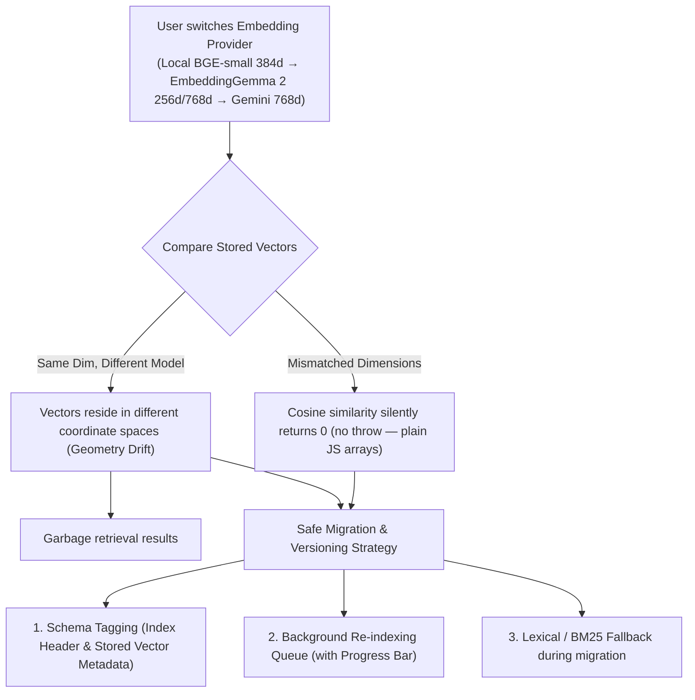

# Dynamic Embedding Provider Support & Multi-Backend Architecture

> **Status:** Design draft — architectural proposal
> **Target Doc:** `docs/design-embedding-provider-support.md`
> **Primary Surface:** Settings → Inference Providers → `Embeddings`
> **Downstream Consumers:** Layered Memory (`layered-memory.ts`), Short-Term Memory, Sacred Text Journal, Entity Ledger

---

## 1. Problem & Opportunity

### The Current Bottleneck
In AIRI today, semantic memory search is hardcoded to a single local worker:
- **Hardwired Implementation:** `packages/stage-ui/src/libs/search/layered-memory.ts` imports `searchWorker` directly from `packages/stage-ui/src/libs/workers/search/index.ts`.
- **Hardcoded Model:** `search.worker.ts` loads `Xenova/bge-small-en-v1.5` over WebGPU via Transformers.js.
- **Resource Contention:** BGE-small reserves ~100MB VRAM via `getGPUCoordinator()` at priority `GPU_PRIORITY.BG_REMOVAL_LOAD + 1`, competing with 3D VRM rendering, Live2D rendering, and local Whisper/Kokoro inference.
- **Quality & Lingual Limits:** BGE-small has 33M parameters, 384 dimensions, and a 512-token context window. It struggles with long journal entries, subtle negations/emotional subtext, and degrades completely on non-English conversations (e.g. Japanese or Chinese).

### The Opportunity
AIRI's **Free AI Hub** already catalogs **39 embedding models** across providers (Google AI Studio `gemini-embedding`, NVIDIA NIM `Nemotron Embed`, OpenRouter, Cloudflare Workers AI `@cf/baai/bge-m3`, SEA-LION, etc.). Google AI Studio offers a free tier of up to 1,500 requests/minute for `text-embedding-004`. Enabling remote and alternative local embedding backends will:
1. Drastically improve memory discrimination and recall quality (MTEB score ~66+ vs ~58).
2. Unlock true multilingual and cross-lingual memory retrieval.
3. Completely offload GPU/VRAM pressure from lower-end host machines.

---

## 2. Category Taxonomy: Dedicated "Embeddings" vs. "Limbic"

### The Decision: Dedicated `Embeddings` Category (Recommended)

In Settings → Inference Providers, the navigation bar currently features explicit functional modalities:
`Chat` · `Speech` · `Transcription` · `Artistry` · `Vision` · `Motion` · `System 1` · `Cloud & Storage`

```
┌────────────────────────────────────────────────────────────────────────────────────────┐
│  Chat   Speech   Transcription   Artistry   Vision   Motion   System 1   [ Embeddings ]│
└────────────────────────────────────────────────────────────────────────────────────────┘
```

#### Why Dedicated `Embeddings` Wins Over "Limbic" Megagroup:
1. **Modality Parity with Free AI Hub:** In the Free AI Catalog, `Embeddings (39)` is already a first-class modality filter alongside `Chat (253)`, `Vision (85)`, and `STT Hearing (7)`. Making it a dedicated pill in Inference Providers creates 1:1 cognitive alignment between discovering a model and configuring it.
2. **Distinct Functional Contracts:**
   - **System 1 (Jev / ModernBERT):** A *discrete classifier & decision engine* (Input: text $\rightarrow$ Output: classification, intent tokens, routing logits, compliance instructions).
   - **Embeddings:** A *continuous vector encoder* (Input: text $\rightarrow$ Output: high-dimensional float array $\mathbb{R}^D$ for cosine similarity math).
3. **Avoids the "Junk Drawer" Anti-Pattern:** Cramming vector encoders and fast decision trees into a single "Limbic" tab forces complex nested sub-tabs and confuses users looking for their vector memory configuration.

---

### 3. The Core Engineering Challenge: Incompatible Vector Geometries

Unlike LLMs (where switching from GPT-4 to Claude yields plain text strings), **embedding models cannot be swapped transparently on existing vectors**.



### The Required Safeguards:

### 1. Vector & Index Versioning Schema (Adaptive Record Layer)
Every snapshot in IndexedDB (`airi-search-index`) and every persisted document must carry provenance metadata so that incompatible caches are immediately detected without corrupting cosine similarity math:

```ts
/** Header stored alongside the snapshot in IndexedDB */
export interface SearchIndexSnapshotHeader {
  schemaVersion: number // e.g. 2
  embeddingModel: string // e.g. "onnx-community/embeddinggemma-2-ONNX" or "Xenova/bge-small-en-v1.5"
  embeddingDim: number // e.g. 256, 384, 768
  dtype: 'q4' | 'q8' | 'fp32'
  taskPrefixVersion: number // 1 for asymmetric DeepMind prefixes, 0 for legacy
  indexedAt: number
}

/** Per-document vector record metadata */
export interface StoredVectorMetadata {
  vector: number[]
  embeddingModel: string // e.g. "onnx-community/embeddinggemma-2-ONNX"
  embeddingDim: number // e.g. 256, 768, 384
  embeddedAt: number
}
```

*Cache Invalidation Rule:*
When `search.worker.ts` or `layered-memory.ts` boots:
1. It compares `snapshot.header.embeddingModel` and `snapshot.header.embeddingDim` against the active configuration.
2. If either differs, the existing vector snapshot is flagged as incompatible and invalidated.
3. The system falls back to BM25 lexical keyword matching while initiating an automated background re-indexing backfill from raw document sources (`what`/`fact`/`user_turn`).

### 2. Automated Re-indexing & Backfill Queue
When a user switches embedding models or when the local model is upgraded:
1. The UI prompts or queues: *"Re-indexing memory constellation for new embedding model..."*
2. A background worker batches stored memories (Short-Term, Sacred Journal, Entity Ledger), passes text through the active embedder, and repopulates vector records.
3. The Memory Hub displays a non-intrusive progress status.
4. During migration, chat turns remain fully responsive by querying BM25 tokens.

### 3. Graceful Offline & Failure Fallback
If a remote embedding provider hits a rate limit, network timeout, or missing API key:
- Semantic scoring temporarily drops to zero.
- The retrieval engine falls back to n-gram / lexical keyword matching.
- The chat turn **never crashes or hangs**.

---

## 4. Next-Gen Local Baseline: EmbeddingGemma 2 (WebGPU / ONNX)

### Canonical References & Ecosystem
* **DeepMind Announcement:** [EmbeddingGemma 2: an open, lightweight multimodal embedding model](https://blog.google/innovation-and-ai/technology/developers-tools/embeddinggemma-2/) (Oct 6, 2026).
* **ONNX Model Weights:** [`onnx-community/embeddinggemma-2-ONNX`](https://huggingface.co/onnx-community/embeddinggemma-2-ONNX) (authored by Joshua Lochner / `@Xenova`, Transformers.js lead).
* **Hugging Face WebGPU Space:** [`webml-community/embeddinggemma-2-webgpu`](https://huggingface.co/spaces/webml-community/embeddinggemma-2-webgpu).
* **Runtime WASM / MJS Path:** Located in `local/runtime/` of the WebGPU space:
  * [`ort-wasm-simd-threaded.asyncify.mjs`](https://huggingface.co/spaces/webml-community/embeddinggemma-2-webgpu/blob/main/local/runtime/ort-wasm-simd-threaded.asyncify.mjs) (53.1 kB)
  * [`ort-wasm-simd-threaded.asyncify.wasm`](https://huggingface.co/spaces/webml-community/embeddinggemma-2-webgpu/blob/main/local/runtime/ort-wasm-simd-threaded.asyncify.wasm) (26.9 MB) — Provides ONNX Runtime Web threaded WASM fallback whenever WebGPU is unavailable or disabled.

### Architectural Decisions for AIRI

#### 1. Text-Only Backbone (Selective Encoder Loading)
EmbeddingGemma 2 is a 740M modular model consisting of a 270M text backbone, 170M vision encoder, and 300M audio encoder.
Because AIRI's current retrieval engine indexes text, dialogue, and journal entries, we deliberately strip unused vision and audio weights before loading:

```ts
import { AutoConfig, AutoModel } from '@huggingface/transformers'

const MODEL_ID = 'onnx-community/embeddinggemma-2-ONNX'
const config = await AutoConfig.from_pretrained(MODEL_ID)
config.vision_config = null // Strip 109MB vision weights
config.audio_config = null // Strip 189MB audio weights

const model = await AutoModel.from_pretrained(MODEL_ID, {
  config,
  device: 'webgpu',
  dtype: 'q4',
})
```
* **Net Parameter Size:** 270M parameters (down from 740M).
* **Download Footprint:** **175 MB** (down from 473 MB in full q4).
* **VRAM Impact:** Increases from BGE-small's ~100MB to **~180–190MB VRAM**. On consumer GPUs and Apple Silicon, an extra ~80MB allocation is well within headroom while unlocking 8,192-token context windows and universal multilingual capability.

#### 2. The `q4` vs. `q4f16` Decision: Universal Compatibility Over Micro-Savings
The ONNX distribution offers both `q4` (175 MB) and `q4f16` (157 MB).
**We explicitly choose standard `q4` over `q4f16`:**
* **Shader-f16 Fragility:** `q4f16` mandates the WebGPU `shader-f16` extension. On Linux with NVIDIA hardware, Dawn disables `shader-f16` unless started with `--enable-dawn-features=vulkan_enable_f16_on_nvidia`. Without this flag, WGSL compilation fails immediately with `extension 'f16' is not allowed in the current environment`. Older Windows graphics drivers and mobile WebGPU runtimes also intermittently fail on half-precision float shaders.
* **Compatibility Invariant:** Standard `q4` stores 4-bit quantized weights but uses standard 32-bit float WGSL shader arithmetic. It executes reliably across macOS Metal, Windows DirectX 12/Vulkan, and Android/Linux without specialized driver flags.
* **Negligible Delta:** The download difference is only **18 MB** (175 MB vs 157 MB), making `q4` the strictly superior choice for resilience.

#### 3. Task Instruction Prefixes (Mandatory for Accuracy)
EmbeddingGemma 2 was pre-trained with asymmetric task instruction prefixes. Google DeepMind benchmarks confirm that omitting these prefixes degrades retrieval precision (NDCG@10 / MRR):
* **Query Prefix:** `task: search result | query: ${query}`
* **Document / Memory Prefix:** `title: ${title} | text: ${content}` with the title-aware catalog in §7 (real journal titles, synthetic date/role titles for STMM/raw/chips/lifetime). `title: none | text: ${fact || what}` is a **last-resort fallback only** for sources with genuinely no title nor date/role metadata (expected: never, after §7 D1–D5).

#### 4. Matryoshka Representation Learning (MRL) & L2 Normalization
EmbeddingGemma 2 natively outputs 768-dimensional embeddings. It supports MRL truncation down to 512d, 256d, or 128d:
* **Selected Dimension:** **256d**.
  * **Memory footprint:** 256 floats = 1,024 bytes per vector (one-third smaller than BGE-small's 384d / 1,536 bytes).
  * **Quality retention:** MTEB English retrieval drops by only 0.68 points (from 68.46 to 67.78); MTEB Multilingual drops by 0.95 points (61.36 to 60.41).
* **L2 Re-normalization Rule:** Slicing an embedding breaks unit length. Truncated vectors **must be L2-normalized** before storage and cosine scoring:
  ```ts
  const truncated = rawVector.slice(0, 256)
  const norm = Math.hypot(...truncated) || 1
  const normalizedVector = truncated.map(v => v / norm)
  ```

---

## 5. Privacy & Transparency Boundaries

Because memory retrieval encodes private personal conversations and character journals, the UI must clearly delineate data boundaries:

| Provider Type | Badge | Data Privacy | Latency | Multilingual | Context Window |
| :--- | :--- | :--- | :--- | :--- | :--- |
| **Local WebGPU (BGE-Small)** | 🟢 `Local (Baseline)` | 100% on-device; zero network traffic | 15–25ms | English only | 512 tokens |
| **Local WebGPU (EmbeddingGemma 2 q4)** | 🟢 `Local (High Precision)` | 100% on-device; zero network traffic | 25–50ms | Universal (100+ langs) | 8,192 tokens |
| **Google AI Studio (Gemini Embedding)** | ⚡ `Cloud (High Precision)` | Sent over TLS to Google AI API | 80–180ms | Excellent (100+ langs) | 8,192 tokens |
| **Cloudflare Workers AI (`@cf/baai/bge-m3`)** | ⚡ `Cloud (Fast Edge)` | Sent to Cloudflare edge worker | 60–120ms | Excellent | 8,192 tokens |
| **OpenAI Compatible (Ollama / Local vLLM)** | 🏠 `Self-Hosted` | Local network IP (`127.0.0.1:11434`) | 20–60ms | Model-dependent | Model-dependent |

---

## 6. Architectural Implementation Plan

### Step 1: Search Worker Upgrade (`packages/stage-ui/src/libs/workers/search/`)
- Upgrade `search.worker.ts` to load `onnx-community/embeddinggemma-2-ONNX` in `q4` (replaces `MODEL_ID = 'Xenova/bge-small-en-v1.5'`, `:38`).
- Rewrite `getEmbedder()` (`:114-129`): `pipeline('feature-extraction', …, { pooling: 'mean', normalize: true })` does not fit a pruned multimodal backbone — load via `AutoModel` with the `AutoConfig` vision/audio strip (§4), `device: 'webgpu'`, `dtype: 'q4'`, keeping the WASM fallback branch (point it at the threaded runtime files cited in §4). Output handling changes: hidden-state pooling → 256d MRL slice → mandatory L2 re-normalization (replaces the old `normalize: true` flag).
- Format inputs with title-aware asymmetric prefixes per §7 (`task: search result | query:` / `title: ${title} | text:` — never bare `title: none` where §7 D1–D5 supplies a title).
- Apply 256d MRL truncation with mandatory L2 re-normalization.
- Implement `SearchIndexSnapshotHeader` with `schemaVersion: 2` (write it in the `persist` handler, gate on it in `normalizeSnapshot`/`hydrateDocuments` — see Step 2).
- Scrub the stale `384-dim` comment (`search.worker.ts:452`).

### Step 2: Layered Memory Bridge & Cache Invalidation (`packages/stage-ui/src/libs/search/layered-memory.ts`)
- Write `SearchIndexSnapshotHeader` in the worker `persist` handler and validate it on boot: today `layeredMemory.init()` (`:97-100`) passes the snapshot through blindly and `normalizeSnapshot()` (`search.worker.ts:362-376`) accepts headerless legacy shapes — headerless snapshots must be treated as `taskPrefixVersion: 0` / invalid on first Gemma boot.
- If snapshot model, dimension, or `taskPrefixVersion` mismatches the active embedder, purge stale 384d vectors and trigger background re-indexing backfill while serving queries via BM25. Stale vectors hide in three places, not one: (a) `airi-search-index` snapshot docs (quantized 4dp embeddings), (b) the worker reuse-by-content shortcut (`search.worker.ts:403-407`, which trusts `existing.embedding` on title-less content equality — must also compare prefix version), (c) the `TextJournalEntry.embedding` per-entry field (`types/text-journal.ts:23`, forwarded at `memory-text-journal.ts:189`; never populated today but trusted wherever present).
- Update VRAM accounting in `packages/stage-ui/src/libs/workers/search/index.ts:83-115` from 100MB to ~185MB: rename the `'bge-small-en'` status/executor/coordinator keys (4 occurrences: `:92`, `:94`, `:99`, `:102-105`) and keep the `GPU_PRIORITY.BG_REMOVAL_LOAD + 1` slot. The inference-status store itself (`composables/use-inference-status.ts:49-78`) is key-agnostic — verified, no UI hardcode to chase.
- Scrub BGE incantations in comments: `layered-memory.ts:303` ("bge ONNX"), `memory-text-journal.ts:211` + `:455` ("bge-small-en").

### Step 3: Provider Store Integration (`packages/stage-ui/src/stores/providers/`)
- Add `'embedding'` to provider modalities for future remote/dynamic backends.
- Define `EmbeddingProvider` interface with batch embedding support.
- Implement standard adapters:
  - `LocalWebGpuEmbeddingAdapter` (wraps upgraded `search.worker.ts`)
  - `GoogleGeminiEmbeddingAdapter` (calls `v1beta/models/text-embedding-004:batchEmbedContents`)
  - `OpenAICompatibleEmbeddingAdapter` (calls `/v1/embeddings` for Ollama, OpenRouter, Cloudflare)

### Step 4: UI Surfaces (`packages/stage-pages/src/pages/settings/`)
- Add `Embeddings` tab pill to `packages/stage-pages/src/pages/settings/modules/providers.vue`.
- Display cataloged embedding providers from `free-ai-catalog.ts` with 1-click configuration.
- Add "Re-index All Memories" maintenance action with live progress indicator in Memory Settings.

---

## 7. Embedding Input Catalog: Asymmetric Prefix Points (Title-Aware)

EmbeddingGemma 2 requires asymmetric prefixes (§4.3): queries as
`task: search result | query: ${query}` and documents as
`title: ${title} | text: ${content}`. The generic
`title: none | text: ${fact || what}` fallback from §4.3 **MUST NOT**
be used wherever a real or synthetic title exists — `none` discards
the title signal DeepMind trained on and collapses distinct memories
(journals, daily recaps, chips) into one undifferentiated cluster.
This section catalogs every current code point that must adopt the
prefix format, with the exact title source per kind.

> **Single funnel invariant:** all document points below converge in
> `backgroundIndexAll()` (`packages/stage-ui/src/stores/memory-text-journal.ts:155-313`)
> → `layeredMemory.indexDocuments()` (`libs/search/layered-memory.ts:524`)
> → `searchWorker.index()` (`libs/workers/search/index.ts:119`)
> → worker `index` handler + `getVector(getDocumentContent(doc))`
> (`libs/workers/search/search.worker.ts:396-427`, `:131-142`, `:144-146`).
> Today `getDocumentContent()` returns `fact || what || ''` and the
> journal `title` is dropped at index time (`memory-text-journal.ts:182-190`).
> The fix is one centralized `formatDocumentForEmbedding(kind, title, text)`
> helper at the worker boundary (plus `formatQueryForEmbedding(query)`),
> not per-caller string interpolation — otherwise query prefixes get
> double-applied on the `primaryVector` reuse path (§Q2) and BM25
> tokenization gets polluted (prefix words must never enter IDF).

### D1. LTMM journal entries — `journal_entry` / `ltmm_entry` ✅ real title

- **Index site:** `memory-text-journal.ts:182-190` (`fact: e.content`, title available on `e.title` but currently **not forwarded**).
- **Title source:** `TextJournalEntry.title` (`packages/stage-ui/src/types/text-journal.ts:9` — required string; `createEntry` defaults to `'Journal Entry'`, `memory-text-journal.ts:365`).
- **Tool path:** `executeCreateTextJournalEntry` falls back to first 40 chars of content when no title is given (`packages/stage-ui/src/stores/modules/tools/text-journal.ts:42`), so a usable title almost always exists.
- **Format:** `title: ${entry.title} | text: ${entry.content}`.
- **Anti-pattern:** never emit `title: none` here. The placeholder default `'Journal Entry'` is weak but still preferable to `none`; the tool's 40-char fallback is better — consider backfilling it at index time when `title === 'Journal Entry'` (use content slice as title).

### D2. STMM daily blocks — `memory_block` / `stmm_block` ✅ synthetic date title

- **Index site:** `memory-text-journal.ts:196-203` (`fact: b.summary`, `timestamp: b.date`; title currently dropped).
- **Shape:** `ShortTermMemoryBlock` (`packages/stage-ui/src/types/short-term-memory.ts:3-18`) has **no title field** — `date` (`YYYY-MM-DD`), `summary`, `characterName`, `messageCount`/`sessionCount`.
- **Format:** `title: Daily recap ${b.date} — ${b.characterName} | text: ${b.summary}` (date is the load-bearing discriminator; `${messageCount} msgs / ${sessionCount} sessions` may append when disambiguating same-date rebuilds).
- **Note:** `useShortTermMemoryStore.searchBlocks()` is a lexical-only fallback (no embedding) — no prefix needed there. Only the worker-indexed copy needs the synthetic title.

### D3. Raw dialogue turns — `user_turn` / `assistant_turn` → indexed as `raw_turn` ✅ synthetic role+date title

- **Index site:** `memory-text-journal.ts:216-254` (most recent 8 sessions, max 250 docs, `text.length > 10`, deduped by exact text; `kind: 'raw_turn'` resolves to layer `raw` via the `_turn` suffix rule in `resolveMemoryLayer`, `layered-memory.ts:83-84`; `id: m.id`, `source: chat:${sessionId}`).
- **Shape:** chat message `{ role, content, createdAt }` — no title; `extractTextContent` (`memory-text-journal.ts:138-151`) flattens string/array parts.
- **Format:** `title: Chat ${role} turn — ${YYYY-MM-DD} ${sessionId.slice(0, 8)} | text: ${messageText}` (role + date + short session id jointly disambiguate repeats like "ok" / "lol" across sessions; never `title: none`).
- **Note:** raw turns are excluded from the persist snapshot and re-embedded lazily (`search.worker.ts:476-490` strips `raw_turn` embeddings) — the formatter must be deterministic so re-indexing reproduces identical inputs.

### D4. Echo chips — `echo_chip` ✅ synthetic type+date title

- **Index site:** `memory-text-journal.ts:265-272` (`fact: c.content`, `source: echo:${c.type}`; date/type currently dropped).
- **Shape:** `EchoChip` (`packages/stage-ui/src/types/echo-chip.ts:18-38`) — `type: 'mood' | 'flavor' | 'journal_candidate'`, `date` (anchor `YYYY-MM-DD`), `content` (2–5 word burst, e.g. "Dogs know tricks"), plus `citedText[]` / `claims[]` (currently **not** indexed).
- **Format:** `title: ${c.type} chip ${c.date} | text: ${c.content}` (e.g. `title: flavor chip 2026-09-30 | text: Gaming as stress relief`).
- **Extension (optional):** append top cited quote when present — `text: ${c.content} — ${citedText[0].slice(0, 200)}` — but keep the 2–5 word burst first so truncation (8,192 tokens is ample; MRL slice is post-encode) never loses the chip itself.

### D5. Lifetime artifact — `lifetime_entry` ✅ synthetic thread title

- **Index site:** `memory-text-journal.ts:281-290` (single doc per character+universe, `fact: distilledContent`, `source: 'lifetime'`).
- **Shape:** `LifetimeMemoryArtifact` (`packages/stage-ui/src/types/lifetime-memory.ts:9-43`) — `distilledContent` (~1k tokens), `baseContent`, `finalPack`, watermark `metadata.lastConsumedDay`.
- **Format:** `title: Eternal thread ${characterName} through ${lastConsumedDay ?? updatedAtDate} | text: ${distilledContent}` (single-doc layer means the title mostly aids cross-character disambiguation; still never `none`).
- **Caution:** `distilledContent` is long — the 8,192-token window holds it, but keep title ≤120 chars so head-truncation (if ever applied) never eats body text.

### D6. Knowledge-graph claims — `kg_claim` ⚠️ future point (NOT currently embedded)

- **Current path:** claims are matched **lexically only** inside `layeredMemory.search` (`libs/search/layered-memory.ts:204-300`, formatted as `` `[Knowledge Graph] ${subject} ${predicate} ${object} (${date})` ``) — they never pass through `getVector`. No prefix change needed today.
- **If/when embedded:** `title: ${subject} ${predicate} | text: ${object} — evidence: ${evidence[0] ?? ''}` (subject+predicate as title preserves the relational frame; object as text keeps the novel claim front-loaded). Flagged here so a future `kg_claim` index addition does not default to `title: none`.

### Explicit non-points (do NOT prefix)

- **Image journal / backgrounds** — `localforage` `bg-{nanoid}` blobs (`stores/background.ts`); never embedded, no text path.
- **Event log** — `local:event-log` ledger (`stores/event-log.ts`); heartbeat text via `getRecentEventsText`, never embedded.
- **Director notes / scratchpad** — prompt-injected grounding blocks (`chat.ts:847-854`); never embedded.
- **STMM `searchBlocks` lexical fallback** (`modules/tools/text-journal.ts:106-124`) and **BM25/keyword path** (`search.worker.ts:229-279`, `hybrid-scorer.ts` Jaccard) — raw text only; prefix tokens (`task:`, `title:`, `none`) would pollute IDF/Jaccard and must be kept out of the keyword pipeline.

### Query-side points — `task: search result | query: ...` (embedding path ONLY)

- **Q1. Worker choke point (canonical):** `search.worker.ts:429-433` — `queryVector = vector ?? await getVector(query)`. Apply `formatQueryForEmbedding` **here** (single place) so every caller inherits it; keep `getKeywordCandidates(query)` on the **raw** query to protect BM25.
- **Q2. Fan-out / vector-reuse path:** `layered-memory.ts:309-343` (multi-pass: primary `searchWorker.search(analysis.expandedQuery, …)` at `:316-323` computes `primaryVector`, secondaries at `:329-336` reuse it; single-pass at `:437-443`). `decomposeQuery` fan-out is capped at `MAX_SUB_QUERIES = 3` (`:56`). Because the vector is computed once and reused, prefixing in the caller **and** the worker would double-prefix — prefix at Q1 only.
- **Q3. Caller queries (inherit Q1/Q2, no direct change):** per-turn chat RAG (`stores/chat.ts:817-823`, `query: sendingMessage`, limit 6); `text_journal` tool search (`modules/tools/text-journal.ts:62-65`, limit 5); Nan0 `memoryRetriever` (`stores/modules/nan0.ts:528-533`, limit ≤3, 3 s abort); manual probe (`memory-long-term.vue:148`); echo-synthesis anchor search (`stores/echo-chips.ts:297-301`, `turnQuery` = last-4 messages joined, sliced to 200 chars — short by construction, prefix anyway via Q1).
- **Q4. System-1 rerank (do NOT prefix):** `layeredMemory.search` §8 (`:493-519`, `runRerank(query, poolToRerank)`) is a cross-encoder over raw query+candidate text, not a bi-encoder embedding — EmbeddingGemma prefixes do not apply.

### Implementation rules (binds Step 1–2)

1. **Two helpers, one owner:** add `formatDocumentForEmbedding(kind, title, text)` + `formatQueryForEmbedding(query)` next to `getDocumentContent` in `search.worker.ts` (or a shared `libs/search/embedding-format.ts` imported by both worker and `layered-memory.ts` for the header version check). No inline `title:`/`task:` string building at call sites.
2. **Title hygiene:** trim, collapse `\n`/`|` to spaces, cap title at ~120 chars; fallback chain `real title → synthetic title (D2–D5) → content slice (40 chars) → 'untitled'` — `none` is only legal when the source genuinely has neither title nor date/role metadata (expected: never, after D1–D5).
3. **BM25 separation:** keyword tokenization (`tokenize`, `ensureDocumentCache`, `getKeywordCandidates`) always runs on raw `fact/what` and raw query; prefixed strings feed `getVector` exclusively.
4. **Re-index correctness:** backfill must rebuild `title + text` from repos (`textJournalRepo`, `shortTermMemoryRepo`, `chatSessionsRepo`, `echoChipsRepo`, `lifetimeMemoryRepo`) — persisted snapshots store flattened `content` with titles already lost, so re-prefixing snapshot text alone would bake in `none` forever. Bump `taskPrefixVersion: 0 → 1` (header §3) so old snapshots invalidate on upgrade.

---

## 8. BGE-Small Migration Marks: Exhaustive Checklist (Audit 2026-10-07)

Repo-wide grep for `bge-small|bge_small|BGE_SMALL|BgeSmall|BGE-small|bge-small-en` plus `Xenova/` / `feature-extraction` / `384` shows the BGE blast radius is **confined to the search subsystem plus harnesses and docs** — no other `Xenova/*` model reference (moondream, modnet, CLIP, Silero-VAD, vit-gpt2) is embedding-related. Every mark below is a point of contention for the migration; code marks (M1–M5) block correctness, harness/doc marks (M6–M10) block thoroughness.

| # | Mark (file:line) | Kind | Action |
| --- | --- | --- | --- |
| M1 | `libs/workers/search/search.worker.ts:38` (`MODEL_ID`), `:114-129` (`getEmbedder`), `:131-142` (`getVector`), `:133` (`pooling: 'mean', normalize: true`) | code | Full rewrite per Step 1: AutoModel + config strip + q4 + MRL/L2. The old `normalize: true` flag must go — post-truncation L2 renorm replaces it. |
| M2 | `libs/workers/search/index.ts:92-105` (4× `'bge-small-en'` key, 100MB alloc) | code | Rename keys, ~185MB alloc per Step 2. Priority slot unchanged. |
| M3 | `libs/workers/search/search.worker.ts:403-407` (embedding reuse on content equality), `stores/memory-text-journal.ts:189` (`embedding: e.embedding` forward), `types/text-journal.ts:23` + `:51` (`embedding` / `version` fields, `version` carried-but-never-set) | code | Gate reuse on prefix version; treat any stored 384d vector as untrusted. Decide: stamp `version` per entry at embed time, or stop forwarding `embedding` entirely. |
| M4 | `libs/workers/search/search.worker.ts:476-494` (persist: strips `raw_turn` embeddings, quantizes rest 4dp), `:354-376` (hydrate/normalize accept headerless snapshots), `libs/search/layered-memory.ts:97-100` (blind `init`) | code | Header write + read gate per Step 2; headerless ⇒ version 0 ⇒ invalidate. |
| M5 | Stale comments: `search.worker.ts:452` ("384-dim"), `layered-memory.ts:303` ("bge ONNX"), `memory-text-journal.ts:211`, `:455` ("bge-small-en") | code | Scrub during Steps 1–2 (they mislead the next reader about dims/pipeline). |
| M6 | `scripts/tests/locomo-benchmark/precompute-embeddings.mjs:36`, `precompute-windowed-embeddings.mjs:31`, `locomo-runner.mjs:213` (+ reports under `reports/memory-lab/`) | harness | Precomputed BGE caches + runner banner pin `Xenova/bge-small-en-v1.5` — regenerate caches with prefixed Gemma inputs or benchmark comparisons silently measure the wrong geometry. |
| M7 | `libs/search/__tests__/search.test.ts:13-14` (`vi.mock` of worker), `:70-150` (3-dim toy vectors) | tests | ✅ Verified safe: worker is fully mocked and toy dims are geometry-agnostic — no change needed. Keep mock boundary intact. |
| M8 | Docs: `docs/blueprint-semantic-search-integration.md` (7 BGE refs), `.agents/skills/airi-memory-retrieval-engine/SKILL.md:11`, `docs/memory_lab/*` specs, `docs/project-companion-comparisons.md:79,582` | docs | Doc-only refresh post-migration (SKILL.md line 11 names the hardcoded model — update when the worker flips). |
| M9 | `composables/use-inference-status.ts:49-78` | verified-clean | Key-agnostic store — no change; cited so nobody hunts it. |
| M10 | `assets/free-ai-catalog-baseline.json:10560-10768` (`@cf/baai/bge-small-en-v1.5`, `BAAI/bge-small*`, 384d `dimensions`) | catalog-data | No change: these describe remote/HF options, still valid Step-3 adapters. Cloudflare `@cf/baai/bge-m3` is already the edge pick in §5. |

### Corrections applied in this audit (source-grounded)

- **Cosine mismatch behavior:** both `cosineSimilarity` copies (`search.worker.ts:190-208`, `hybrid-scorer.ts:207-225`) `return 0` on length mismatch — plain JS arrays never throw a tensor shape error. Mermaid node + §3 text fixed to "silently returns 0 (silent zero-score)".
- **Footprint math:** 256d/1024 B vs 384d/1536 B is a **one-third** reduction, not 25% (§4 fixed).
- **Step 1 contradicted §7** by prescribing `title: none | text:` — fixed to title-aware formatting with §7 reference.
- **Step 2 understated the invalidation surface** (snapshot-only) — expanded to snapshot + reuse shortcut + per-entry field, plus the missing header write/read paths.
- **q4-over-q4f16 rationale corroborated** by `airi-local-inference-engines` §4 (Dawn `vulkan_enable_f16_on_nvidia` gating on Linux/NVIDIA).
- **External claims flagged, not verified:** MTEB deltas (68.46→67.78 EN / 61.36→60.41 multilingual), 15–50ms latency table (§5), 8,192-token Gemma context, 175/157 MB downloads — vendor/DeepMind figures; confirm during implementation against `onnx-community/embeddinggemma-2-ONNX` file listing.

