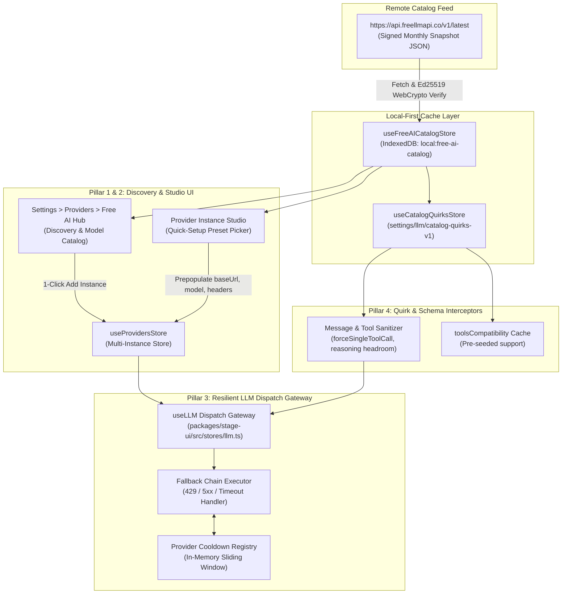

# Architectural Design: Free AI Catalog Discovery, Multi-Instance Presets, Client-Side Resilient Fallback & Quirks Pre-Seeding

**Status:** Proposed Architecture & Design Specification
**Authoritative References:**
- [`.agents/skills/airi-provider-core-registry/`](../.agents/skills/airi-provider-core-registry/SKILL.md) — Provider definition and registry contracts.
- [`.agents/skills/airi-provider-store-instances/`](../.agents/skills/airi-provider-store-instances/SKILL.md) — Multi-instance provider store, Pinia lifecycle, and IndexedDB persistence.
- [`.agents/skills/airi-llm-dispatch-gateway/`](../.agents/skills/airi-llm-dispatch-gateway/SKILL.md) — `useLLM` dispatch gateway, tool discovery, and stream settlement.
- [`.agents/skills/airi-provider-ui-pages/`](../.agents/skills/airi-provider-ui-pages/SKILL.md) — Provider configuration forms and settings switchboard.
- [`docs/design-multi-instance-provider-studio.md`](./design-multi-instance-provider-studio.md) — Multi-instance provider studio architecture.
- [`docs/data-catalog.md`](./data-catalog.md) — Storage keys and data persistence inventory.

---

## 1. Executive Summary & Goals

Access to AI inference is bifurcating: while frontier models are expensive, virtually every major AI lab (Google, Groq, Cerebras, Mistral, Cloudflare, NVIDIA, Cohere, ModelScope, etc.) offers a high-utility free tier. Cumulatively, these tiers provide billions of free tokens each month across hundreds of models.

However, for companion platforms like AIRI, relying on free AI tiers poses four distinct challenges:
1. **Discoverability:** Users do not know which providers offer free tiers, where to sign up, or which models are free vs. trial credits.
2. **Setup Friction:** Configuring manual OpenAI-compatible endpoints requires hunting down base URLs, model IDs, and specific request parameters.
3. **Fragility & Rate Limits:** Free tiers enforce strict rate limits (e.g. 10–30 RPM, 20–200 RPD) or experience transient latency spikes. A single `429 Too Many Requests` currently terminates the conversation or crashes proactivity heartbeats and memory summarization.
4. **Idiosyncrasies & Silent Failures:** Free endpoints often feature undocumented quirks (e.g. NVIDIA NIM rejecting parallel tool calls, Gemini Flash consuming output token budget with hidden reasoning tokens, HuggingFace free credits expiring).

### The Core Architectural Mandate: Complete Cross-Stage Decoupling
Unlike standalone proxy daemons (which require running a separate local Node.js/Docker server), **AIRI's solution must be 100% native, client-side TypeScript**. It must run identically and without external dependencies across:
- **`stage-tamagotchi`**: Desktop Electron app.
- **`stage-web`**: Pure static browser stage.
- **`stage-pocket`**: Capacitor mobile stage (iOS and Android).

This document details the unified architecture across **Four Pillars**:
1. **Pillar 1: The In-App Free Tier Catalog Discovery Hub (Browse & Add)**
2. **Pillar 2: Quick Setup Templates & Instant Presets in Multi-Instance Studio**
3. **Pillar 3: Resilient Client-Side Fallback Chains in `useLLM`**
4. **Pillar 4: Quirks, Capability & Tool-Compatibility Pre-Seeding**

---

## 2. System Architecture & Component Placement



---

## 3. Pillar 1: In-App Free Tier Catalog Discovery Hub

### 3.1 Data Feed Ingestion & Offline Safety
The public monthly snapshot from `https://api.freellmapi.co/v1/latest` is an unauthenticated, signed ~330 KB JSON document containing over 360 models across 24+ platforms.

1. **WebCrypto Public-Key Verification:**
   - The feed is signed via Ed25519 (`x-catalog-signature` header).
   - In pure browser/Capacitor environments, AIRI uses the native `crypto.subtle.verify` Web Crypto API against the pinned public key:
     ```typescript
     const PINNED_CATALOG_PUBKEY_SPKI = new Uint8Array([
       0x30,
       0x2A,
       0x30,
       0x05,
       0x06,
       0x03,
       0x2B,
       0x65,
       0x70,
       0x03,
       0x21,
       0x00,
       0xAB,
       0xDC,
       0xAF,
       0xE3,
       0xED,
       0xC4,
       0x7B,
       0x23,
       0x07,
       0x2A,
       0xC7,
       0xD5,
       0x60,
       0x18,
       0x64,
       0x73,
       0x3D,
       0x65,
       0x62,
       0x02,
       0x17,
       0x49,
       0x47,
       0x87,
       0x36,
       0x73,
       0x7A,
       0xB4,
       0xD8,
       0x18,
       0x5F,
       0x79
     ])
     ```
   - **Offline & Stale Tolerance:** If the remote feed is unreachable (airplane mode on mobile or restricted web environments), AIRI falls back to a bundled baseline JSON snapshot shipped with the app build.
   - **Local Cache:** Stored in IndexedDB (`local:free-ai-catalog`) with a 7-day TTL check and manual "Check for Updates" button.

### 3.2 Catalog Store: `useFreeAICatalogStore`
Located in `packages/stage-ui/src/stores/providers/free-ai-catalog.ts`:

```typescript
export interface FreeAICatalogModel {
  platform: string
  modelId: string
  displayName: string
  intelligenceRank: number // 1..1000 (1 = top capability)
  speedRank: number // 1..11 (1 = fastest)
  sizeLabel: 'Frontier' | 'Large' | 'Medium' | 'Small'
  limits: {
    rpm: number | null
    rpd: number | null
    tpm: number | null
    tpd: number | null
  }
  monthlyTokenBudget: string
  contextWindow: number
  enabled: boolean
  supportsVision: boolean
  supportsTools: boolean
  quirks: Array<{
    slug: string
    title: string
    body: string
    severity: 'info' | 'warning' | 'critical'
  }>
}

export interface FreeAICatalogPlatform {
  id: string
  name: string
  baseUrl: string
  signupUrl: string
  pricing: 'free' | 'freemium'
  requiresCreditCard: boolean
  apiFormat: 'openai-compatible' | 'gemini-native' | 'cohere-native'
}
```

### 3.3 The Discovery UI (`Settings > Providers > Free AI Hub`)
A dedicated discovery page mounted in `packages/stage-pages/src/pages/settings/providers/free-hub/index.vue`:

1. **Filtering & Slicing:**
   - **Modality Pills:** Chat, Vision (VLM), Audio Transcription (STT).
   - **Capability Filters:** "Supports Function/Tool Calling" (critical for AIRI agents/journals/proactivity), "No Credit Card Required", "High RPM (>20)".
   - **Rank Sorters:** "Smartest First" (`intelligenceRank`), "Fastest First" (`speedRank`), "Largest Context" (`contextWindow`).
2. **Model Card Surface:**
   - Model name, Provider tag, Context length badge (e.g. `128k`, `1M`).
   - Rate limit telemetry: `15 RPM · 1,500 RPD · ~3M tokens/mo free`.
   - Quirks preview pill (e.g., `⚠️ Thinking tokens use output cap`).
3. **The "Add to AIRI" Action Workflow:**
   - Clicking **"Add to AIRI"** evaluates the platform ID:
     - **Case A: Native Provider Exists** (e.g. `groq`, `google-generative-ai`, `mistral-ai`, `openrouter`): Creates an instance via `providersStore.addInstance(definitionId, `${platformName}: ${displayName}`)` and deep-links to the configuration card with the signup URL pre-displayed.
     - **Case B: Arbitrary OpenAI-Compatible Platform** (e.g. NVIDIA NIM, ModelScope, Cerebras, B.AI, AnyAPI): Creates an instance under `openai-compatible` with `baseUrl`, default `modelId`, and display label prefilled.

---

## 4. Pillar 2: Quick Setup Templates & Multi-Instance Presets

### 4.1 Frictionless Provider Creation
Today, creating an instance of `openai-compatible` presents users with blank `baseUrl` and `apiKey` text fields. Most users don't know the exact endpoint URL or valid model strings.

### 4.2 The "Load Preset" Component (`ProviderPresetSelector.vue`)
Injected directly into [`provider-instances-section.vue`](file:///Users/richardpinedo/Projects.nosync/airi/airi_dasilva333/packages/stage-ui/src/components/scenarios/providers/provider-instances-section.vue) and [`provider-basic-settings.vue`](file:///Users/richardpinedo/Projects.nosync/airi/airi_dasilva333/packages/stage-ui/src/components/scenarios/providers/provider-basic-settings.vue):

```html
<template>
  <div class="mb-4 rounded-xl border border-neutral-200/70 p-3 bg-neutral-50/50 dark:border-neutral-800/70 dark:bg-neutral-900/30">
    <div class="flex items-center justify-between mb-2">
      <span class="text-xs font-semibold uppercase tracking-wider text-neutral-500">
        {{ t('settings.pages.providers.templates.quick_setup_title') }}
      </span>
      <span class="text-xs text-primary-500 hover:underline cursor-pointer" @click="openCatalogHub">
        {{ t('settings.pages.providers.templates.browse_full_catalog') }}
      </span>
    </div>

    <div class="grid grid-cols-2 sm:grid-cols-3 gap-2">
      <button
        v-for="preset in popularFreePresets"
        :key="preset.id"
        class="flex flex-col items-start p-2 rounded-lg border text-left transition hover:border-primary-500"
        @click="applyPreset(preset)"
      >
        <span class="text-xs font-medium text-neutral-900 dark:text-neutral-100">{{ preset.label }}</span>
        <span class="text-[10px] text-neutral-500">{{ preset.quotaSummary }}</span>
      </button>
    </div>
  </div>
</template>
```

### 4.3 Pre-Packaged Popular Presets Table
| Preset Name | Target Definition | Base URL | Default Model | Free Quota | Key Creation Deep-Link |
| :--- | :--- | :--- | :--- | :--- | :--- |
| **Cerebras Llama 3.3 70B** | `openai-compatible` | `https://api.cerebras.ai/v1` | `llama-3.3-70b` | ~1,000k tpm / 30 rpm | `https://cloud.cerebras.ai` |
| **Groq Llama 3.3 70B** | `groq` | Native Groq SDK | `llama-3.3-70b-versatile` | 30 rpm / 14.4k rpd | `https://console.groq.com/keys` |
| **Google Gemini 2.5 Flash** | `google-generative-ai`| Native Google SDK | `gemini-2.5-flash` | 15 rpm / 1,500 rpd | `https://aistudio.google.com/app/apikey` |
| **NVIDIA NIM Llama 3.3 70B** | `openai-compatible` | `https://integrate.api.nvidia.com/v1` | `meta/llama-3.3-70b-instruct` | 1,000 free credits | `https://build.nvidia.com` |
| **Mistral Codestral / Small** | `mistral-ai` | Native Mistral SDK | `mistral-small-latest` | 1 rps free tier | `https://console.mistral.ai/api-keys` |
| **ModelScope Qwen 2.5/3** | `openai-compatible` | `https://api-inference.modelscope.cn/v1` | `qwen/Qwen2.5-72B-Instruct` | Free daily quota | `https://modelscope.cn/my/overview` |
| **GitHub Models (GPT-4o/4.1)** | `openai-compatible` | `https://models.github.ai/inference` | `openai/gpt-4.1-mini` | 150 rpd / 15 rpm | `https://github.com/settings/tokens` |

When a preset is selected:
1. `baseUrl` is locked or prefilled with a "Reset to Recommended" button.
2. The exact model ID is saved into the instance configuration.
3. A direct external link opens the provider's API key management page.
4. Quirk guards (e.g. `forceSingleToolCall`) are attached immediately to the instance state.

---

## 5. Pillar 3: Resilient Client-Side Fallback Chains in `useLLM`

### 5.1 The Quota Exhaustion Failure Mode
The single greatest failure mode of free AI tiers is the sudden **HTTP 429 Too Many Requests** or **HTTP 503 Overloaded**. In a companion system:
- Chat turns abort mid-sentence.
- Background Proactivity heartbeats silently fail.
- Memory summaries (STMM / LTMM) skip consolidation.
- Echo Chips extraction produces empty emotions.

### 5.2 The Virtual Multi-Instance Provider: `Fallback Pool`
Rather than modifying every individual caller, we introduce a first-class virtual provider pattern in AIRI: **`ProviderDefinition: fallback-pool`**.

A Fallback Pool holds an ordered list of configured provider instances and their corresponding model IDs:
```typescript
interface FallbackPoolConfig {
  id: string
  name: string // e.g. "Primary Companion Free Pool"
  strategy: 'ordered-priority' | 'lowest-latency' | 'round-robin'
  chain: Array<{
    instanceKey: string // e.g. "google-generative-ai:primary"
    modelId: string // e.g. "gemini-2.5-flash"
    label?: string
  }>
  retryPolicy: {
    maxAttempts: number // default: 3
    cooldownMs: number // default: 60_000 (1 min)
    failoverOnErrors: Array<'429' | '500' | '503' | 'timeout' | 'quota_exhausted'>
  }
}
```

### 5.3 Resilient Dispatch in `useLLM` (`packages/stage-ui/src/stores/llm.ts`)
The `useLLM` store acts as the single funnel. When the active provider is a `fallback-pool` (or when fallback is explicitly enabled on a request), dispatch executes through the **Resilient Attempt Loop**:

```typescript
// Core loop inside streamFromFallbackPool
let currentAttempt = 0
let lastError: unknown = null

for (const target of poolConfig.chain) {
  // Check if provider is currently in cooldown
  if (isProviderCoolingDown(target.instanceKey)) {
    debug(`[llmStore:fallback] Skipping ${target.instanceKey} (in cooldown)`)
    continue
  }

  currentAttempt++
  if (currentAttempt > poolConfig.retryPolicy.maxAttempts)
    break

  try {
    const providerInstance = await providersStore.getProviderInstance(target.instanceKey)
    if (!providerInstance)
      continue

    debug(`[llmStore:fallback] Attempt ${currentAttempt} via ${target.instanceKey} (${target.modelId})`)

    // Attempt stream execution
    await executeStream(target.modelId, providerInstance, messages, options)

    // On success: clear any error counters and resolve
    recordProviderSuccess(target.instanceKey)
    return
  }
  catch (err: any) {
    lastError = err
    const isFailoverTrigger = isRateLimitOrOverloadError(err)

    if (isFailoverTrigger) {
      debug(`[llmStore:fallback] Failover triggered on ${target.instanceKey}: ${err.message}`)
      // Cool down the failed provider for the configured duration
      recordProviderFailure(target.instanceKey, poolConfig.retryPolicy.cooldownMs)

      // Emit a non-fatal notification event to inform UI of seamless switch
      options?.onStreamEvent?.({
        type: 'provider-fallback',
        from: target.instanceKey,
        next: poolConfig.chain[currentAttempt]?.instanceKey,
        reason: err.message,
      } as any)

      continue // Try the next link in the chain
    }

    // If it's a fatal prompt error (e.g. 400 Bad Request / Content Policy), rethrow immediately
    throw err
  }
}

throw new Error(`All providers in fallback chain exhausted. Last error: ${String(lastError)}`)
```

### 5.4 State Machine for Provider Cooldowns
To prevent hammering a provider that just returned a 429:
- **`ProviderCooldownRegistry`**: An in-memory sliding window tracking `[instanceKey]: cooldownUntilTimestamp`.
- Reset on timer expiry or on explicit user manual re-test.
- If all providers are in cooldown, the router picks the one with the lowest remaining cooldown time and waits for the delta before failing out.

---

## 6. Pillar 4: Quirks, Capabilities & Tool-Compatibility Pre-Seeding

### 6.1 Bypassing Expensive Runtime Discovery
In AIRI today, [`attemptForToolsCompatibilityDiscovery`](file:///Users/richardpinedo/Projects.nosync/airi/airi_dasilva333/packages/stage-ui/src/stores/llm.ts#L474) runs two staggered `Hello, world!` probe requests to discover if a model supports tools. On free tiers with 15 RPM, sending 2 probe requests on model load wastes 13% of the user's entire minute budget.

By syncing FreeLLMAPI's catalog quirks, AIRI can **pre-seed** tool support:
```typescript
// Pre-seeding toolsCompatibility without sending any network probes
function preseedToolCompatibilityFromCatalog(catalogModels: FreeAICatalogModel[]) {
  const toolsCache = useLocalStorage<Record<string, boolean>>('settings/llm/tools-compatibility-v3', {})

  for (const model of catalogModels) {
    const key = `${model.platform}-${model.modelId}`
    if (toolsCache.value[key] === undefined) {
      // Pre-seed known tool support
      toolsCache.value[key] = model.supportsTools
    }
  }
}
```

### 6.2 Managing Critical Quirk Interceptors
FreeLLMAPI’s catalog records operational advisories ("quirks") that directly affect inference correctness:

#### Quirk A: `forceSingleToolCall: true` (Parallel Tool Call Rejection)
- **Affected Providers:** AMD Radeon TokenFactory, NVIDIA NIM (`meta/llama-3.3-70b-instruct`).
- **Symptom:** Upstream API rejects request with `400: This model only supports single tool-calls at once!`.
- **AIRI Interceptor Solution:**
  In [`packages/stage-ui/src/stores/llm.ts`](file:///Users/richardpinedo/Projects.nosync/airi/airi_dasilva333/packages/stage-ui/src/stores/llm.ts) `streamFrom`:
  ```typescript
  if (quirkStore.hasQuirk(model, 'force-single-tool-call')) {
    requestOverrides.parallel_tool_calls = false
  }
  ```

#### Quirk B: `gemini-thinking-token-room` (Hidden Output Token Depletion)
- **Affected Providers:** Google Gemini 2.5 Flash / Flash Lite.
- **Symptom:** When a low `max_tokens` (e.g. 500) is set, internal thinking tokens consume the budget, truncating the visible response to 10 tokens.
- **AIRI Interceptor Solution:**
  Ensure `max_tokens` includes safety headroom or inject `thinkingConfig: { thinkingBudget: 0 }` for short proactivity prompts unless reasoning is explicitly requested.

#### Quirk C: Context Window Ceiling Enforcement
- **Affected Providers:** Free tiers with strict token boundaries (e.g. Groq 8k–128k, Cerebras 8k).
- **AIRI Interceptor Solution:**
  The catalog's `contextWindow` value automatically binds to `options.contextWidth` / `num_ctx` and feeds into AIRI's system prompt head/tail pruning pipeline ([`airi-prompt-builder-engine`](../.agents/skills/airi-prompt-builder-engine/SKILL.md)).

---

## 7. Cross-Stage Compatibility Matrix

| Feature | `stage-tamagotchi` (Electron) | `stage-web` (Browser) | `stage-pocket` (Capacitor iOS/Android) | Implementation Technique |
| :--- | :--- | :--- | :--- | :--- |
| **Catalog Feed Fetch** | Yes | Yes | Yes | Standard `fetch()` |
| **Ed25519 Signature Check** | Yes | Yes | Yes | Web Crypto API (`crypto.subtle.verify`) |
| **Offline Bundled Snapshot** | Yes | Yes | Yes | Vite JSON import (`@proj-airi/stage-ui/assets/catalog.json`) |
| **IndexedDB Catalog Cache** | Yes | Yes | Yes | `unstorage` IndexedDB driver / `localforage` |
| **Quick Preset Selection** | Yes | Yes | Yes | Pure Vue 3 template in `@proj-airi/stage-ui` |
| **Resilient Fallback Loop** | Yes | Yes | Yes | In-memory loop in Pinia store `useLLM` |
| **Quirks Interceptor** | Yes | Yes | Yes | Pure TypeScript interceptor in `llm.ts` |
| **External Server Daemon** | **None Required** | **None Required** | **None Required** | Fully decoupled & zero-daemon |

---

## 8. Implementation Roadmap & Phased Execution

### Phase 1: Free AI Catalog Store & Offline Snapshot Baseline
1. Create `packages/stage-ui/src/stores/providers/free-ai-catalog.ts`.
2. Bundle a baseline snapshot of FreeLLMAPI's monthly catalog into `@proj-airi/stage-ui/assets/catalog-baseline.json`.
3. Implement `fetchCatalogWithSignatureCheck()` using native Web Crypto `SubtleCrypto`.
4. Expose computed filters: `freeModels`, `visionModels`, `toolSupportedModels`, `rankingIndex`.

### Phase 2: Quick-Setup Preset Component in Provider Studio
1. Build `packages/stage-ui/src/components/scenarios/providers/provider-preset-picker.vue`.
2. Embed the preset picker at the top of `openai-compatible` configuration and in the "Add Provider Instance" modal.
3. Hook 1-click instantiation: prefilling `baseUrl`, canonical model ID, and deep-linking to provider API key creation pages.

### Phase 3: Free AI Hub Discovery Page
1. Mount `packages/stage-pages/src/pages/settings/providers/free-hub/index.vue`.
2. Add the "Free AI Hub" entry card in `Settings > Providers` index with a standout "Browse 350+ Free Models" badge.
3. Implement responsive model cards with filter pills (Modality, Speed Rank, Context Size, Tool Calling).
4. Implement "Add to AIRI" button dispatching directly to `providersStore.addInstance()`.

### Phase 4: Resilient Fallback Chain in `useLLM`
1. Define the `fallback-pool` provider configuration schema in `packages/stage-ui/src/libs/providers/types.ts`.
2. Implement `ProviderCooldownRegistry` in `packages/stage-ui/src/stores/providers/runtime/cooldown.ts`.
3. Update `streamFrom` and `generateFrom` in `packages/stage-ui/src/stores/llm.ts` to wrap multi-target attempts with automatic 429/5xx failover.
4. Add non-fatal fallback toast/chip notifications in `chat.ts` when failover occurs.

### Phase 5: Catalog Quirks & Tools Pre-Seeding
1. Ingest quirks from the catalog into `useCatalogQuirksStore`.
2. Update `streamOptionsToolsCompatibilityOk` in `llm.ts` to check pre-seeded catalog flags before executing probes.
3. Add request sanitization overrides for `forceSingleToolCall` (`parallel_tool_calls: false`).
4. Surface quirks advisory callouts on provider and model detail views in Settings.

---

## 9. Verification & Quality Gates

1. **Static Typing & Compilation:**
   - Run `pnpm -F @proj-airi/stage-ui typecheck`
   - Run `pnpm -F @proj-airi/stage-pages typecheck`
2. **WebCrypto Parity Test:**
   - Unit test verifying that `crypto.subtle.verify` correctly validates the signed catalog buffer against the pinned public key in both Node/Vite test runner and browser mock.
3. **Simulated Failover Integration Test:**
   - Unit test in `packages/stage-ui/src/stores/llm.test.ts`:
     - Setup a Fallback Chain: Provider 1 (mock throwing 429) -> Provider 2 (mock succeeding).
     - Assert that `llmStore.stream()` catches 429, puts Provider 1 in cooldown, switches to Provider 2, and resolves the stream cleanly without user-visible errors.
4. **Cross-Stage Smoke Verification:**
   - Verify discovery and preset creation on `stage-tamagotchi` (Electron) and `stage-web` (browser).
