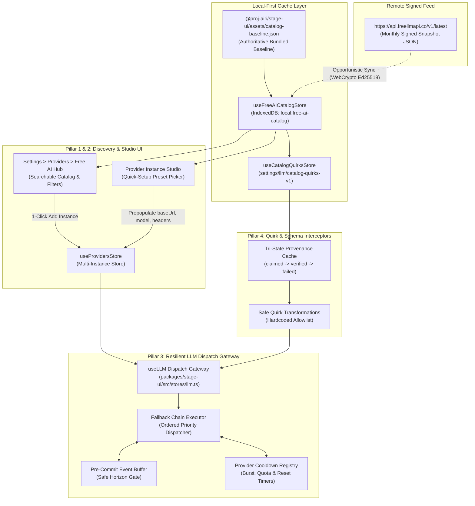

# Architectural Design: Free AI Catalog Discovery, Multi-Instance Presets, Client-Side Resilient Fallback & Quirks Pre-Seeding

**Status:** Proposed Architecture & Design Specification
**Authoritative References:**
- [`../.agents/skills/airi-provider-core-registry/SKILL.md`](../.agents/skills/airi-provider-core-registry/SKILL.md) — Provider definition and registry contracts.
- [`../.agents/skills/airi-provider-store-instances/SKILL.md`](../.agents/skills/airi-provider-store-instances/SKILL.md) — Multi-instance provider store, Pinia lifecycle, and IndexedDB persistence.
- [`../.agents/skills/airi-llm-dispatch-gateway/SKILL.md`](../.agents/skills/airi-llm-dispatch-gateway/SKILL.md) — `useLLM` dispatch gateway, tool discovery, and stream settlement.
- [`../.agents/skills/airi-provider-ui-pages/SKILL.md`](../.agents/skills/airi-provider-ui-pages/SKILL.md) — Provider configuration forms and settings switchboard.
- [`./design-multi-instance-provider-studio.md`](./design-multi-instance-provider-studio.md) — Multi-instance provider studio architecture.
- [`./data-catalog.md`](./data-catalog.md) — Storage keys and data persistence inventory.

---

## 1. Executive Summary & Philosophy

Access to AI inference is rapidly democratizing: while frontier models carry high per-token pricing, virtually every major AI lab (Google, Groq, Cerebras, Mistral, Cloudflare, NVIDIA, Cohere, ModelScope, etc.) now maintains a generous, recurring free tier. Cumulatively, these tiers offer billions of free tokens each month across hundreds of distinct models.

### 1.1 The Fork's Sovereign Model vs. Upstream's Prepaid Broker
In upstream AIRI (`moeru-ai/airi`), the official hosted AI offering operates as a proprietary, prepaid middleman:
- Users purchase "Flux" credits via Stripe.
- Chat and Vision selections are hardcoded to an opaque `Auto — Automatically routed by AI Gateway` route where the operator chooses the underlying vendor and captures the margin.
- Empty module slots automatically default to this prepaid route.

**This fork takes the opposite architectural stance:**
1. **User Sovereignty & Direct Vendor APIs:** Users retain 100% direct control over their providers, endpoints, and models without vendor opacity or token markup.
2. **Account Portability Without Brokerage:** This fork already enables signing in with a private Cloudflare account (Workers KV + R2) to synchronize and restore API credentials seamlessly across devices.
3. **Zero-Daemon Free-Tier Aggregation:** Rather than running an external proxy daemon or purchasing bundled tokens, AIRI provides **guided discovery**, **1-click preset templates**, and **native client-side fallback chains** directly in the app.

### 1.2 The Cross-Stage Architectural Mandate
Unlike standalone proxy tools that require running a separate background Node.js/Docker daemon on `localhost`, **AIRI's implementation is 100% native client-side TypeScript**. It operates identically with zero daemon dependencies across:
- **`stage-tamagotchi`**: Electron desktop companion.
- **`stage-web`**: Pure static web stage hosted on GitHub Pages.
- **`stage-pocket`**: Capacitor mobile stage on iOS and Android.

---

## 2. System Architecture & Component Placement



---

## 3. Pillar 1: In-App Free Tier Catalog Discovery Hub

### 3.1 Data Feed Contract: Wire vs. Normalized Store
To prevent conflating external feed representations with internal application state, the catalog architecture cleanly separates the **Wire Schema** (`RemoteCatalog`) from the **Normalized Store Projection** (`NormalizedCatalogModel`).

#### Remote Wire Schema (`RemoteCatalog`)
FreeLLMAPI publishes a signed monthly snapshot. Quirks are stored at the root with model/platform selectors rather than nested in each model:

```typescript
export interface RemoteCatalogQuirk {
  slug: string
  title: string
  body: string
  severity: 'info' | 'warning' | 'blocker'
  targets: Array<{
    platform: string
    modelId?: string
  }>
}

export interface RemoteCatalogModel {
  platform: string
  modelId: string
  displayName: string
  intelligenceRank: number // 1..1000 (1 = top capability)
  speedRank: number // 1..11 (1 = fastest)
  sizeLabel: 'Frontier' | 'Large' | 'Medium' | 'Small'
  limits: {
    rpm: number | null
    rpd: number | null
    tpm: number | null
    tpd: number | null
  }
  monthlyTokenBudget: string
  contextWindow: number
  enabled: boolean
  supportsVision: boolean
  supportsTools: boolean
}

export interface RemoteCatalog {
  version: string
  generatedAt: string
  tier: 'monthly' | 'live'
  counts: {
    platforms: number
    models: number
    embeddings: number
    transcriptionModels: number
    quirks: number
  }
  models: RemoteCatalogModel[]
  transcriptionModels?: RemoteCatalogModel[]
  quirks: RemoteCatalogQuirk[]
}
```

#### Normalized Store Projection (`NormalizedCatalogModel`)
In `useFreeAICatalogStore`, models are normalized and joined with their applicable quirks for reactive consumption:

```typescript
export interface NormalizedCatalogModel extends RemoteCatalogModel {
  applicableQuirks: RemoteCatalogQuirk[]
  provenance: 'bundled' | 'remote-sync'
}
```

### 3.2 Offline-First & Cryptographic Verification
1. **Authoritative Bundled Baseline:**
   AIRI bundles a verified snapshot at `@proj-airi/stage-ui/assets/catalog-baseline.json`. The app is 100% functional offline from the moment of install without waiting for a network fetch.
2. **Opportunistic Remote Update:**
   When connected, AIRI periodically polls `https://api.freellmapi.co/v1/latest`.
3. **WebCrypto Ed25519 Verification:**
   The signature in `x-catalog-signature` is verified in-memory against the pinned public key using standard Web Crypto:
   ```typescript
   const PINNED_CATALOG_PUBKEY_SPKI = new Uint8Array([
     0x30,
     0x2A,
     0x30,
     0x05,
     0x06,
     0x03,
     0x2B,
     0x65,
     0x70,
     0x03,
     0x21,
     0x00,
     0xAB,
     0xDC,
     0xAF,
     0xE3,
     0xED,
     0xC4,
     0x7B,
     0x23,
     0x07,
     0x2A,
     0xC7,
     0xD5,
     0x60,
     0x18,
     0x64,
     0x73,
     0x3D,
     0x65,
     0x62,
     0x02,
     0x17,
     0x49,
     0x47,
     0x87,
     0x36,
     0x73,
     0x7A,
     0xB4,
     0xD8,
     0x18,
     0x5F,
     0x79
   ])
   ```
4. **Operational Pre-Implementation Spike Requirements:**
   Before relying on live updates, a spike must verify:
   - CORS headers (`Access-Control-Allow-Origin: *`) on `https://api.freellmapi.co/v1/latest`.
   - `Access-Control-Expose-Headers` includes `x-catalog-signature` and `x-catalog-version`.
   - WebCrypto Ed25519 compatibility on target Safari, Capacitor WebViews, and Electron.
   - If any network check fails, the bundled baseline remains authoritative with zero user degradation.

### 3.3 The Discovery UI (`Settings > Providers > Free AI Hub`)
Mounted at `packages/stage-pages/src/pages/settings/providers/free-hub/index.vue`:
- **Dynamic Metrics:** Header displays live count derived from the active snapshot (e.g. `Showing 367 models across 24 free providers — Snapshot: 2026.09.13`), never a hardcoded marketing string.
- **Slicing & Filtering:**
  - Modality: Chat, Vision, Speech-to-Text.
  - Verification & Billing: "No Credit Card Required", "Immediate Setup".
  - Capabilities: "Tool Calling Supported", "Context $\ge$ 128k".
- **Action Workflow:**
  - **Native Provider Match** (e.g. Groq, Google Generative AI, Mistral): Directs user to create/open that provider's native instance with key signup deep-links.
  - **OpenAI-Compatible Generic** (e.g. Cerebras, NVIDIA NIM, ModelScope, GitHub Models): Auto-populates a new `openai-compatible` instance with validated `baseUrl`, canonical model ID, and quirk flags.

---

## 4. Pillar 2: Quick Setup Templates & Multi-Instance Presets

### 4.1 Frictionless Onboarding in Provider Studio
Rather than requiring users to manually discover, copy, and paste `https://api.cerebras.ai/v1` or `https://integrate.api.nvidia.com/v1`, the multi-instance configuration view embeds **Curated Quick-Setup Presets**.

### 4.2 Curated Presets with Regional & Friction Transparency
Presets reference live platform/model identifiers and explicitly declare setup friction:

| Preset | Target Engine | Base URL | Canonical Model | Setup Friction / Caveats |
| :--- | :--- | :--- | :--- | :--- |
| **Groq Llama 3.3 70B** | `groq` (Native SDK) | Native Groq | `llama-3.3-70b-versatile` | **Lowest Friction**: Instant key, no credit card, 30 RPM. |
| **Google Gemini 2.5 Flash** | `google-generative-ai` | Native Google | `gemini-2.5-flash` | **High Context**: 1M context, instant key, 15 RPM. |
| **Cerebras Llama 3.3 70B** | `openai-compatible` | `https://api.cerebras.ai/v1` | `llama-3.3-70b` | **Ultra-Fast**: ~1,800 tokens/sec, no credit card, 30 RPM. |
| **Mistral Small / Codestral**| `mistral-ai` (Native SDK) | Native Mistral | `mistral-small-latest` | **Reliable Tools**: Instant key, phone verification required. |
| **GitHub Models (GPT-4o mini)**| `openai-compatible` | `https://models.github.ai/inference` | `openai/gpt-4.1-mini` | **Developer Ready**: Uses personal GitHub token, 150 RPD. |
| **NVIDIA NIM Llama 3.3 70B** | `openai-compatible` | `https://integrate.api.nvidia.com/v1` | `meta/llama-3.3-70b-instruct` | **1,000 Free Credits**: Rejects parallel tool calls (quirk-handled). |
| **ModelScope Qwen 2.5/3** | `openai-compatible` | `https://api-inference.modelscope.cn/v1` | `qwen/Qwen2.5-72B-Instruct` | **Regional Notice**: Requires Aliyun CN phone binding. |

### 4.3 Preset Injection Contract
When applied via `ProviderPresetSelector.vue`:
1. `baseUrl` is assigned and marked with a "Reset to Recommended" anchor.
2. Canonical `model` is selected.
3. Relevant quirks (e.g. `parallel_tool_calls: false`) are attached to instance configuration.
4. An external link button directs the user to the vendor's exact key creation dashboard.

---

## 5. Pillar 3: Resilient Client-Side Fallback Chains in `useLLM`

### 5.1 The Critical Fallback Safety Challenge
In free-tier usage, sudden `429 Too Many Requests` or transient `503 Overloaded` responses are routine. However, **naive automatic failover is dangerous**:
- If Provider A streams `"Certainly! Here are the five steps:"` and then crashes, naively restarting on Provider B produces duplicated, jarring, or contradictory responses.
- If Provider A executes a tool call (e.g. modifying an external file or sending a message) and disconnects before streaming the reply, replaying against Provider B causes **destructive duplicate execution**.

### 5.2 The Pre-Commit Safe Failover Boundary
To solve this, `useLLM` establishes an explicit **Safe Commit Horizon**:

```
Request Started
      │
      ▼
┌────────────────────────────────────────────────────────┐
│ Phase 1: PRE-COMMIT WINDOW (Buffer State)             │
│ • Events (text-delta, reasoning-delta) are buffered    │
│ • No visible text rendered to Chat UI / Speech queue  │
│ • 429 / 5xx / Timeout caught here:                     │
│   ==> 100% AUTOMATIC & SILENT FAILOVER TO NEXT LINK    │
└────────────────────────────────────────────────────────┘
      │
      ▼ (First visible token flushed OR tool execution initiated)
══════════════════════════════════════════════════════════
  SAFE COMMIT HORIZON (Boundary of No Automatic Return)
══════════════════════════════════════════════════════════
      │
      ▼
┌────────────────────────────────────────────────────────┐
│ Phase 2: POST-COMMIT WINDOW (Committed State)          │
│ • Visible tokens streamed to user / TTS playback       │
│ • Tool calls executing                                 │
│ • 429 / 5xx / Drop caught here:                        │
│   ==> MUST NOT REPLAY AUTOMATICALLY                   │
│   ==> Emit 'stream-interrupted' event                  │
│   ==> Surface UI action: [Retry Turn] [Continue]       │
└────────────────────────────────────────────────────────┘
```

#### Safe Boundary Rules
1. **Pre-Commit Automatic Failover:** If a provider fails before emitting any committed content or invoking any tool, the router silently cancels the attempt and tries the next provider in the chain.
2. **Post-Commit Interruption:** Once content reaches the UI or speech synthesizers, the router ceases automatic retry, emits a clean `stream-interrupted` event, and preserves the partial turn.
3. **Tool Idempotency Guard:** If a request has already dispatched an active tool call, automatic replay is strictly barred unless the tool is explicitly flagged as `idempotent: true`.
4. **Cancellation Isolation:** Explicit user cancellations (`AbortController.abort()`) are flagged and must **never** be treated as a timeout or failover trigger.
5. **Background Task Exemption:** Non-streaming background jobs (memory consolidation, STMM daily summaries, Echo Chips, proactivity reflection) have no real-time audio/UI commitments and can safely fail over across their entire lifecycle.

### 5.3 Fallback Pool Definition: `ProviderDefinition: fallback-pool`
A virtual provider definition registered in `@proj-airi/stage-ui`:

```typescript
export interface FallbackPoolChainItem {
  instanceKey: string // e.g. "google-generative-ai:primary"
  modelId: string // e.g. "gemini-2.5-flash"
  label?: string
}

export interface FallbackPoolConfig {
  id: string
  name: string
  strategy: 'ordered-priority' // v1 strictly implements ordered-priority
  chain: FallbackPoolChainItem[]
  retryPolicy: {
    maxAttempts: number // default: 3
    failoverOnErrors: Array<'429' | '500' | '503' | 'timeout'>
  }
}
```

### 5.4 Realistic Quota & Rate Limit State Machine
A single flat 60-second cooldown is replaced by a structured state machine:

| Error / Event | State Transition | Cooldown / Action Policy |
| :--- | :--- | :--- |
| **Burst 429** | `BURST_COOLDOWN` | Honors upstream `Retry-After` header; defaults to exponential backoff (15s $\rightarrow$ 30s $\rightarrow$ 60s). |
| **Daily / Monthly Cap** | `EXHAUSTED` | Cooled down until reported reset window (or next UTC midnight). |
| **Auth 401 / 403** | `ACTION_REQUIRED` | Marked invalid; taken out of rotation until user updates credentials. |
| **Tool Schema 400** | `QUIRK_RETRY` | Applies sanitization override (e.g. single-tool-call) and retries once. |
| **Pre-Output 500 / 503** | `FAILOVER` | Fails over to next chain link; cools down failed endpoint for 60s. |
| **Content Policy Block** | `POLICY_BLOCKED` | **Hard Stop.** Never route around a safety block with another provider. |
| **User Abort** | `CANCELLED` | Halts immediately without failover or error penalties. |
| **All Links Exhausted** | `ALL_EXHAUSTED` | Notifies user with earliest reset timestamp instead of hanging. |

---

## 6. Pillar 4: Quirks, Capabilities & Tool-Compatibility Pre-Seeding

### 6.1 Tri-State Capability Provenance
Catalog metadata represents **claims**, not verified operational facts. AIRI models model capabilities with a tri-state provenance lifecycle:

```typescript
export type CapabilityState = 'catalog-claimed' | 'runtime-verified' | 'runtime-failed'

export interface ModelCapabilityRecord {
  supportsTools: CapabilityState
  supportsVision: CapabilityState
  lastVerifiedAt?: number
  lastFailedReason?: string
}
```

- **Runtime Overrides Claim:** If a model claims `supportsTools: true`, AIRI initially skips probe requests and allows tool calling. However, if the endpoint throws a tool-related error, it is immediately updated to `runtime-failed`.
- **Cache Scoping:** Capability keys are scoped by `[instanceKey]:[modelId]` to account for variations across different gateways serving the same model name.

### 6.2 Hardcoded Quirk Transformation Allowlist
To prevent supply-chain vulnerabilities from arbitrary catalog payloads, AIRI enforces a strict compile-time allowlist of supported transformations:

```typescript
export const SUPPORTED_QUIRK_TRANSFORMS = {
  'force-single-tool-call': (overrides: Record<string, unknown>) => {
    overrides.parallel_tool_calls = false
  },
  'gemini-thinking-token-room': (overrides: Record<string, unknown>) => {
    if (overrides.max_tokens && Number(overrides.max_tokens) < 1000) {
      overrides.max_tokens = 2048 // Ensure reasoning headroom
    }
  },
  'context-window-ceiling': (overrides: Record<string, unknown>, contextLimit: number) => {
    overrides.num_ctx = contextLimit
  },
} as const
```
Remote catalog entries may activate known transforms by slug; they can never inject raw arbitrary HTTP headers or payload properties.

---

## 7. Security, Privacy & Data Custody Invariants

1. **Zero Credential Exposure:** API keys entered into AIRI remain strictly within the user's local device storage (and private Cloudflare KV/R2 if sync is enabled). **No keys or prompts are ever transmitted to FreeLLMAPI or any central project server.**
2. **HTTPS & Domain Validation:** All remote catalog `signupUrl` and `baseUrl` fields must satisfy valid HTTPS schemas and pass against an allowlist of known vendor root domains before being presented to users.
3. **Explicit Confirmation for Custom Endpoints:** If a user selects an unknown or community-submitted OpenAI-compatible endpoint, the UI explicitly highlights the target URL before any credentials or tokens are dispatched.

---

## 8. Cross-Stage Compatibility Matrix

| Feature | `stage-tamagotchi` (Electron) | `stage-web` (Browser) | `stage-pocket` (Capacitor) | Implementation Technique |
| :--- | :--- | :--- | :--- | :--- |
| **Authoritative Baseline** | Yes | Yes | Yes | Bundled Vite JSON asset (`catalog-baseline.json`) |
| **Opportunistic Feed Sync** | Yes | Yes | Yes | Standard `fetch()` with CORS support |
| **Ed25519 Signature Check** | Yes | Yes | Yes | Web Crypto API (`crypto.subtle.verify`) |
| **Catalog Cache** | Yes | Yes | Yes | IndexedDB (`unstorage` / `localforage`) |
| **Quick Presets** | Yes | Yes | Yes | Native Vue 3 components in `@proj-airi/stage-ui` |
| **Pre-Commit Fallback** | Yes | Yes | Yes | In-memory event buffer in `useLLM` store |
| **Tri-State Quirk Guards** | Yes | Yes | Yes | Pure TypeScript interceptors in `llm.ts` |
| **External Daemons** | **None Required** | **None Required** | **None Required** | 100% Client-Side Decoupled |

---

## 9. Reordered Implementation Roadmap

To deliver immediate user value without blocking on external sync infrastructure, implementation is phased from highest-leverage UI wins to deep resilience:

### Phase 1: Curated Quick-Setup Presets (Immediate Win)
- Add `ProviderPresetSelector.vue` into the multi-instance configuration views.
- Bundle the top 5 zero-friction free presets (Groq, Cerebras, Google AI Studio, Mistral, GitHub Models).
- Connect presets directly to 1-click instantiation and provider key signup links.

### Phase 2: Pre-Commit Safe Fallback Pool in `useLLM`
- Define the `fallback-pool` virtual provider in `@proj-airi/stage-ui`.
- Implement the **Safe Commit Horizon** and pre-commit event buffer in `packages/stage-ui/src/stores/llm.ts`.
- Implement the structured cooldown registry (`BURST_COOLDOWN`, `EXHAUSTED`, `POLICY_BLOCKED`).
- Enable automatic failover for background jobs (summaries, echo chips, proactivity) and pre-commit chat turns.

### Phase 3: Free AI Hub Discovery Page
- Mount `packages/stage-pages/src/pages/settings/providers/free-hub/index.vue`.
- Expose searchable catalog with modality, context length, and no-credit-card filters.
- Connect "Add to AIRI" buttons to `providersStore.addInstance()`.

### Phase 4: Remote Signed Catalog Sync
- Implement background update checker against `https://api.freellmapi.co/v1/latest`.
- Verify Ed25519 signature via `crypto.subtle.verify` and update IndexedDB cache.
- Fallback seamlessly to bundled baseline if offline or network-blocked.

### Phase 5: Tri-State Quirks & Tools Pre-Seeding
- Ingest quirks from catalog into `useCatalogQuirksStore`.
- Pre-seed `toolsCompatibility` with `'catalog-claimed'` state to eliminate cold-start probe requests.
- Hook hardcoded quirk transformations (`force-single-tool-call`, `thinkingBudget`) into `useLLM`.

---

## 10. Verification & Quality Gates

1. **Static Typing:** Run `pnpm -F @proj-airi/stage-ui typecheck` and `pnpm -F @proj-airi/stage-pages typecheck`.
2. **Pre-Commit Horizon Test:** Verify in `llm.test.ts` that an error thrown before the first token commits fails over cleanly, while an error thrown after token commit emits `stream-interrupted` without replaying text.
3. **Tool Idempotency Gate Test:** Verify that a turn with an active non-idempotent tool call refuses automatic replay on drop.
4. **WebCrypto Verification Test:** Unit test validating the Ed25519 verification against the pinned public key across Node and browser test runners.
5. **Cross-Stage Verification:** Smoke-test preset configuration and fallback routing on both desktop (`stage-tamagotchi`) and web (`stage-web`).
