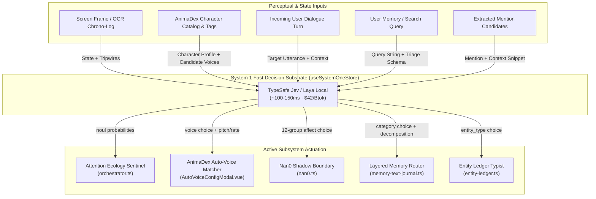

# Architecture & Design: TypeSafe Jev ("System 1") Integrated Subsystems

> **Status**: Active Architecture Specification & Shipped Inventory
> **Canonical RFC / Future Roadmap**: [`docs/proposal-jev-integration.md`](./proposal-jev-integration.md)
> **Related Domain Skill**: [`.agents/skills/airi-jev-decision-engine/SKILL.md`](../.agents/skills/airi-jev-decision-engine/SKILL.md)
> **Primary Store**: [`packages/stage-ui/src/stores/modules/system-one.ts`](../packages/stage-ui/src/stores/modules/system-one.ts)

---

## 1. Executive Summary & Paradigm

In Project AIRI, conversational dialogue and complex multi-hop roleplay are driven by autoregressive **System-2** frontier models (Claude, Gemini, DeepSeek, GPT-4o). While expressive, autoregressive generation carries 800ms–3,000ms latency, high token costs, and variance in schema compliance.

**TypeSafe Jev (and local Laya WASM/ONNX)** serves as AIRI's dedicated **System-1** discrete decision engine:
- **Non-Autoregressive**: Evaluates categorical decisions and probabilities directly using parallel classification heads (~100–150ms roundtrip, $42 per billion tokens on OpenRouter).
- **Zero Token Generation**: Does not generate prose, stream text, or output markdown preambles.
- **Strict Primitives**: Evaluates typed JSON by construction across:
  - `choice`: Multi-class selection over candidate string keys with calibrated probability distributions.
  - `noul`: Binary truth verification returning an exact 0.0 to 1.0 probability.
  - `score`: Continuous scalar evaluation (e.g. 0.0 to 1.0 intensity).
- **Universal Graceful Degradation**: Every consumer checks `systemOneStore.configured`. If offline or unconfigured, the system degrades silently to deterministic local regex, keyword heuristics, or default fallbacks without throwing unhandled exceptions.

---

## 2. Core Infrastructure & Provider Architecture

### 2.1 The Central Store: `useSystemOneStore`
- **Location**: [`packages/stage-ui/src/stores/modules/system-one.ts`](../packages/stage-ui/src/stores/modules/system-one.ts)
- **Test Suite**: [`packages/stage-ui/src/stores/modules/system-one.test.ts`](../packages/stage-ui/src/stores/modules/system-one.test.ts)
- **Key Capabilities**:
  - `execute(state, questions, model?)`: Unified entrypoint evaluating parallel questions against an arbitrary string or JSON state packet.
  - `runTriage(query)`: Classifies memory search intent into Category, Temporal Subtype, Search Scope, and Conjunction Structure using `JEV_TRIAGE_SCHEMA`.
  - `runRerank(query, candidates)`: Scores retrieved memory candidates against `JEV_RERANK_CRITERIA`.
  - `classifyEntities(mentions)`: Categorizes extracted text mentions into canonical entities or `conversational_artifact` via `JEV_ENTITY_CLASSIFIER_SCHEMA`.

### 2.2 Dual Provider Transport
1. **OpenRouter Alpha Decisions**:
   - Endpoint: `POST https://openrouter.ai/api/alpha/decisions`
   - Model Slug: `typesafe/jev-1.13` / `typesafe/jev-latest`
   - Contract Requirement: Probabilities **must** use `"type": "noul"`. Passing `"type": "boolean"` yields HTTP 400 Bad Request. Categorical selections use `"type": "choice"` with explicit string candidate options.
   - Zero-Friction Setup: Automatically reuses the user's existing OpenRouter API key configured in `providersStore` (`local:providers`).
2. **Local Laya (WASM / ONNX)**:
   - Provider: `laya-local` (`tozp/laya-onnx`)
   - Fully offline on-device classifier executing locally with zero API cost.

### 2.3 Management & Debug UI
- **Module Settings Page**: [`packages/stage-pages/src/pages/settings/modules/system-one.vue`](../packages/stage-pages/src/pages/settings/modules/system-one.vue)
  - Interactive test benches for Triage, Rerank, and Affect classification.
  - Real-time latency tracking and ping diagnostics.
- **Provider Settings Pages**:
  - [`packages/stage-pages/src/pages/settings/providers/system1/[providerId].vue`](../packages/stage-pages/src/pages/settings/providers/system1/[providerId].vue)
  - [`packages/stage-pages/src/pages/settings/providers/system1/laya-local.vue`](../packages/stage-pages/src/pages/settings/providers/system1/laya-local.vue)

---

## 3. Shipped & Active Integration Inventory

### 3.1 Domain E: AnimaDex Wizard Fast Voice Matching & Acoustic Assignment
- **Primary Source**: [`packages/stage-pages/src/pages/settings/airi-card/components/AutoVoiceConfigModal.vue`](../packages/stage-pages/src/pages/settings/airi-card/components/AutoVoiceConfigModal.vue) (lines 350–435)
- **Secondary Surfaces**: [`packages/stage-pages/src/pages/settings/airi-card/guided.vue`](../packages/stage-pages/src/pages/settings/airi-card/guided.vue), [`packages/stage-ui/src/stores/animadex-wizard.ts`](../packages/stage-ui/src/stores/animadex-wizard.ts)
- **Concrete Problem Solved**:
  - In the AnimaDex Guided Creation Wizard, selecting a multi-character cast requires assigning each character an installed voice profile and tuning speech acoustics (pitch, speed rate, idle motions).
  - Autoregressive LLM parsing caused 2,000ms–4,000ms UI freezes with frequent markdown preambles or invalid voice IDs.
- **The Jev Implementation**:
  - Compiles an installed candidate voice pool from `speechStore.availableVoices` and virtual voice profiles.
  - Sends a single multi-query Jev request containing:
    1. `best_voice_id` (`choice`): Matches character archetype and tags against voice candidate descriptions.
    2. `pitch_modifier` (`choice`): Selects semitone pitch offset from `0.70x` to `1.20x` matching physical stature.
    3. `speed_rate` (`choice`): Selects pacing cadence multiplier from `0.80x` (ponderous) to `1.15x` (rapid).
    4. `idle_motion` (`choice`): Selects the best mapped idle animation from the character's bound 3D/2D model.
  - Resolves in **~120ms**, binding directly into `useAnimaDexWizardStore` with zero UI lag.

---

### 3.2 Domain C: Attention Ecology Programmable Visual Attention Gate
- **Primary Source**: [`packages/stage-ui/src/stores/modules/vision/orchestrator.ts`](../packages/stage-ui/src/stores/modules/vision/orchestrator.ts) (lines 393–445)
- **Secondary Surfaces**: [`packages/stage-ui/src/stores/modules/vision.ts`](../packages/stage-ui/src/stores/modules/vision.ts), [`packages/stage-pages/src/pages/settings/airi-card/components/tabs/CardCreationTabProactivity.vue`](../packages/stage-pages/src/pages/settings/airi-card/components/tabs/CardCreationTabProactivity.vue)
- **Concrete Problem Solved**:
  - Continuous desktop perception traditionally relied on either brittle hardcoded keyword tags (`"coding"`, `"reading"`) or expensive cloud VLM calls on every screen delta ($5–$15/Mtok, 2,000ms latency), which bankrupts API budgets.
- **The Jev Implementation**:
  - Operates as **Stage 2** in the attention pipeline:
    $$\text{Screen Frame} \xrightarrow{\text{Stage 0: pHash}} \text{Changed Crop} \xrightarrow{\text{Stage 1: Local OCR}} \text{Chrono-Log Buffer + Entity Evidence} \xrightarrow[\sim 100\text{ms}]{\text{Stage 2: Jev Multi-Tripwire Gate}} \text{Proactive Turn}$$
  - The rolling Chrono-Log buffer (last $N$ frames) is enriched with biographical context from `useEntityLedgerStore` (e.g. recognizing collaborator names on screen).
  - Evaluates active user sentinel questions in parallel using `"type": "noul"`:
    - Default: *"Did a notable, unexpected, or socially meaningful event occur that warrants companion proactive dialogue?"*
    - Custom user tripwires: *"Did my code compilation or test suite fail with an error?"*, *"Is the user messaging a close friend?"*
  - Trigger Policy: If `max(prob) >= threshold` (typically 0.75), promotes the event to the primary LLM with calibrated confidence.

---

### 3.3 Domain B: Nan0 Living Cognition Pre-Processor & Shadow Boundary
- **Primary Source**: [`packages/stage-ui/src/stores/modules/nan0.ts`](../packages/stage-ui/src/stores/modules/nan0.ts) (lines 482–508)
- **Underlying Engine**: [`packages/nan0-runtime/`](../packages/nan0-runtime/) (`Nan0Kernel.ts`, `Nan0EmotionalDynamics.ts`)
- **Benchmark Suite**: `scripts/tests/rwkv-harness/experiments/jev-nan0-pragmatic-benchmark.py`
- **Concrete Problem Solved**:
  - Legacy regex broke on paraphrased statements, while small on-device WASM models (Needle 2 45M SAN) suffered from "hedging sinks", collapsing into `uncertain_or_mixed` when handling subtle human sarcasm and emotional pragmatics.
- **The Jev Implementation**:
  - Serves as the asynchronous **Tier 2 Shadow Challenger** inside Nan0's Telemetry-Only Shadow Boundary.
  - Evaluates contrastive queries mapping 1:1 to Kyo's 12 canonical speech-act perturbation groups (`admitted_false_statement`, `commitment_pledge`, `affection_care`, `dismissal_neglect`, `hostility_insult`, `persistence_threat`, `boundary_protection`, `completed_repair`, `stranger_demands`, `mystery_secret`, `glitch_system`, `roast_invitation`).
  - **Distractor Attractor Baselines**: Includes explicit negative options (e.g. `refused_or_negated_roast`, `technical_file_deletion`, `software_process_kill`) to absorb sarcasm and negate false positives.
  - Benchmark Performance: Achieved **100.0% spike recall, 0.0% false positive spikes, and 100% full-vector accuracy** across the 43-case contrastive shootout in ~430ms.

---

### 3.4 Hybrid Memory Triage & Search Reranking
- **Primary Sources**:
  - [`packages/stage-ui/src/stores/memory-text-journal.ts`](../packages/stage-ui/src/stores/memory-text-journal.ts) (lines 485–514)
  - [`packages/stage-ui/src/stores/entity-ledger.ts`](../packages/stage-ui/src/stores/entity-ledger.ts) (lines 158–185, 382–415)
- **Concrete Problem Solved**:
  - Natural language queries like *"When was the last time we visited Kyoto?"* or *"List all the books you recommended to me"* require fundamentally different retrieval strategies (temporal scan vs multi-session aggregation vs single-turn atomic lookup).
  - Passing all retrieved vector chunks directly to the LLM creates prompt bloat and pollutes reasoning with low-relevance snippets.
- **The Jev Implementation**:
  - **Query Triage (`JEV_TRIAGE_SCHEMA`)**: Evaluates query category (`c1_multihop`, `c2_temporal`, `c3_detective`, `c4_literal`), temporal subtype, search scope (`single_session` vs `multi_session`), conjunction structure, and `requires_decomposition` in a single pass.
  - **Candidate Reranking (`JEV_RERANK_CRITERIA`)**: Evaluates retrieved chunks from 0 (completely off-topic) to 3 (directly provides key evidence), filtering out noise before prompt synthesis.
  - **Entity Classification (`JEV_ENTITY_CLASSIFIER_SCHEMA`)**: Disambiguates whether an extracted capitalized word is a `person`, `place`, `organization`, `activity`, or `conversational_artifact` (e.g. "Obviously", "Goodnight", "Deal").

---

## 4. Open Initiatives & Future Roadmap

The remaining unintegrated domains from the initial proposal are preserved in [`docs/proposal-jev-integration.md`](./proposal-jev-integration.md) for future promotion:

1. **Domain A: Arcade Room Retro Gaming, Catalog Triage & Self-Synthesizing Copilot**:
   - Detailed Specification: [`proposal-generic-gaming-agent-runtime.md`](./proposal-generic-gaming-agent-runtime.md) (Sections 5.4–5.6).
   - **Catalog Triage**: Offline Jev classification over the 8,900+ DOS catalog recommending Path A (System-2 VLM Strategy) vs Path B (System-1 Reflex).
   - **Decoupled Two-Tier Semantic Engine**: System 2 analyzes a 15s demonstration trace (80×40 sparse grid diffs) to synthesize a pure JavaScript **State Extractor** (`extractGameState`), which runs at 20 Hz in $<1\text{ms}$ feeding structured situation reports into System 1 (Laya Local / Jev ~100ms) to evaluate discrete action choices (`'UP'`, `'DOWN'`, `'LEFT'`, `'RIGHT'`).
2. **Domain F: Dual-Duty Ninja-Swap Interceptor**:
   - Single-pass merged Jev evaluation (~110ms) reconciling authoring-time whitelists with live sentence strides to simultaneously inject avatar blendshapes (`<|ACT:...|>`) and speech inflection tags (`[whisper]`, `[sigh]`) with 100% voice-face emotional synchronization.
3. **Domain G: Memory Token Compaction & Pre-Summary Filter**:
   - Curative pre-filter stripping routine conversational banter from raw chat transcripts before dispatching to daily/lifetime summarizer LLMs (~70% token savings).
4. **Domain D: Toggle 4 (Recent Topics) Salience Rework**:
   - Discrete topic selection replacing the legacy 270-line stopword list.

---

## 5. Architectural Cross-Reference Index

| Subsystem | Primary Code Anchors | Authoritative Design Docs |
| :--- | :--- | :--- |
| **System 1 Engine** | `stage-ui/stores/modules/system-one.ts` | [`proposal-jev-integration.md`](./proposal-jev-integration.md) |
| **AnimaDex Wizard** | `stage-pages/.../AutoVoiceConfigModal.vue` | [`proposal-animadex-wizard.md`](./proposal-animadex-wizard.md) |
| **Attention Ecology** | `stage-ui/stores/modules/vision/orchestrator.ts` | [`proposal-attention-ecology-local-webgpu-guard.md`](./proposal-attention-ecology-local-webgpu-guard.md), [`design-vision-system-support.md`](./design-vision-system-support.md) |
| **Nan0 Cognition** | `stage-ui/stores/modules/nan0.ts`, `nan0-runtime/` | [`nan0/design-nan0-cognition-runtime.md`](./nan0/design-nan0-cognition-runtime.md), [`nan0/shadow-boundary-specification.md`](./nan0/shadow-boundary-specification.md) |
| **Memory & Ledger** | `stage-ui/stores/memory-text-journal.ts`, `entity-ledger.ts` | [`design-subconscious-system1-inference-providers.md`](./design-subconscious-system1-inference-providers.md) |
