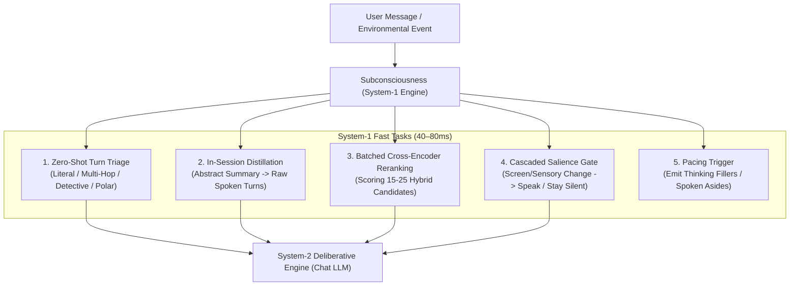

# Design: Subconsciousness (System-1) Inference Provider Architecture & Semantic Retrieval Surface Synthesis

- **Status**: Proposed / Architecture Draft
- **Date**: 2026-09-21
- **Domain**: Inference Providers, Memory Systems, Cognitive Ecology, Card Editor
- **Cross-References**:
  - [`docs/design-semantic-search-browser-native.md`](design-semantic-search-browser-native.md)
  - [`docs/design-multi-instance-provider-studio.md`](design-multi-instance-provider-studio.md)
  - [`docs/arch-memory-system-overview.md`](arch-memory-system-overview.md)
  - [`packages/stage-pages/src/pages/settings/providers/index.vue`](../packages/stage-pages/src/pages/settings/providers/index.vue)

---

## 1. Executive Summary & Problem Framing

Currently, AIRI categorizes AI inference providers into 7 primary modality tabs:
`Chat` (deliberative generation), `Speech` (TTS), `Transcription` (STT), `Artistry` (image generation), `Vision` (VLM), `Motion` (kinetics), and `Cloud & Storage` (backup adapters).

Recent breakthrough benchmarking on the **LoCoMo long-context conversational memory benchmark** demonstrated that deliberative generation (System-2 LLMs) alone cannot scale to dense, multi-session memory retrieval without experiencing context pollution, quadratic token costs, and high latency. Introducing a dedicated **System-1 Coprocessor** (such as Laya ONNX or TypeSafe Jev) achieved a **+16.5 to +21 point jump in factual accuracy** by executing ultra-fast (40–80ms), typed cognitive operations: zero-shot triage, in-session distillation, and batched cross-encoder reranking.

This document proposes elevating System-1 from benchmark test scripts into a **first-class, user-configurable Inference Provider Category** in AIRI, tentatively titled **"Subconsciousness"** (or **"Intuition"**). Furthermore, it catalogs the **three active consumers of semantic search** across AIRI, addresses the UI gap where **Universe RAG** is hidden in the composer popover without global settings representation, and maps where these cognitive surfaces belong across Settings and the Character Card Editor.

---

## 2. Naming Exploration & Conceptual Framing

In cognitive science (Kahneman's *Thinking, Fast and Slow*), human cognition operates across two modes:
- **System 1 (Fast, instinctive, unconscious, parallel)**: Rapid pattern matching, salience detection, associative memory lookup, and cognitive triage.
- **System 2 (Slow, deliberative, conscious, sequential)**: Reasoning, multi-step planning, conversational composition, and creative generation.

Within AIRI's virtual companion framing:

| Proposed Tab Label | Tone & Aesthetic | Pros | Cons |
| :--- | :--- | :--- | :--- |
| **`Subconsciousness`** | Psychological, poetic, character-centric | Captures the feeling of thoughts happening beneath the surface before the companion speaks. Pairs beautifully with `Chat` and `Cognition`. | Slightly long for compact mobile tabs. |
| **`Intuition`** | Elegant, human, organic | Fits anime/companion character design; implies rapid gut-feel decisions and instant memory recall. | Might be confused with emotional mood systems. |
| **`System One`** | Technical, precise, scientific | 100% accurate to cognitive science; immediately understood by engineers and power users. | Lacks the emotional charm and warmth of AIRI. |
| **`Soul`** | Philosophical, spiritual | Evocative, beloved in classic anime robotics (*Ghost in the Shell*). | Too abstract; doesn't describe the technical function (triage/rerank). |

> **Recommendation**: Label the primary provider tab **`Subconsciousness`** (localized as *Subconscious / 潜意识 / 潜在意識*) with a short subtitle: *"Fast instinctive coprocessor for memory triage, reranking, and salience gating (System-1)."*

---

## 3. The Three Out-of-the-Box Provider Backends & The Non-LLM Principle

### Core Architectural Principle: Strict Prohibition of Autoregressive LLMs in System-1
A foundational design rule of AIRI's Subconsciousness layer is that **generative, autoregressive Large Language Models (even sub-1B/3B SLMs or local Ollama instances) are strictly prohibited from participating in System-1 tasks.**

**Rationale**:
1. **Extreme Latency Requirements**: System-1 tasks (zero-shot turn triage, in-session candidate distillation, cross-encoder reranking, salience gating) operate directly inside real-time interactive loops (as the user types or during conversational pacing). They require **deterministic 40–80ms response times**.
2. **Autoregressive Jitter & Overhead**: Even a 0.5B model generates token-by-token with variable decoding delays, context window loading, and KV cache spin-up, resulting in 400–1500ms latency. Introducing an LLM into these sub-second loops would degrade user experience.
3. **Task Alignment**: System-1 requires compact, specialized neural discriminators (classification heads, cross-encoders, and choice scorers), not creative sequence generators.

---

The Subconsciousness category provides **three distinct backends out of the box**:

```
┌─────────────────────────────────────────────────────────────────────────────┐
│                 AIRI Subconsciousness (System-1) Providers                  │
├───────────────────────┬────────────────────────────┬────────────────────────┤
│   1. Laya (Local)     │   2. TypeSafe AI (Cloud)   │ 3. OpenRouter (Hosted) │
│   -----------------   │   ----------------------   │  --------------------  │
│   • ONNX Runtime Web  │   • Micro-Coprocessor API  │  • Reused provider key │
│   • 100% Offline      │   • 40–80ms JSON choice    │  • TypeSafe micro-host │
│   • CPU / WebGPU      │   • Zero local VRAM        │  • Fast REST endpoint  │
└───────────────────────┴────────────────────────────┴────────────────────────┘
```

### Backend 1: Laya (Local On-Device Coprocessor)
- **Runtime**: ONNX Runtime Web (`onnxruntime-web`) via WebGPU / WASM, managed through AIRI's `ModelCacheManager`.
- **Target Weights**: Compact, specialized neural classifiers and cross-encoders (~15 MB to 60 MB), including `laya-triage-int8`, `needle-2` (Cactus SAN 45M), or mobile-quantized BERT/DeBERTa rerankers.
- **Benefits**: Zero API cost, zero network telemetry, complete privacy, works offline on laptops and mobile devices.

### Backend 2: TypeSafe AI (Direct Cloud Micro-Coprocessor)
- **Runtime**: Dedicated REST JSON API (`https://api.typesafe.ai/v1/system-one`) authenticated via `TYPESAFE_API_KEY`.
- **Protocol**: Single forward-pass multi-question schema (`type: 'choice'`, `type: 'classification'`, `type: 'confidence'`).
- **Benefits**: Sub-80ms global execution, zero local disk or RAM consumption, zero local GPU contention during voice or Live2D rendering.

### Backend 3: OpenRouter (TypeSafe Hosted Micro-Endpoint)
- **Runtime**: Reuses existing user-configured OpenRouter API credentials to access TypeSafe-compatible fast coprocessor micro-endpoints hosted on OpenRouter.
- **Protocol**: Micro-latency classification/choice API, avoiding the need for a separate direct TypeSafe account while guaranteeing non-autoregressive sub-100ms execution.
- **Benefits**: Instant zero-friction setup for users who already hold OpenRouter balances, maintaining strict System-1 performance without touching autoregressive LLM routes.

---

## 4. Core Runtime Responsibilities: What Consumes System-1?

System-1 is not limited to isolated benchmark queries. Across AIRI, it serves as the **high-speed cognitive lifeblood** for multiple subsystems:



1. **Turn Triage & Cognitive Scope**:
   Classifies incoming user messages into retrieval archetypes (`c1_multihop`, `c2_temporal`, `c3_detective`, `c4_literal`) and determines whether search should span single-session or multi-session memory.
2. **In-Session Semantic Distillation**:
   When long-term memory surfaces an abstract daily summary (`ltmm`), System-1 evaluates the raw candidate turns within that session and distills the exact 1–2 verbatim turns containing the factual evidence, eliminating prompt fluff.
3. **Batched Cross-Encoder Candidate Reranking**:
   Takes the top 15–25 candidate turns retrieved by BGE vector search and BM25, scoring and ordering them in a single batch request before prompt assembly.
4. **Attention Ecology & Continuous Screen Perception**:
   Works in tandem with the Cascaded Salience Gate to determine whether screen perception deltas (e.g. user opening a code editor vs watching a video) warrant an autonomous companion remark or an AFK/idle NO_REPLY decision.
5. **Conversational Pacing & Dynamic Fillers**:
   Evaluates query complexity to trigger natural spoken filler phrases (*"Hmm, let me recall..."*, *"Give me a second to check..."*) while System-2 deliberates.

---

## 5. Cataloging the Four Consumers of Semantic Search in AIRI

AIRI's memory retrieval engine (`packages/stage-ui/src/libs/workers/search/search.worker.ts` and `layered-memory.ts`) is consumed by **four distinct flows**:

### Consumer 1: History Popover Search (Explicit User Retrieval)
- **Surface**: Desktop & Mobile Chat Drawer (`chat-history-popover.vue`).
- **Trigger**: User clicks the magnifying glass in the chat drawer and types a search query.
- **Behavior**: Executes hybrid vector + lexical search over indexed sessions, displaying matching message bubbles in a modal for direct user navigation.
- **Characteristics**: Interactive, user-initiated, human-readable UI presentation.

### Consumer 2: Settings Memory Explorer (`Settings > Memory Systems > Journal`)
- **Surface**: Settings Long-Term Memory View (`packages/stage-pages/src/pages/settings/memory-systems/text-journal.vue`).
- **Trigger**: User navigates to Settings > Memory Systems > Journal and searches through long-term memory entries.
- **Origin**: This is where semantic search originally started in AIRI—as a persistent explorer/inspector for stored LTMM records.
- **Status**: **No changes required here.** It functions cleanly for administrative data inspection and debugging.

### Consumer 3: Pre-Flight Universe RAG (Composer Grounding)
- **Surface**: Chat Composer (`chat-input.vue` / `universe-rag-popover.vue`).
- **Trigger**: User enables the "Universe RAG" toggle in the chatbox popover.
- **Behavior**: As the user types, a debounced background search query runs against the current character/universe memory index. Retrieved memory spans are displayed as grounded interactive **Grounded Memory Chips** (semantic context chips) above the input box and injected directly into the LLM system prompt for the next turn.
- **Critical Distinction**: **Grounded Memory Chips are NOT Echo Chips.** Echo Chips represent affective emotional anchors and mood state synthesis (as documented in `airi-memory-echo-chips`). Grounded Memory Chips represent retrieved factual context and conversational evidence. Conflating these two concepts creates architectural and UI confusion.
- **Current Problem / UI Gap**: **Universe RAG is completely absent from global settings.** It exists only as an ephemeral toggle inside the chat composer popover. Users cannot configure default retrieval thresholds, candidate limits, or enable it globally across sessions.

### Consumer 4: Autonomous Assistant Tool Search (`text_journal`)
- **Surface**: Agent Tool Registry (`packages/stage-ui/src/stores/memory-text-journal.ts`).
- **Trigger**: Assistant model receives `text_journal` in its tool definition array.
- **Behavior**: During multi-step reasoning, the model autonomously calls `text_journal({ query: "...", limit: 3 })` to look up character notes, diary entries, or past conversation milestones.
- **Characteristics**: Model-initiated, JSON-schema constrained, tool loop execution.

---

## 6. Surface Integration Map: Where Everything Belongs

To unify these capabilities cleanly across AIRI's UI architecture:

### A. Settings Surface: `Settings > Inference Providers > Subconsciousness`
Located as the 8th tab in `packages/stage-pages/src/pages/settings/providers/index.vue`:

```
[Chat]  [Speech]  [Transcription]  [Artistry]  [Vision]  [Motion]  [Cloud & Storage]  [Subconsciousness 🧠]
```

- **Active Provider Cards** (Strictly non-autoregressive):
  - `Laya (Local ONNX / WebGPU)` (Free, On-Device, Instant)
  - `TypeSafe AI Jev (Direct Cloud Coprocessor)` (Low-latency Cloud)
  - `OpenRouter (TypeSafe Hosted Micro-Endpoint)` (Reused Cloud API credentials)
- **Shared Parameters**:
  - Global Timeout (default: 5000ms, fallback to heuristic triage on timeout).
  - Triage Confidence Threshold (e.g. $\ge 0.75$).
  - Distillation Strategy: `raw_turn_hydration` vs `summary_preserved`.

### B. Settings Surface: `Settings > Memory Systems` (Elevating Universe RAG)
`Settings > Memory Systems` hosts Short-Term Summaries, Text Journal (Consumer 2, unchanged), and Lifetime Archives.
- **Proposed Addition**: A dedicated section titled **"Universe RAG & Contextual Grounding"**:
  - Global toggle: *Enable Pre-Flight Memory Retrieval*.
  - Candidate Pool Budget (3, 5, 8 items).
  - Minimum Similarity Threshold slider ($0.38$ default).
  - Subconsciousness Reranker Binding: select whether candidates are reranked via the Subconscious provider before injection.

### C. Character Card Surface: Card Editor > `Cognition` Tab
In the AIRI Card Editor (`AIRI Card Editor > [Edit] > Cognition`):
- **Design Tradeoff: Global Default vs Per-Character Scope**:
  - *Option 1 (Strictly Global)*: Subconsciousness provider and pre-flight RAG thresholds apply uniformly across all characters via Settings. Simpler, but prevents companion-specific specialization.
  - *Option 2 (Global Default + Per-Character Cognition Overrides)*: Settings defines the global default engine (e.g. TypeSafe Cloud or Laya), while the Card Editor's `Cognition` tab allows specific characters to declare local overrides (e.g. an offline local Laya model for a private companion card, or higher intuition sensitivity for an investigative persona).
- **Cognitive Sensitivity**: Sets character-level intuition sensitivity (how aggressively the character recalls past memories vs staying in the immediate present).
- **Universe Scoping**: Pin or isolate character memory retrieval to specific fictional universes or shared timeline ledgers.

---

## 7. Next Steps & Implementation Roadmap

1. **Phase 1: Architecture Specification (This Document)**:
   Document the provider model, catalog semantic search consumers, and establish the UI integration map.
2. **Phase 2: Provider Store Registration**:
   Add `subconscious` to `packages/stage-ui/src/libs/providers/types.ts` (`TaskType`), register `providerLaya`, `providerTypeSafeJev`, and `providerOpenRouterSubconscious` in the provider core registry.
3. **Phase 3: Settings Provider Page**:
   Mount the `subconscious` tab in `packages/stage-pages/src/pages/settings/providers/index.vue` and implement credential forms.
4. **Phase 4: Memory Settings & Universe RAG Elevation**:
   Expose Universe RAG configuration inside `packages/stage-pages/src/pages/settings/memory-systems/` alongside short-term and long-term journals.
5. **Phase 5: Subconscious Pipeline Hooking**:
   Route Universe RAG and chat interaction pipelines through the configured Subconscious provider for seamless, character-wide fast cognitive coprocessing.
