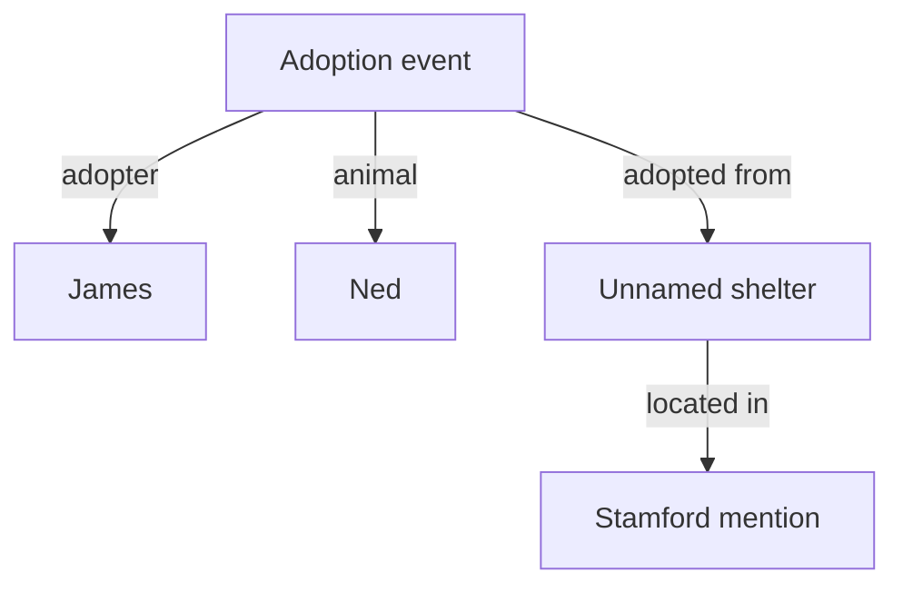

# Pass 2 Peer Review: System-1 Ingestion and Entity Ledger

**Repository:** `dasilva333/airi`, `main`
**Verified revision:** [`631158b1fab87af6d2f265abeaea86b07cac5639`](https://github.com/dasilva333/airi/commit/631158b1fab87af6d2f265abeaea86b07cac5639)
**Date:** 2026-09-21
**Scope:** Architecture review of the supplied brief; no implementation changes

## Recommendation

**Proceed with an entity-and-event ledger prototype, after revising the extraction, evidence, temporal, and completeness contracts.** It can make repeated joins, lists, and date queries much cheaper and more reliable. It does not make ingestion correct merely because extraction produces valid JSON or lookup is deterministic.

The recommended architecture is:

- Preserve a searchable source layer.
- Use Needle to propose compact, source-grounded mentions and claims.
- Resolve references and bind event participants in a separate, auditable step.
- Use Laya selectively for contextual classification and uncertain decisions.
- Store entities, events, claims, and their evidence in indexed JavaScript Maps.
- Query the ledger and text index together until coverage is demonstrated.
- Format supported graph answers deterministically; use a local generative head for bounded synthesis and inference.

**Do not make salience a deletion gate, generic nouns global aliases, or missing graph edges negative answers.** Those choices would replace retrieval misses with persistent ingestion errors.

## 1. Corrections to the brief

The current remote `main` is unchanged from the Pass 1 review. I inspected its dataset, case-study turns, benchmark source, lifecycle guidance, and current primary model/runtime documentation. The new hardware measurements are supplied in the brief; I did not independently run them or find a corresponding benchmark artifact among the relevant tracked files.

| Claim in brief | Verified correction or qualification | Design consequence |
|---|---|---|
| `conv-47` has 670 turns | The committed dataset has **689 raw turns**, 31 sessions, and 150 C1–C4 questions | Count input records programmatically; disclose any filtering |
| `D5:1` is from 10 April 2022 | Session 5 is **9:52 am on 12 April 2022** | Load anchors from source metadata |
| Single-pass search can hit only one session | Both BM25 and vector search traverse the global index; they can retrieve multiple sessions | The actual limitations are ranking, coverage, duplication, and context budgets |
| Turns lacked session timestamps at ingestion | Pass 1 stores timestamps; its downstream candidate mapping and answer extraction fail to use them | Preserve metadata through the pipeline, rather than treating it as newly available |
| 4.8%/14.0% describe the displayed temporal/literal examples | Those are category averages. The displayed adoption-date question scores **9.09%**, and the pup-name question **11.11%**, under the saved custom F1 | Label per-example and category metrics separately |
| Type probabilities 98.4%/96.1%, salience 3, fact confidence 1.0 | No corresponding inference trace was supplied | Label these as illustrative, not measurements or certainty |
| A ledger yields 100% C1/C2/C4 | These are possible outcomes for selected cases given correct extraction and query interpretation | Replace guarantees with measured acceptance criteria |

Sources: [dataset][data], [index implementation][index], [hybrid search][hybrid], [runner][runner], [shootout trace][trace].

The central opportunity is **amortizing semantic work at ingestion**, not a limitation that lexical/vector retrieval can access only one session. Keep this distinction: it helps compare the ledger fairly against a stronger retrieval baseline.

## 2. Needle schema and context design

### 2.1 Start with extraction proposals, not a complete ontology in one call

A small schema should permit empty results, unresolved fragments, and unknown semantic labels. Requiring every turn to produce a complete subject–predicate–object triple forces social chatter, questions, and elliptical replies into invented facts.

Needle’s documented interface supports schema-based extraction through a declared tool, a 256-token sliding window, and resettable sessions. Its free-form reasoning field is not subject to the same grammar constraints as tool arguments. These properties support a strict host adapter; they do not establish semantic extraction accuracy. [Needle 2 documentation](https://huggingface.co/Cactus-Compute/needle2)

The following is a **proposed schema to smoke-test against the pinned Needle build**, not a claim that it has already been compiled or benchmarked. Its output is an intermediate proposal, not a ledger write:

```json
{
  "name": "extract_memory_fragments",
  "description": "Copy mentions and factual or contextual fragments from the target passage. Keep uncertainty, negation and plans. Leave absent spans out. Return empty arrays when nothing is extractable.",
  "parameters": {
    "type": "object",
    "additionalProperties": false,
    "properties": {
      "mentions": {
        "type": "array",
        "maxItems": 8,
        "items": { "type": "string", "minLength": 1, "maxLength": 64 }
      },
      "claims": {
        "type": "array",
        "maxItems": 3,
        "items": {
          "type": "object",
          "additionalProperties": false,
          "properties": {
            "quote": { "type": "string", "minLength": 1, "maxLength": 240 },
            "subject_span": { "type": "string", "minLength": 1, "maxLength": 64 },
            "predicate_span": { "type": "string", "minLength": 1, "maxLength": 64 },
            "object_span": { "type": "string", "minLength": 1, "maxLength": 96 },
            "time_span": { "type": "string", "minLength": 1, "maxLength": 64 },
            "polarity": { "type": "string", "enum": ["positive", "negative", "unknown"] },
            "mode": {
              "type": "string",
              "enum": ["asserted", "question", "plan", "hypothetical", "quoted", "fragment", "unknown"]
            }
          },
          "required": ["quote", "polarity", "mode"]
        }
      }
    },
    "required": ["mentions", "claims"]
  }
}
```

The host supplies turn ID, speaker ID, session time, scope, model/schema version, and request ID. Do not spend model output tokens copying those fields. Missing subject/object spans remain unresolved; the resolver can recover implicit participants from context. Multi-argument events such as naming, recommending, or donating require role binding later; optional binary spans are not the complete event representation.

The array limits bound output, **not factual complexity**. When a target contains more clauses than the budget supports, split it into source-addressed passages and process all passages. A limit-hit or truncated response is not successful complete ingestion. Keep unresolved fragments available for text retrieval and targeted re-extraction.

### 2.2 Host validation and Markdown leakage

Use the structured completion interface and inspect only the expected function call’s `arguments`. Do not regex-scrape JSON from Markdown or the reasoning field. Expose one extraction tool, accept a legal empty result, and reject an unexpected call name/count, schema violation, runtime error, or truncated output.

Validate copied spans against the exact target text. Locate offsets on the host; if a string appears multiple times, resolve its occurrence explicitly or retain ambiguity. Declare the offset unit, such as JavaScript UTF-16 code units. Keep original text when normalizing Unicode or punctuation so offsets remain reproducible.

A string field can legally contain Markdown-looking text. Grammar constrains structure, not the truth or style of every string. If a generated header is absent from the source, span validation rejects it; if the source actually contains that header, it is source data. Substring validation establishes provenance, **not entailment**: swapped actors and incorrect negation can still use genuine words.

Preserve independent statuses: `ok_empty`, `ok_with_candidates`, `needs_context`, `truncated`, `timeout`, and `error`. Do not collapse all failures into “nothing to remember.” Reuse the existing [Needle worker reset, validation, and timeout patterns][needle-runner], while creating task-specific calibration and schemas.

### 2.3 A fixed two-turn window is insufficient for the motivating example

The actual sequence is:

| Turn | Speaker | Information needed |
|---|---|---|
| `D1:12` | James | “my dogs” establishes ownership and animal type |
| `D1:13` | John | Asks for the names of James’s pets |
| `D1:14` | James | “Max and Daisy” supplies the names |

A two-turn window ending at `D1:14` can resolve the names of pets, but misses the direct dog-type statement. References to a planned dog-walking app in the same reply must not substitute for that ownership evidence.

**Recommended starting policy:** target turn plus up to two previous turns in the same session, bounded by the actual tokenizer. Make the target explicit. Use earlier turns for interpretation, but emit newly supported claims for the target; record every context turn that contributes to a resolved fact. Never use future turns in a streaming-ingestion claim.

For short replies or unresolved pronouns, consult a small discourse state: current participants, recent grounded entity mentions, the outstanding question, and its source IDs. Keep that state outside the model’s hidden conversation state. Reset inference between requests and pass context explicitly, so one extraction failure does not silently contaminate later turns.

A three-turn window is a starting policy, not a universal context solution. Long turns and long generated outputs can push useful material out of Needle’s moving window. Budget input **and output**, split on meaningful clause boundaries, and preserve negation and quoted-speech boundaries. Measure the real schema; do not transplant 150 ms from a shorter task.

## 3. Laya taxonomy and salience

### 3.1 Classify a mention in context

Ask a question such as:

> Which coarse type best describes the referent of the highlighted mention in this passage? Use unknown when the passage does not establish it.

Supply the exact mention, speaker, relevant passage, and grounded local context. Do not ask Laya to classify the isolated string `Ned` and assume it must be a pet.

| Coarse type | Examples and purpose |
|---|---|
| `person` | Named people and resolved family references |
| `animal` | Individual pets; store dog/Labrador as subtype claims |
| `place` | Cities, countries, venues, geographic locations |
| `organization` | Clubs, charities, hospitals, companies |
| `work_or_product` | Books, games, applications, named equipment |
| `event` | A particular tournament, trip, adoption, meeting |
| `activity` | Gaming, programming, cooking, hobbies |
| `group` | A referred collection of people or animals |
| `other_or_unknown` | Unresolved or unsupported assignments |

Dates, quantities, names-as-values, and boolean values need typed literal storage; they do not all need entity nodes. Use facets for overlapping concepts: a shelter can denote an organization or a facility, and McGee’s can be an establishment with a physical location. A single `choice` result is a coarse proposal, not a disjoint universal ontology.

Pet status is relational: an animal can be someone’s pet, while `dog` is a type. Similarly, “possession” depends on ownership. Keep those distinctions out of the primary entity-type classifier.

Start with short option descriptions. Laya’s published wrapper limits option-header length and truncates the state for the English checkpoint; oversized context and elaborate taxonomy prose can remove the evidence you intended to classify. [Laya interface and limits](https://github.com/receptron/laya)

### 3.2 Salience should prioritize work, not determine whether evidence exists

Use a rubric for **new retrievable information**, with context included:

| Level | Proposed rubric |
|---|---|
| 0 | Pure acknowledgement or greeting; no new attributable information |
| 1 | Vague reaction, unresolved fragment, or repetition with no identifiable new claim |
| 2 | A specific attribute, preference, relation, event detail, or temporal fact |
| 3 | New identity/relation binding, important state change, explicit correction, or a detail that materially completes an existing event |

“Max and Daisy” can merit high priority when it completes the outstanding naming question. “I don’t have a pet yet” is quiet language but important evidence. Adopting Ned is not important merely because it sounds emotional; it establishes a new animal, name, relationship, and event.

Use salience for enrichment order, compression, or optional model work. **Retain validated factual proposals regardless of emotional salience**, and preserve the source even when the score is low. Track discarded or deferred candidates explicitly.

Laya’s `score` is an expected rubric level; it may return a fractional number. Keep the distribution rather than expecting a literal integer 3. Its entropy-derived `confidence` is not an end-to-end fact correctness probability. [Laya scoring implementation](https://github.com/receptron/laya/blob/main/src/laya.ts), [confidence implementation](https://github.com/receptron/laya/blob/main/src/sequence.ts)

Avoid one “permanent” flag. Separate historical events, ongoing states, temporary states, plans, and unknown temporal scope. Adoption remains a historical event even if pet ownership later ends; a plan can be durable memory without ever becoming a completed event. No predicted permanence should authorize destructive deletion or overwriting.

## 4. Ledger representation and identity

### 4.1 Use normalized Maps with secondary indexes

For this benchmark, a graph database is unnecessary. A relational set of records plus indexes gives the relevant graph operations without duplicating evidence:

```js
const ledger = {
  sources: new Map(), // turnId -> source text, speaker, session, source hash
  mentions: new Map(), // mentionId -> span, source ID, candidate entity IDs
  entities: new Map(), // entityId -> canonical label, type claims, mention IDs
  events: new Map(), // eventId -> type, role bindings, claim IDs
  claims: new Map(), // claimId -> proposition, qualifiers, evidence, status
  bySubjectPredicate: new Map(), // subjectId -> predicate -> Set<claimId>
  byObjectPredicate: new Map(), // objectId -> predicate -> Set<claimId>
  byEvent: new Map(), // eventId -> Set<claimId>
  bySource: new Map(), // turnId -> Set<claimId>
  byAlias: new Map(), // scoped normalized surface -> Set<entityId>
  ingestion: new Map() // turnId -> processing and coverage status
}
```

These are proposed interfaces, not implemented code. Nested Maps avoid delimiter collisions in composite string keys. Typical relation queries visit the relevant posting lists instead of scanning the entire corpus. Persist a versioned snapshot and source/model/schema hashes to make the in-memory ledger rebuildable.

Use stable, scoped entity IDs such as a conversation ID plus a local opaque ID. For later AIRI integration, preserve user/character/universe boundaries. Human-readable labels are not identity keys. Do not silently unify two people with the same name.

The reverse indexes accelerate traversal; they **do not assert new inverse predicates**. An incoming `adopted` edge does not imply the reversed proposition “Ned adopted James.”

### 4.2 Model events and roles, not only binary triples

The proposed D5 node records adoption and shelter location but omits the adoption-to-shelter link. It also proposes querying `OWNS_PET` without defining how that relation is created. These are correctness gaps even if every displayed field is extracted accurately.

A candidate representation, after successful contextual binding, is:



Attach `D5:1` and the precise supporting spans to these role claims. Bind `pup`, `it`, and `Ned` through the within-turn naming reference. The unnamed shelter gets a local identity; the string `shelter` is not a globally unique organization.

Represent naming, adoption, travel, recommendations, and donations with explicit participants and qualifiers. This avoids collapsing “John recommended a book to James” into an ambiguous binary relationship or attaching a trip’s date to the wrong event.

An ownership assertion may be **derived** from this adoption event under a declared rule, with event/source dependencies and an inferred start interval. A later transfer or loss can close that ownership state without erasing the adoption event. Alternatively, answer “pets mentioned as owned” by unioning explicit ownership with supported acquisition events. The semantics must be specified rather than hidden in a query template.

### 4.3 Minimum claim contract

| Field | Requirement |
|---|---|
| Identity | `claimId`, scope, schema version |
| Proposition | Subject, normalized predicate, typed object/literal, optional event ID |
| Original wording | Predicate/value spans and supporting quotations |
| Attribution | Speaker, asserted subject, and quotation/reported-speech scope |
| Qualifiers | Polarity, modality, completion/state status, relevant event roles |
| Time | Source-session time, event/valid time, precision and ambiguity |
| Provenance | All source turns/spans and any parent claim/rule/KB dependencies |
| Lifecycle | Candidate, accepted, disputed, superseded; links to replacements |
| Confidence | Separate raw extraction, typing, linking scores and calibration IDs; allow null |

Do not write `confidence: 1.0` because a value passed a grammar or substring check. Store `spanValidation: passed` separately. Semantic acceptance still needs evaluated extraction/binding logic, and uncertain claims must remain distinguishable from direct source assertions.

Keep historical records while updating current projections. Distinguish **when something happened** from **when it was mentioned** and **when the system learned it**. Repeated mentions of one event should reinforce its provenance, not increment event counts. A later statement about an earlier date is not automatically the latest valid state. This follows the repository’s [memory lifecycle and supersession design][lifecycle].

### 4.4 Alias reconciliation

Maintain three separate relationships:

| Relationship | Example | Treatment |
|---|---|---|
| Type/subtype | puppy → dog; Labrador → dog | Lexical/type normalization with provenance |
| Local reference | `it` or `the pup` → Ned in a particular passage | Contextual coreference, scoped to mentions |
| Name/alias | A nickname or explicit renaming → an individual | Entity alias with supporting evidence and temporal scope |

**`dog`, `puppy`, `pup`, and `Ned` must not become four globally interchangeable names.** Doing so would merge Max, Daisy, and Ned and destroy list/count correctness.

Prefer an unresolved mention over an unsupported merge. Candidate reconciliation can use speaker, ownership, grammatical reference, type compatibility, date, and nearby named mentions. Similarity or a high-confidence type label alone is insufficient. Keep merges reversible and record their supporting claims; avoid an irreversible union-find structure as the only identity record.

## 5. Temporal resolution and the corrected D5 case

Use the actual session anchor, **12 April 2022**. The source provides a local wall-clock time but no explicit timezone; preserve that rather than inventing UTC. Date-only arithmetic can use an explicit civil-calendar policy.

“Last week” is not mathematically identical to subtracting seven days and formatting the result as “first week of April.” For this anchor:

- Subtracting seven days gives **5 April**: a point, not an event interval established by the utterance.
- Under a previous Monday–Sunday calendar-week policy, the interval is **4–10 April**.
- The benchmark gold wording is **“first week of April 2022.”** That phrasing is not uniquely implied by the source, and a conventional 1–7 April interpretation differs from 4–10 April.

Store the original expression and the interpretation policy. Do not use the QA gold answer to determine the persisted date. A suitable proposed temporal value is:

```json
{
  "raw_expression": "last week",
  "anchor_turn_id": "D5:1",
  "anchor_date": "2022-04-12",
  "anchor_timezone": null,
  "kind": "interval",
  "interpretations": [
    {
      "policy": "previous_calendar_week_monday_start_v1",
      "start": "2022-04-04",
      "end_exclusive": "2022-04-11"
    }
  ],
  "precision": "week",
  "ambiguous": true
}
```

This records one supported policy interpretation without claiming it is the only possible reading. Define handling for “last Friday,” “a few weeks ago,” “next month,” partial dates, and duration arithmetic before evaluating exactness. Resolve expressions from quoted or reported events against their appropriate anchor, not blindly against the current source date.

Exact arithmetic is still valuable. The adventure-book source at **29 April 2022** says “three days ago”; resolving it to **26 April 2022** is straightforward. Keep date resolution separate from choosing which event answers the question.

Report official answer F1 alongside a diagnostic for interval/temporal correctness. Do not silently change the official scoring or force gold-specific phrasing into ingestion to obtain exact match.

## 6. Query routing and multi-hop retrieval

### 6.1 Start additively

For a 689-turn corpus, it is reasonable to run cheap ledger lookup and lexical retrieval together. Add dense search when needed or retain it as a fixed baseline arm. Avoid a new brittle four-way classifier that makes graph versus text an irreversible choice.

The query planner should produce a validated, bounded operation such as:

```json
{
  "operation": "list",
  "subject": "James",
  "relation": "owns_pet",
  "constraints": { "animal_type": "dog" },
  "projection": "name",
  "temporal_scope": "mentioned_history"
}
```

This is an illustrative plan, not gold-category input. Distinguish `mentioned_history`, `as_of`, `during`, and `latest_known`; query wording or an explicit benchmark reference-time policy must determine the scope. Do not let a model emit unrestricted graph queries or invent entity IDs. Resolve surface names against the scoped index and preserve ambiguous candidates.

Permit ledger-only completion only when the relation is supported, entity binding is unambiguous, qualifiers are satisfied, contradictions are handled, and coverage is adequate for the operation. Point lookup requires less completeness than “all,” “how many,” or “none.”

### 6.2 Use indexed joins, not unconstrained graph wandering

For the dog-name query:

1. Resolve James’s entity ID.
2. Gather accepted ownership claims and qualifying adoption-derived ownership claims across the requested history.
3. Join to animal-type claims, including supported subtype rules.
4. Resolve individual identities and names; apply relevant temporal/retraction qualifiers.
5. Deduplicate by animal ID, not surface name or document ID.
6. Return names with a proof bundle for each animal.
7. Search the source layer for additional pet/ownership/name evidence and unresolved mentions before claiming completeness.

If ingestion succeeds, Max, Daisy, and Ned can be returned together without a top-three document bottleneck. Their proof bundles include context such as `D1:12–D1:14`, even though the canonical QA annotation cites fewer turns. Preserve semantic proof coverage and annotated-ID recall as distinct diagnostics.

Other C1 questions need other operations:

| Question family | Appropriate operation |
|---|---|
| Named animals or visited countries | Relation projection and distinct entity union |
| Number of tournaments | Distinct event count, with event coreference |
| Books recommended to someone | Join recommender, recipient, and work roles |
| Games played at charity tournaments | Join event type, participation, and game roles |
| Changes in employment | Ordered state/event history, including aspirations as plans |
| Whether both people have pets | Evidence-backed existential/negative reasoning for each person |

Use small, predicate-constrained joins with bounded exploration and a visited set when traversal is needed. There is no single optimal BFS depth for every C1 question. Never silently stop at a traversal cap and present the resulting list as complete; signal truncation and invoke fallback.

In particular, **no ownership edge does not mean no pet**. `D2:18` provides evidence about John’s then-current lack of a pet and desire to get one. That is different from an empty graph. Counting observed entities gives a lower bound unless the corpus and extraction establish the relevant set’s completeness.

## 7. World knowledge and answer heads

### 7.1 Entity linking is a separate source of knowledge

Typing `Stamford` as a place does not yield Connecticut. A linker needs a local knowledge source or a model-generated hypothesis, and it must disambiguate place names. A location string should not globally map to one geographic entity without supporting context.

For the shelter question, the complete proof is:

1. Source-supported adoption links James/Ned to the local shelter.
2. Source-supported location links that shelter to a Stamford mention.
3. A disambiguated external entity link selects a particular Stamford.
4. A versioned local knowledge record supplies its administrative parent.

Keep external knowledge in a separate namespace with its own provenance. A frozen general gazetteer is an offline option; a hard-coded Stamford → Connecticut answer table built from `conv-47` QA is benchmark contamination. An SLM may propose a mapping, but that proposal is not an observed conversation fact.

Also, adopting a dog from a shelter in a place does not prove residence there. The benchmark asks whether James lives in Connecticut and expects a qualified inference. Preserve that uncertainty instead of adding a certain `resides_in` edge. Other C3 questions ask about loneliness, relationships, motives, and unnamed games; a geography linker alone cannot solve the category.

### 7.2 Choose C plus B, with A as a narrow experiment

| Option | Recommendation | Boundaries |
|---|---|---|
| **C: deterministic template filler** | Default for supported names, attributes, lists, counts, and resolved dates | Requires correct bindings, semantics, and coverage; cannot invent missing facts |
| **B1: MiniLM extractive QA** | Optional literal-span fallback over source text | Returns text present in evidence; cannot supply Connecticut if absent |
| **B2: non-thinking Qwen3-0.6B** | First local generative candidate for evidence synthesis and C3 | Benchmark grounding, abstention, and CPU latency; do not assume adequate world knowledge |
| **A: Needle `{answer: string}`** | Test for narrow copying/formatting tasks only | A string schema constrains output shape, not reasoning or factuality |

MiniLM and Qwen belong to different classes: the former is an extractive reader; the latter is a generative model. The relevant MiniLM checkpoint is trained for extractive QA, while Qwen3 exposes a non-thinking mode. [MiniLM model card](https://huggingface.co/deepset/minilm-uncased-squad2), [Qwen3-0.6B model card](https://huggingface.co/Qwen/Qwen3-0.6B)

Give the answer head a compact packet of selected claims, source quotations, event dates/intervals, conflicts, and any separately attributed knowledge. A proposed output contract is:

```json
{
  "answer": "Ned, Daisy, Max",
  "supporting_claim_ids": ["claim_1", "claim_2", "claim_3"],
  "answer_kind": "supported",
  "coverage": "complete_for_declared_scope"
}
```

IDs above are illustrative. The host must validate references and compute whether coverage is justified; never trust the model’s `coverage` label as proof. Allow `partial`, `inferred`, `conflicted`, and `unknown` outcomes. Score only the answer field, while evaluating provenance and inference separately.

A concise proposed instruction is: “Return the shortest answer that satisfies the question. Preserve list members, dates, negation, and uncertainty. Use the supplied evidence and explicitly identified knowledge. Do not convert a plan into a completed event. If support is insufficient, return UNKNOWN. Put support IDs outside the answer.”

Do not make the generative answer a new accepted ledger fact automatically. Inference feedback would otherwise amplify the first mistaken link.

## 8. CPU/CoreML decision and indexing budget

**Keeping CPU as the initial execution provider is reasonable given the supplied measurements.** There is no need to delay this prototype for CoreML optimization. However, 250 supported partitions does not establish exactly 250 physical memory copies or CPU↔Neural Engine transfers. CoreML can schedule on CPU, GPU, or ANE; partition overhead is a plausible explanation, not a complete measured causal account. ONNX Runtime provides compute-plan profiling for hardware assignment. [CoreML execution-provider documentation](https://onnxruntime.ai/docs/execution-providers/CoreML-ExecutionProvider.html)

Using the brief’s timings with the actual turn count:

| Assumption | Model time alone |
|---|---:|
| One 150 ms Needle call × 689 turns | **103.35 s** |
| One 74.48 ms Laya call × 200 turns | **14.90 s** |
| Those two components combined | **118.25 s** |
| One Laya call on every turn instead | **51.32 s** |
| Needle plus Laya on every turn | **154.67 s** |

The two-minute estimate has almost no headroom for startup, tokenization, dense embeddings, reference resolution, entity typing, retries, serialization, or multi-passage extraction. It is an optimistic component estimate, not demonstrated full indexing.

There is a circular gate in “Laya on 200 high-salience turns” if Laya is also how salience is determined. Either score all turns and count that cost, or define a cheap preselector whose recall is measured. A safer first policy is to retain all source text and span-validated proposals, then spend Laya work on ambiguous bindings and optional enrichment.

Per-entity typing also changes the workload: five entity questions plus salience and temporal-shape questions are not equivalent to the one-question benchmark. The Laya wrapper batches question-specific sequences; one API call does not mean constant work irrespective of question count. Measure the actual schema and batch/token lengths. [Laya batch implementation](https://github.com/receptron/laya/blob/main/src/laya.ts)

Measure:

- Cold startup versus warm indexing and warm query latency.
- Exact Needle backend: WASM versus native CPU, versions and model hashes.
- Laya execution-provider options, thread counts, question count, input lengths, and output distributions.
- Dense embedding time, total output tokens, retries, extraction failures, and fallback work.
- Peak resident memory and contention while the actual pipeline is active.

The entire stack does not inherit Needle’s 14 MB footprint; Laya’s published Node package describes much larger weights and memory requirements. [Laya package documentation](https://github.com/receptron/laya)

Use persistent isolated processes where needed, especially given the reported earlier native-runtime collision. Do not create a process per turn. If processing concurrently, keep model inference isolated and merge results into the ledger in a deterministic source order; contextual resolution must not observe future or partially committed state.

## 9. Invariants and a useful first execution

No architecture can guarantee breakthrough scores on its first run. The useful goal is a first run that reveals exactly where information was lost, misbound, or left unresolved.

### Required invariants

1. **Source preservation:** Extraction failure or low salience never removes the only available evidence. Keep raw text for this benchmark. If product retention later permits raw-log deletion, preserve permitted evidence excerpts or mark dependent claims unverifiable; do not silently leave broken provenance.
2. **Ingestion isolation:** The ingestion entry point receives conversation data only. It must not read QA answers, categories, evidence annotations, or gold event summaries. A genuinely local raw-ingestion arm must not secretly depend on supplied generated observations/summaries.
3. **Attribution and modality:** Separate the speaker from the subject. Negated ownership, desires, questions, quotations, fiction, and plans cannot silently become positive completed facts.
4. **Identity discipline:** Same type or same surface string does not establish same individual. All merges have evidence and are reversible.
5. **Temporal discipline:** Retain source time, event/valid time, interval precision, and resolver policy. Preserve history and explicit supersession.
6. **Knowledge discipline:** Conversation assertions, rule-derived facts, external knowledge, and model hypotheses remain distinguishable.
7. **Completeness discipline:** Empty results are unknown without adequate negative evidence; partial enumeration is not an exact total.
8. **Replay discipline:** Reindexing the same turn does not duplicate entities, events, or counts. Changes in text, schema, model, or resolver versions invalidate the appropriate derived records and indexes.
9. **Failure discipline:** Every source passage has a processing status. Truncation, model failure, or a traversal cap cannot masquerade as successful completion.
10. **Evaluation discipline:** Canonical answer scoring, semantic evidence sufficiency, and graph extraction accuracy are separate measurements.

### Small fixture set before the full run

| Fixture | Required behavior |
|---|---|
| `D1:12–D1:14` | Bind Max and Daisy to James’s dogs; retain all supporting context |
| `D5:1` | Connect Ned/pup/it, the adoption, and the specific unnamed shelter; use 12 April anchor |
| “I might adopt a dog” | Store a plan/possibility, not completed adoption or definite ownership |
| “I didn’t adopt Ned; John did” | Preserve negation and bind the positive actor correctly |
| Two dogs both called Max in different scopes | Maintain distinct identities |
| Ownership ends or a pet is renamed | Preserve historical facts; update current projection explicitly |
| One tournament mentioned repeatedly | Count one event when identity is established |
| A second tournament with similar wording | Do not merge solely by predicate/text similarity |
| Ambiguous Stamford mention | Preserve candidate links; do not assert an unsupported location identity |
| Empty extraction, malformed/truncated call, timeout | Distinct statuses with usable text fallback |

These are proposed checks, not tests run in this review. Begin with a source-only extraction audit over a small stratified set including multi-clause turns, short replies, quotations, negation, time expressions, and low-emotion identity facts. Annotate that set without exposing benchmark QA to ingestion.

### Benchmark arms

| Arm | Purpose |
|---|---|
| Raw text hybrid + fixed answer head | Fair baseline for locally ingested raw data |
| Raw text plus Needle candidate fragments | Isolate extraction benefit without entity merging |
| Ledger plus text fallback, same answer head | Measure identity, event, and join value |
| Add selective Laya classification/validation | Measure its incremental benefit and latency |
| Add versioned offline knowledge linking | Isolate C3 knowledge contribution |
| Oracle facts/evidence, diagnostic only | Separate answer/query-planning limits from ingestion loss |

Keep the prior supplied-observation benchmark as a separately labeled historical comparison. Do not combine corpus changes, a new answer model, new scoring, and new routing into a single unexplained delta.

Track mention/claim precision and recall; actor/relation binding; false merges and missed links; temporal accuracy/ambiguity; per-turn processing coverage; C1 set recall and completeness; source evidence recall; canonical F1 by category; unsupported-answer rate; and end-to-end indexing/query p50/p95. An additional adversarial diagnostic can help detect ownership and species mix-ups, while the headline comparison remains the same 150 C1–C4 questions.

Use `conv-47` as development data. Freeze schema, linking rules, prompts, and thresholds before measuring generalization on other conversations. **A successful first pass is one that improves evidence-backed answers without hiding regressions or unsupported claims; 100% on hand-picked examples is not a system-level acceptance criterion.**

## Review limits and repository status

Verified here: current revision, dataset counts, the source date and dialogue context, case-specific stored F1 values, existing metadata/retrieval behavior, calendar arithmetic, and the stated timing arithmetic. Recommendations and schemas are proposed designs. Needle extraction accuracy, Laya entity probabilities, new answer-head quality, CoreML causality, and full indexing performance were not executed or independently established.

The review checkout has no pending tracked or untracked changes. No code, commits, or remote branches were modified.

[data]: https://github.com/dasilva333/airi/blob/631158b1fab87af6d2f265abeaea86b07cac5639/reports/memory-lab/datasets/locomo-conv47.json
[index]: https://github.com/dasilva333/airi/blob/631158b1fab87af6d2f265abeaea86b07cac5639/scripts/tests/locomo-benchmark/locomo-index.mjs
[hybrid]: https://github.com/dasilva333/airi/blob/631158b1fab87af6d2f265abeaea86b07cac5639/scripts/tests/locomo-benchmark/hybrid-searcher.mjs
[runner]: https://github.com/dasilva333/airi/blob/631158b1fab87af6d2f265abeaea86b07cac5639/scripts/tests/locomo-benchmark/locomo-runner.mjs
[trace]: https://github.com/dasilva333/airi/blob/631158b1fab87af6d2f265abeaea86b07cac5639/reports/memory-lab/locomo-conv47-shootout-trace.json
[needle-runner]: https://github.com/dasilva333/airi/blob/631158b1fab87af6d2f265abeaea86b07cac5639/scripts/tests/rwkv-harness/experiments/nan0-pragmatic-benchmark-runner.py
[lifecycle]: https://github.com/dasilva333/airi/blob/631158b1fab87af6d2f265abeaea86b07cac5639/docs/memory_lab/memory-schema-and-lifecycle-spec.md
