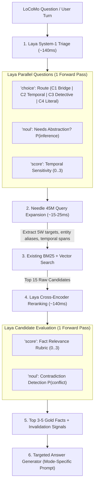

# LoCoMo System-1 Memory Coprocessor Specification

**Document Identifier**: `docs/memory_lab/locomo-system1-coprocessor-spec.md`
**Status**: Proposal / Architectural Initiative
**Target Benchmark**: LoCoMo Canonical Benchmark (`conv-47`, 150 QA pairs over 31 sessions)
**Authoring Context**: AIRI Memory Lab

---

## 1. Executive Summary

### 1.1 The Problem: The "Tiered Query Router Dragon"
Across 15 historical benchmark runs in the AIRI Memory Lab (documented in `docs/memory_lab/ChatGPT Ultimate Hybrid Design Doc.md` and `evaluation-and-benchmarking-methodology.md`), the memory architecture has swung between two destructive failure modes:

1. **The Literal Choke (Run 09)**: Strict lexical heuristics and narrow retrieval windows maximized single-hop precision (`C4`) and temporal stability (`C2`), but completely failed open-domain inductive reasoning (`C3`) because the router could not recognize when abstraction was required (e.g., subtle cues like *Stamford $\rightarrow$ Connecticut* or *fat fingers $\rightarrow$ obesity*).
2. **The Ungrounded Detective (Run 14 / 15)**: When heuristics were loosened to unlock `C3` reasoning, the router accidentally triggered "Detective Mode" on straightforward factual questions. The system hallucinated ungrounded abstractions, destabilized temporal ordering, and degraded precision F1.

Every attempt to resolve this via **heuristic regexes, keyword counters, or language cues** proved brittle. Conversely, delegating triage to cloud LLMs introduced unacceptable per-turn latency (+500–1000ms), recurring API costs, and breached offline privacy.

### 1.2 The Solution: The Needle + Laya System-1 Coprocessor
This initiative introduces a dual-model, local, zero-marginal-cost **System-1 Coprocessor** that wraps around AIRI’s existing retrieval spine without rewriting or gutting it:

- **Cactus Needle 2 (45M SAN SLM)**: Ultra-fast (~15–25ms, ~90MB RAM) generative small language model specializing in **5W entity extraction** (`who`, `what`, `where`, `when`, `why`), reference resolution, and synthetic search-key expansion.
- **Laya (ModernBERT + Decision Head ONNX)**: Fast (~140ms, ~2GB RAM) open-source System-1 decision model executing calibrated **multi-task classification, rubric scoring, and predicate probability estimation** in a single forward pass without generating text.

Together, they replace fragile regex triage with calibrated zero-shot routing, and upgrade bi-encoder candidate pools with cross-encoder rubric reranking—at **$0.00 cost and 100% offline execution**.

---

## 2. Goals & Objectives

1. **Benchmark on Canonical LoCoMo (`conv-47`)**:
   - Establish a standalone benchmark harness evaluating the 31-session, 150-QA gold standard dataset from `snap-research/locomo`.
   - Measure performance across all 4 canonical categories: `C1` (multi-hop), `C2` (temporal), `C3` (open-domain), and `C4` (single-hop literal).
2. **Eliminate Heuristic Triage**:
   - Replace regex-based query routers with Laya's single-pass `choice` classifier, achieving $>90\%$ routing accuracy against gold question intent.
3. **Slay the False-Positive Retrieval Dragon**:
   - Use Laya's `score` (0..3) rubric to cross-encode candidate facts, filtering out semantic false friends before prompt injection.
4. **Preserve Architectural Parity & Non-Destructive Integration**:
   - Maintain AIRI’s existing retrieval foundation (`packages/stage-ui/src/libs/search/` with `bge-small-en-v1.5` embeddings, BM25 token index, and 5W schemas) without breaking existing chat or staging workflows.
5. **Surpass Historical Benchmarks**:
   - Target beating the previous Memory Lab bests (Run 09: 30.9% F1, Run 11: 34.2%, Run 14B: 37.8%, Run 15: 36.5%) with a focus on balanced `C1`–`C4` performance.

---

## 3. System Architecture & Pipeline



### 3.1 Stage 1: Laya Zero-Shot Triage
Before any database query occurs, the incoming question is evaluated against Laya using a calibrated `choice` question:
```json
{
  "locomo_triage": {
    "type": "choice",
    "instructions": "Classify what depth and style of memory retrieval and reasoning this question requires.",
    "criteria": {
      "literal_c4": "Direct factual question about a specific entity, attribute, or single event without temporal sequence or multi-step deduction.",
      "temporal_c2": "Requires identifying when an event occurred, timeline sequence, elapsed time, relative dates, or duration.",
      "multihop_c1": "Requires connecting two or more distinct facts, people, or events across different conversations or sessions.",
      "detective_c3": "Requires open-domain inference, inductive abstraction, categorization, or drawing an unstated conclusion."
    }
  }
}
```

### 3.2 Stage 2: Needle 45M 5W Query Expansion
Needle extracts structured search anchors from the question:
- `who`: Target entities/personas
- `what`: Core action or predicate
- `where`: Geographic or environmental location
- `when`: Temporal phrases (e.g. "last summer", "after the trip")
- `why`: Causal focus (for `C1` / `C3`)

### 3.3 Stage 3: Existing Hybrid Retrieval Spine
AIRI's current retrieval engine runs:
- Vector search via `bge-small-en-v1.5` embeddings
- Lexical search via BM25 token frequency
- Top 15–20 candidates are pulled into memory.

### 3.4 Stage 4: Laya Cross-Encoder Reranking & Invalidation
The candidate facts are evaluated in batch by Laya:
1. **Relevance Rubric (`score`)**:
   `criteria: ["irrelevant", "topical mention only", "useful background", "direct answer"]`
2. **Contradiction / Invalidation (`noul`)**:
   `instructions: "Does this fact directly conflict with or get superseded by newer conversation state?"`

Facts scoring $< 1.5$ are pruned. Contradictions trigger invalidation flags.

### 3.5 Stage 5: Targeted Answer Generation
The filtered evidence is routed to the generator with a mode-specific prompt:
- **Literal (`C4`)**: Strict span extraction, no narrative elaboration.
- **Temporal (`C2`)**: Timeline-anchored date formatting.
- **Bridge (`C1`)**: Explicit multi-hop synthesis linking entity A $\rightarrow$ entity B.
- **Detective (`C3`)**: Controlled abstraction strictly grounded in the 5W evidence.

---

## 4. Core Invariants & Architectural Rules

1. **Zero Cloud Dependency for System-1**:
   - Triage and candidate reranking MUST run 100% locally via ONNX / WebGPU. No cloud LLM may be used for query routing or relevance grading.
2. **Non-Destructive Ingestion**:
   - The underlying memory schema and search worker (`packages/stage-ui/src/libs/search/`) must remain backward-compatible. We augment retrieval with coprocessors; we do not fork the data model.
3. **Strict Evidence Grounding (The Sacred Grounding Rule)**:
   - Detective mode is forbidden from asserting inferences that do not map back to a retrieved 5W field. No ungrounded abstractions.
4. **Temporal Protection (Preserve C2 Stability)**:
   - Temporal queries (`C2`) must bypass open-domain expansion to prevent date pollution and ordering hallucinations.
5. **Traceability & Audit Artifacts**:
   - Every benchmark turn must emit a structured JSON trace recording: triage classification, candidate scores, filtered evidence, generation prompt, and raw output.

---

## 5. Phased Implementation Plan

### Phase 1: Dataset Acquisition & Verification
- Pull canonical `conv-47.json` from `snap-research/locomo` into `reports/memory-lab/datasets/locomo-conv47.json`.
- Verify the 31 sessions, ~300 turns, and 150 QA pairs with ground-truth category tags (`c1`, `c2`, `c3`, `c4`).

### Phase 2: Standalone Benchmark Harness
- Create `scripts/tests/locomo-benchmark/locomo-runner.mjs`.
- Implement turn-by-turn session replay into an isolated memory instance.
- Implement standard evaluation metrics: Token F1, NemoriF1, BLEU-1, and Category Breakdown.

### Phase 3: Laya Triage Classifier Validation
- Test Laya's zero-shot classification on the 150 LoCoMo questions against gold categories.
- Measure triage accuracy, confidence spread, and routing speed.

### Phase 4: Needle 5W Query Expansion
- Integrate Needle 2 (45M) to parse 5W query anchors from questions before dispatching to BM25/Vector search.
- Evaluate candidate recall@20 before and after Needle expansion.

### Phase 5: Laya Cross-Encoder Reranker & Full Shootout
- Wire Laya's `score` rubric into the candidate ranking pipeline.
- Run the full 150-question shootout on `conv-47`.
- Compare directly against Memory Lab historical baselines (Runs 09, 11, 14B, 15).

---

## 6. Evaluation Metrics & Success Criteria

| Metric | Historical Baseline (Run 14B / 15) | Target with System-1 Coprocessor |
| :--- | :--- | :--- |
| **Overall Token F1** | ~37.8% | **$\ge 45.0\%$** |
| **C4 Single-Hop F1** | ~63.3% (Run 02) | **$\ge 65.0\%$** (Preserve Literal King) |
| **C2 Temporal F1** | ~25.0% | **$\ge 35.0\%$** (Protected temporal spine) |
| **C1 Multi-Hop F1** | ~34.0% | **$\ge 42.0\%$** (Needle 5W linking) |
| **C3 Open-Domain F1** | ~28.0% | **$\ge 38.0\%$** (Laya Detective gating) |
| **Triage Routing Accuracy** | ~68% (heuristic regexes) | **$\ge 90.0\%$** (Laya zero-shot choice) |
| **System-1 Latency** | N/A (regex: ~2ms / cloud: ~800ms) | **$\le 180$ ms** (local CPU/GPU) |
| **System-1 Cost** | \$0.00 (regex) / \$0.015 (cloud) | **\$0.00** (100% local ONNX) |
