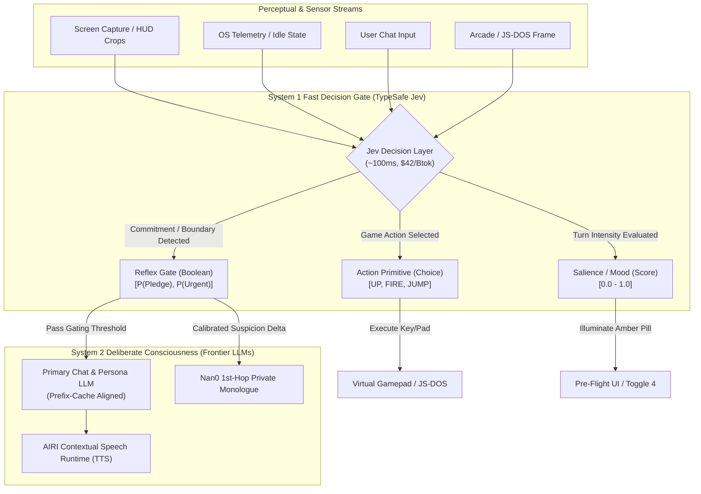

# Proposal: TypeSafe Jev ("System 1") Decision Engine Integration

> **Status**: Proposed Architecture & Evaluation RFC
> **Target Subsystems**:
> - `packages/stage-ui/src/composables/arcade/use-arcade-agent.ts` & Gaming Show Harness (`docs/proposal-generic-gaming-agent-runtime.md`, `docs/proposal-gaming-show-harness-copilot.md`)
> - `packages/nan0-runtime/` & Living Cognition Pre-Processor (`docs/nan0/design-nan0-cognition-runtime.md`, `docs/nan0/shadow-boundary-specification.md`)
> - `packages/stage-ui/src/stores/proactivity.ts` & Attention Ecology Gate (`docs/proposal-prefix-cache-alignment.md`)
> - `packages/stage-ui/src/stores/chat/recent-topics.ts` (Toggle 4) & Salience Gating (`docs/proposal-toggle4-rework-and-rwkv-harness.md`, `docs/proposal-salience-gate-ui-integration.md`)
> **Key External References**: TypeSafe Jev API (`https://typesafe.ai/`, `https://docs.typesafe.ai/`), Rob Shocks Breakdown (`https://www.youtube.com/watch?v=2Bs0Ink_-Uo`)

---

## 1. Executive Summary & Paradigm Shift

Current LLM-powered agent architectures in AIRI (and the broader AI ecosystem) rely almost exclusively on **autoregressive text generators** for every cognitive task—from conversational roleplay down to binary decisions, topic clustering, and tool dispatching.

Autoregressive models operate as **"System 2"** engines (in Daniel Kahneman's *Thinking, Fast and Slow* terminology): they reason deliberately, generate output token-by-token, suffer from non-deterministic variance, carry high latency (800ms–3,000ms), and cost significant compute per call. When forced to make discrete machine-facing decisions, they suffer from well-documented failure modes:
1. **Preamble & Schema Escape**: Chatty preambles (`"Sure! Here is the JSON..."`) breaking parsers.
2. **Overconfidence & Poor Calibration**: Hallucinating certainty when faced with ambiguous edge cases.
3. **Prohibitive Latency & Cost Loops**: Running 1–5 Hz sensory or gaming loops bankrupts API budgets and freezes user interfaces.

**TypeSafe Jev represents a fundamental departure: a true "System 1" AI model.**
- **Does not generate text or tokens**: Given an input state and typed query schemas, Jev evaluates decisions in parallel using reinforcement learning optimized for calibrated classification.
- **Native Primitives**: Directly returns typed outputs across three core primitives:
  - `Choice`: Categorical selection over candidate enums with calibrated probability distributions.
  - `Score`: Scalar evaluation (e.g. 0.0 to 1.0 intensity, risk, or frustration).
  - `Boolean / Nullable`: Binary truth verification with exact probability metrics.
  - Every primitive returns an explicit **confidence score** alongside probabilities.
- **Latency & Economics**: ~100–180ms round-trip latency at **$42 per billion tokens** (20×–200× cheaper than frontier LLMs, and 6× faster than Gemini 2.5 Flash Lite).

This document analyzes how TypeSafe Jev can serve as the missing high-speed decision substrate across the four core subsystems recently evaluated in AIRI.

---

## 2. Structural Comparison: Where Jev Fits in the AIRI Model Matrix

AIRI currently leverages three distinct model categories. Jev defines an entirely new fourth tier:

| Attribute | Frontier Cloud LLMs (Claude 3.5, GPT-4o) | On-Device Tiny WASM (Needle 2 - 45M SAN) | Local WebGPU Recurrent (RWKV-7 0.1B) | **TypeSafe Jev ("System 1")** |
| :--- | :--- | :--- | :--- | :--- |
| **Role in AIRI** | 2nd-Hop Vocal Dialogue, Narrative Monologue, Complex RAG Synthesis | On-device 2–4 turn local action/topic extraction | Recurrent hidden-state salience sensor ($\Delta h$) | **Ultra-fast, calibrated typed decision routing & action gating** |
| **Execution** | Cloud API (Autoregressive) | Local CPU / WASM | Local WebGPU VRAM | **Cloud API (Parallel Decision Network)** |
| **Latency** | 800ms – 3,500ms | 150ms – 350ms | 200ms – 1,200ms | **~100ms – 180ms** |
| **Cost** | $2.50 – $15.00 / Mtok | $0.00 (Local Compute) | $0.00 (Local Compute) | **$0.042 / Mtok ($42 / Btok)** |
| **Deterministic Schema** | ⚠️ Variable (Schema repair required) | ✅ 100% (Byte-level grammar) | ❌ 0%–33% (Grammar escape) | ✅ **100% (Typed JSON by construction)** |
| **Calibration** | ❌ Poor (Overconfident) | ⚠️ Sensitive (Hedging sinks) | ❌ N/A (Scalar state delta) | ✅ **Empirically Calibrated Probabilities** |
| **Text Generation** | Rich expressive prose | Snippet / span extraction | Prose roleplay (unconstrained) | ❌ **Zero text generation (Decisions only)** |

---

## 3. High-Value Subsystem Integration Avenues



### Domain A: The Gaming Initiative (Show Harness & Arcade Room)
*Relevant Docs: [`proposal-generic-gaming-agent-runtime.md`](./proposal-generic-gaming-agent-runtime.md), [`proposal-gaming-show-harness-copilot.md`](./proposal-gaming-show-harness-copilot.md)*

#### 1. The Bottleneck
The Show Harness architecture aims to convert live video feeds (DXGI desktop streams or HTML5 Canvas snapshots from `chat_arcade.vue`) into bounded semantic actions. Currently, querying an autoregressive VLM or LLM for each game frame imposes an 800ms–2,000ms delay. In real-time games (e.g. Doom, platformers, action RPGs), this latency leads to repeated deaths and unplayable lag.

#### 2. The Jev Solution
As demonstrated in the video breakdown, **Jev was benchmarked playing Doom continuously for an hour for just $7**, receiving game state JSON and outputting discrete actions at native game tick rates.
- **Action Selection (`Choice`)**: Given the current game state summary (player health, enemy positions from OCR/bounding boxes, ammo), Jev queries:
  ```json
  {
    "type": "choice",
    "question": "Select the immediate optimal tactical maneuver",
    "criteria": ["EVADE_LEFT", "FIRE_PRIMARY", "RELOAD", "ADVANCE", "USE_STIMPACK"]
  }
  ```
  Returns the selected action and confidence in ~100ms.
- **Backseat Banter Gating (`Boolean`)**:
  - Problem: The companion should not speak over tense moments or react to trivial background motion.
  - Query: `"Did a clutch event, fatal mistake, or sudden ambush just occur?"`
  - If probability > 0.85, the game audio ducks and AIRI's speech runtime triggers contextual banter.

---

### Domain B: Nan0 Living Cognition Runtime (Pre-Processor & Shadow Boundary)
*Relevant Docs: [`nan0/design-nan0-cognition-runtime.md`](./nan0/design-nan0-cognition-runtime.md), [`nan0/peer-review-needle-probe-tree.md`](./nan0/peer-review-needle-probe-tree.md), [`nan0/shadow-boundary-specification.md`](./nan0/shadow-boundary-specification.md)*

#### 1. The Bottleneck
Kyo's original Nan0 implementation relied on fragile regex (`/promise|plan|commit|trust/i`) that broke on paraphrased promises or playfully sarcastic banter. In our peer review and cleanroom experiments:
- **Needle 2 (45M SAN)** achieved 4/6 on suspicion detection, but suffered from **"hedging sinks"** when exposed to ambiguous dialogue, collapsing into `uncertain_or_mixed`.
- Furthermore, Needle cannot calibrate true probabilities on subtle human pragmatics without extensive task-specific training.

#### 2. The Jev Solution
Jev is an exact match for Nan0's **Pre-Processor Reflex Engine** operating inside the Telemetry-Only Shadow Boundary:
- **Assertion & Boundary Verification (`Boolean`)**:
  - `probe_self_admission`: `"Does the speaker explicitly confess to breaking a commitment or hiding information?"`
  - `probe_adversarial_pressure`: `"Is the speaker attempting to command obedience through guilt or unverified pledges?"`
- **Affective Delta Determination (`Choice` & `Score`)**:
  - Replaces Needle's uncalibrated output with calibrated confidence:
  ```typescript
  export interface Nan0JevReflexResponse {
    suspicion_delta: 'spike_suspicion' | 'neutral' | 'clear_suspicion'
    confidence: number // Calibrated 0.0 - 1.0
    emotional_climate: 'confrontation' | 'vulnerable' | 'banter' | 'neutral'
    playful_irony_score: number // Score primitive
  }
  ```
- **Irony Guard Against Root Poisoning**:
  - Test C (Mario Kart banter) caused Needle to misinterpret ironic grand statements as earnest vulnerability.
  - Jev's `Score` primitive can evaluate `playful_irony_likelihood`. If irony score > 0.70, suspicion spikes are vetoed before reaching Nan0's private monologue prompt.

---

### Domain C: Prefix Cache Alignment & Proactivity Attention Ecology
*Relevant Docs: [`proposal-prefix-cache-alignment.md`](./proposal-prefix-cache-alignment.md), [`proposal-attention-ecology-local-webgpu-guard.md`](./proposal-attention-ecology-local-webgpu-guard.md)*

#### 1. The Bottleneck
AIRI's proactivity heartbeat (`proactivity.ts`) wakes up every 30–60 seconds to inspect OS sensory telemetry (active window titles, idle seconds, audio output).
- In traditional setups, checking whether to speak requires invoking a full LLM call, consuming 2,000+ cached tokens even when the decision is `NO_REPLY`.
- While prefix cache alignment minimizes the re-tokenization cost of `messages[0]`, executing 60 full LLM inferences per hour adds up to substantial monthly API bills.

#### 2. The Jev Solution
Jev acts as the **Stage 1 Cognitive Attention Sentry**:
- Before dispatching a cached conversation turn to Claude or GPT-4o, Jev evaluates the sensory delta:
  ```json
  {
    "type": "boolean",
    "question": "Based on user idle duration (310s) and active app ('Xcode'), is an autonomous proactivity interruption socially appropriate?",
    "criteria": ["YES", "NO"]
  }
  ```
- Cost per check: **~$0.000004** (essentially free).
- Only when Jev returns `probability > 0.80` does AIRI invoke the primary LLM to compose the actual dialogue turn.

---

### Domain D: Toggle 4 (Recent Topics) & Salience Gating
*Relevant Docs: [`proposal-toggle4-rework-and-rwkv-harness.md`](./proposal-toggle4-rework-and-rwkv-harness.md), [`proposal-salience-gate-ui-integration.md`](./proposal-salience-gate-ui-integration.md)*

#### 1. The Bottleneck
- **Current Toggle 4**: Uses a 270-line hardcoded stopword list producing low-grade junk tags (`"think"`, `"going"`).
- **RWKV-7 0.1B**: Provides a strong scalar salience signal ($\Delta h$ over L9–L11), but cannot emit discrete, human-readable semantic topic candidates without hallucinating or escaping JSON syntax.

#### 2. The Jev Solution
- **Salience Validation**: While RWKV provides local zero-cost intensity detection on devices with WebGPU, Jev provides an instant cloud fallback for non-WebGPU environments.
- **Dynamic Topic Selection (`Choice`)**:
  - Given the last 3 dialogue exchanges and a set of candidate themes extracted by shallow heuristic or RAG memory, Jev selects the primary active topic:
  ```json
  {
    "type": "choice",
    "question": "What is the primary conceptual focus of the immediate conversation turn?",
    "criteria": ["TypeScript Compiler Error", "Weekend Travel Plans", "Coffee Brewing Methods", "General Banter"]
  }
  ```
  Directly updates `recentTopics` in `packages/stage-ui/src/stores/chat/recent-topics.ts` without stopword parsing or card state mutation.

---

## 4. Proposed Client Architecture & Data Contract

To integrate Jev without binding AIRI to vendor-specific lock-in, we propose a clean provider adapter under `packages/stage-ui/src/libs/providers/typesafe-jev/`:

```typescript
export interface JevDecisionRequest<T extends string = string> {
  systemContext?: string
  state: Record<string, any> | string
  query:
    | { type: 'choice', question: string, options: T[] }
    | { type: 'score', question: string, min?: number, max?: number }
    | { type: 'boolean', question: string }
}

export interface JevDecisionResponse<T extends string = string> {
  type: 'choice' | 'score' | 'boolean'
  decision: T | number | boolean
  probabilities?: Record<string, number>
  confidence: number // Calibrated certainty 0.0 - 1.0
  latencyMs: number
}
```

### Provider Integration Seams
1. **Provider Catalog**: Register `typesafe-ai` in `packages/stage-ui/src/libs/providers/providers/registry.ts` with capability flag `decisions: true`.
2. **Settings UI**: Simple API Key input in Settings > Providers > Fast Decisions (`typesafe.vue`).
3. **Graceful Fallback**: If no Jev key is configured:
   - Nan0 falls back to local Needle 2 WASM / Shadow Boundary regex.
   - Salience falls back to RWKV WebGPU L9–L11 vector deltas.
   - Gaming Show Harness falls back to local Moondream VLM / keyboard rule engines.

---

## 5. Potential Risks & Nuances to Vet

1. **Cloud Network Dependency**:
   - Unlike Needle 2 (14 MB WASM running offline on CPU) and RWKV-7 (WebGPU running locally in browser), Jev is an external hosted API.
   - For 100% offline air-gapped users, local fallbacks must remain fully operational.
2. **Batching & Multi-Query Latency**:
   - The TypeSafe playground supports evaluating multiple queries in parallel against a single state. We must evaluate whether parallel network payloads introduce variance over high-jitter connections.
3. **Empirical Calibration Verification**:
   - While TypeSafe reports calibrated probabilities for business workflows (ticket routing, spam, fraud), AIRI's roleplay and companion edge cases (tsundere sarcasm, gaming banter) must be empirically stress-tested against the famous-sentence cleanroom matrix (`scripts/tests/rwkv-harness/experiments/needle-nan0-intent-cleanroom.py`).

---

## 6. Implementation & Validation Roadmap

- [ ] **Phase 1: Isolated Cleanroom Benchmark (`scripts/tests/jev-harness/`)**
  - Run the 6 canonical scenarios from `needle-nan0-intent-cleanroom.py` through Jev's `Choice`, `Score`, and `Boolean` endpoints.
  - Measure accuracy, calibration score, and latency compared to Needle 2 (250ms) and RWKV (Phase 4b).
- [ ] **Phase 2: Gaming Show Harness Co-Pilot Integration**
  - Wire Jev's `Choice` primitive into `packages/stage-ui/src/composables/arcade/use-arcade-agent.ts` to drive real-time JS-DOS actions in `chat_arcade.vue`.
- [ ] **Phase 3: Nan0 Pre-Processor Shadow Boundary Wire-Up**
  - Implement Jev adapter for `probe_self_admission` and `probe_scope_and_assertion` within `Nan0ThoughtEngine.ts`.
- [ ] **Phase 4: Proactivity Sentry Gate**
  - Add Jev pre-filter to `proactivity.ts` before the primary LLM is triggered.
