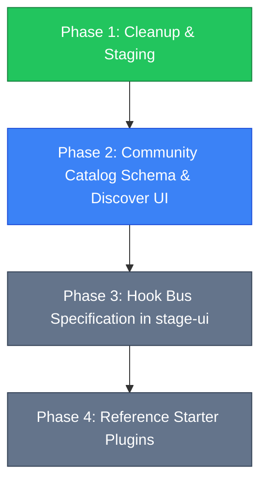

# Proposal: AIRI Next-Generation Plugin Architecture & Community Registry

> **Status**: Proposed / RFC
> **Author**: Richard Pinedo (@dasilva333 / azimuthal)
> **Date**: 2026-10-05
> **Target Audience**: Core Developers, Integration Authors, Modders, Community Contributors
> **Related Documents**: [`docs/design-plugin-architecture.md`](./design-plugin-architecture.md), [`docs/arch-mcp-integration.md`](./arch-mcp-integration.md), [`docs/proposal-twitch-plugin.md`](./proposal-twitch-plugin.md), [`docs/proposal-tools-tab.md`](./proposal-tools-tab.md)

---

## 1. Executive Summary & Context

As Project AIRI has grown across desktop (Electron `apps/stage-tamagotchi`), web (`apps/stage-web`), and mobile (`apps/stage-pocket`), external extensibility has evolved down two distinct historical tracks:
1. **The In-Process / Drop-In Concept**: Early upstream experiments and PR #2541 (`Telltworose/feat/drop in plugins`) explored dropping arbitrary JavaScript/TypeScript folders into the Electron application directory. This approach stalled due to severe security vulnerabilities (unrestricted Node.js execution in the main process), merge conflicts, and platform incompatibility with web/mobile environments.
2. **The Out-of-Process / Protocol-Driven Reality**: Our fork spearheaded the adoption of **Model Context Protocol (MCP)** for secure, isolated LLM tool calling via `stdio` subprocesses with card-level ACLs, and established the **WebSocket Channel Gateway** (`@proj-airi/server-sdk` on port `6121`) for external companion processes (such as the VS Code bridge, Claude Code CLI hook, and browser extensions).

Following the cleanup of legacy dormant stubs (`airi-plugin-bilibili-laplace`, `airi-plugin-homeassistant`) and the relocation of external bridges (moving `airi-plugin-claude-code` to `integrations/claude-code/`), this proposal defines the blueprint for **AIRI's Next-Generation Plugin Platform**:
* **Standardized Common Lifecycle Hooks**: A unified hook bus covering prompt assembly, tool execution, sensory events, audio pacing, and visual avatar reactions.
* **Functional Starter Plugin Blueprints**: Ready-to-build, lightweight plugins that deliver immediate utility (Pomodoro Proctor, Media Announcer, Obsidian Journaler, System Vitals).
* **Unified Add-ons & Plugins UI**: A dedicated Settings hub integrating runtime monitoring, permission management, and community discovery.
* **PR-Based Decentralized Community Registry**: An open, zero-infrastructure community registry modeled after Obsidian and Home Assistant, driven by GitHub Pull Requests to an open catalog JSON schema.

---

## 2. Multi-Tier Runtime Architecture

To avoid past design conflations, AIRI plugins are categorized into three explicit runtime tiers:

```
┌────────────────────────────────────────────────────────────────────────────────────────┐
│                                  PROJECT AIRI CLIENT                                   │
│                                                                                        │
│  ┌───────────────────────────────┐                  ┌───────────────────────────────┐  │
│  │   Tier 1: MCP Tool Servers    │                  │  Tier 3: In-Process Hooks     │  │
│  │   (Stdio Child Processes)     │                  │  (Renderer / Eventa Pipeline) │  │
│  │   • Filesystem access         │                  │  • Prompt before-assemble     │  │
│  │   • Open Websearch            │                  │  • Speech pacing / fillers    │  │
│  │   • Git & CLI execution       │                  │  • Avatar motion & emotes     │  │
│  └───────────────▲───────────────┘                  └───────────────▲───────────────┘  │
│                  │ JSON-RPC (stdio)                                 │ Typed Eventa     │
│  ════════════════╪══════════════════════════════════════════════════╪════════════════  │
│                  │                                                  │                  │
│  ┌───────────────┴──────────────────────────────────────────────────┴───────────────┐  │
│  │               Tier 2: External Gateway Companions (WebSocket 6121)                 │  │
│  │               • Twitch / YouTube Live Chat Ingest   • Home Assistant Sensors     │  │
│  │               • Claude Code / IDE Hook Bridges      • Spotify / Media Trackers   │  │
│  │               • Destiny 2 Game Telemetry            • Mobile / Web Companions    │  │
│  └──────────────────────────────────────────────────────────────────────────────────┘  │
└────────────────────────────────────────────────────────────────────────────────────────┘
```

| Tier | Runtime Model | Communication | Security Boundary | Best For |
| :--- | :--- | :--- | :--- | :--- |
| **Tier 1: MCP Tool Plugins** | Standalone stdio processes (`npx -y`, Python venv, binary) | JSON-RPC over `stdio` via Electron Main | Isolated process; Card-level tool ACLs (`allowedTools`) | Web search, file editing, API queries, database lookups |
| **Tier 2: Gateway Companions** | Standalone background daemons, CLI hooks, or browser extensions | WebSocket (`ws://localhost:6121/ws`) with `authToken` | Network-gated token handshake; event namespace routing | Live stream chat, smart home automation, IDE integration, game telemetry |
| **Tier 3: Client Lifecycle Hooks** | Composable hooks executed within the UI / Pinia stores | Typed IPC (`@moeru/eventa`) & reactive stores | Declarative capability permissions granted by user | UI custom controls, speech synthesis filters, avatar emote reactions |

---

## 3. Core Common Hooks Specification

A successful plugin platform requires clear, well-scoped interception points. AIRI's unified hook bus exposes the following core lifecycle hooks:

### 3.1 Cognitive & Prompt Assembly Hooks
Executed during LLM prompt compilation before sending requests to the inference provider:
* **`hook:prompt:before_assemble`**: Invoked before building the system message. Allows plugins to contribute dynamic persona directives, roleplay scenarios, or state flags.
* **`hook:prompt:inject_context`**: Feeds ambient information into structured context lanes (e.g. `system:environment`, `game:telemetry`, `work:active_file`).
* **`hook:prompt:after_assemble`**: Final inspection hook for prompt sanitization, token budgeting, and prefix-cache alignment.

### 3.2 Tool & Action Execution Hooks
Monitors and regulates tool calling across built-in tools and MCP servers:
* **`hook:tool:before_call`**: Intercepts tool calls before execution. Can validate arguments, prompt the user for confirmation (e.g., destructive disk writes), or rewrite parameters.
* **`hook:tool:after_result`**: Post-processes tool results before they are returned to the model context. Enables automated data compaction or markdown formatting.
* **`hook:tool:on_error`**: Handles tool execution failures, providing recovery suggestions or graceful fallbacks.

### 3.3 Sensory & Proactivity Hooks
Connects environmental perception with character consciousness:
* **`hook:sensory:on_idle`**: Triggered when the user has been inactive for a configured duration, enabling proactivity gates and proactive greeting checks.
* **`hook:sensory:on_context_update`**: Notifies subscribers when an external plugin updates a context lane via `context:update`.
* **`hook:sensory:spark`**: Processes high-priority episodic alerts (`spark:notify`) such as game deaths, timer completions, or incoming chat subscriptions.

### 3.4 Speech & Audio Pipeline Hooks
Hooks directly into the TTS, STT, and playback subsystems:
* **`hook:speech:before_synthesize`**: Intercepts speech text before TTS submission. Allows dynamic pronunciation dictionaries, phonetic transformations, or pacing filler insertion.
* **`hook:speech:on_playback_start`**: Fired when audio starts streaming out of speakers. Can trigger companion lights, synchronized subtitles, or audio visualizers.
* **`hook:speech:interrupt`**: Triggered when user barge-in or high-priority alerts abort active speech playback.

### 3.5 Visual & Avatar Staging Hooks
Hooks into Three.js, VRM, Live2D, and Stage-Mate Unity rendering:
* **`hook:stage:actor_swapped`**: Dispatched when mid-conversation `<|ACTOR|>` tokens or user controls switch the active stage character.
* **`hook:stage:expression_override`**: Permits external triggers (e.g., game health critical) to enforce a persistent facial expression or posture.
* **`hook:stage:outfit_change`**: Dispatched when an outfit or wardrobe preset is toggled.

---

## 4. Starter Plugin Blueprints

To seed the ecosystem and validate the hook bus, the following four functional companion plugins serve as initial reference implementations:

### Blueprint 1: `airi-plugin-pomodoro-proctor`
* **Type**: Tier 2 (Gateway Companion)
* **Goal**: Paced work/study timer that encourages the user, tracks focus intervals, and rewards break time.
* **Mechanics**:
  - Runs a lightweight timer state machine (`focus` ➔ `short_break` ➔ `long_break`).
  - Emits `context:update` with current session count and remaining minutes so the AI knows the user is in deep work.
  - On cycle transition, emits `spark:notify` (`urgency: "soon"`) with a prompt like *"25 minutes of focus completed. Tell the user to stretch and drink water!"*.
  - Emits `hook:stage:expression_override` to switch the avatar to an encouraging wave or cheer motion.

### Blueprint 2: `airi-plugin-media-announcer`
* **Type**: Tier 2 (Gateway Companion) / Native OS Sensor
* **Goal**: Awareness of currently playing music or video playback (Spotify, Apple Music, YouTube).
* **Mechanics**:
  - Polls OS media session APIs (e.g., `nowplaying-cli` on macOS, Windows Media Manager).
  - Pushes track title, artist, playback state, and genre into lane `media:current_track`.
  - Enables the character to passively comment on musical taste, hum along, or lower voice volume when music is playing.

### Blueprint 3: `airi-plugin-system-vitals`
* **Type**: Tier 1 (MCP Tool) + Tier 2 (Sensory Telemetry)
* **Goal**: Real-time awareness of host hardware status (battery, thermal state, RAM pressure).
* **Mechanics**:
  - Exposes an MCP tool `get_system_vitals` for manual checks.
  - When battery drops below 15% on laptops, issues a `spark:notify` alert: *"Battery is at 12%. Remind the user to plug in the charger before the stage shuts down."*.

### Blueprint 4: `airi-plugin-obsidian-journaler`
* **Type**: Tier 1 (MCP Tool)
* **Goal**: Automatic logging of daily memories, conversations, and reflections into the user's local Obsidian vault.
* **Mechanics**:
  - Connects to Obsidian Local REST API or direct filesystem markdown vault.
  - Subscribes to STMM (Short-Term Memory) consolidation and Sacred Journal entries.
  - Appends formatted markdown callouts to the active daily note with character avatar tags.

---

## 5. Unified Settings UI Design: "Add-ons & Plugins"

Rather than burying extensions under disparate menus, Settings will feature a top-level **"Add-ons & Plugins"** module alongside **"AI Providers"** and **"Modules"**:

```
┌────────────────────────────────────────────────────────────────────────────────────────┐
│  Settings > Add-ons & Plugins                                                          │
├────────────────────────────────────────────────────────────────────────────────────────┤
│  [ Installed (4) ]     [ Discover (Community Catalog) ]     [ Developer Tools ]        │
├────────────────────────────────────────────────────────────────────────────────────────┤
│                                                                                        │
│  🔍 Search installed plugins...                             [ + Add Custom / Local ]   │
│                                                                                        │
│  ┌──────────────────────────────────────────────────────────────────────────────────┐  │
│  │ 🟢 Open Web Search                              v1.4.2 • MCP Tool Server         │  │
│  │ Multi-engine web search and markdown page extraction via DuckDuckGo & Brave.     │  │
│  │ Status: Running (PID 7291)  •  Permissions: [Network] [Search]                   │  │
│  │ [ Configure ]  [ View Tools (2) ]  [ Restart ]                          ( Toggle )│  │
│  └──────────────────────────────────────────────────────────────────────────────────┘  │
│  ┌──────────────────────────────────────────────────────────────────────────────────┐  │
│  │ 🟢 Pomodoro Proctor                             v0.2.0 • Gateway Companion       │  │
│  │ Focus timer companion with automated stretch breaks and stage cheer animations.  │  │
│  │ Status: Connected (ws://localhost:6121) • Permissions: [Sparks] [Stage Emotes]  │  │
│  │ [ Session Settings ]  [ View Logs ]                                     ( Toggle )│  │
│  └──────────────────────────────────────────────────────────────────────────────────┘  │
│  ┌──────────────────────────────────────────────────────────────────────────────────┐  │
│  │ ⚪ Claude Code Terminal Hook                    v0.9.0 • CLI Integration         │  │
│  │ Intercepts UserPromptSubmit terminal hooks and mirrors active coding prompt.     │  │
│  │ Status: Idle (Listening on hook stdin)                                           │  │
│  │ [ Setup Instructions ]  [ Copy Hook Script ]                            ( Toggle )│  │
│  └──────────────────────────────────────────────────────────────────────────────────┘  │
└────────────────────────────────────────────────────────────────────────────────────────┘
```

### Key UI Capabilities:
1. **Unified Status Badges**: Clean visual indicator of connection state (Running, Connected, Idle, Error, Disabled).
2. **Permission Transparency**: Prominently displays the capabilities requested by the plugin (`[Network]`, `[Filesystem]`, `[Speech]`, `[Stage]`, `[Prompt]`).
3. **Card-Level Scope Mapping**: Directly linkable to Character Card editors so users can restrict plugins to specific characters.
4. **Zero-Restart Toggles**: Toggle plugins on or off without killing or restarting the desktop application.

---

## 6. PR-Based Community Registry System

To keep AIRI 100% local-first and independent of costly proprietary registry servers, the Community Registry adopts a **Decentralized Git-Driven Model** (inspired by Home Assistant Community Store / Obsidian / Raycast):

### 6.1 The Manifest Catalog (`catalog/community-plugins.json`)
The source of truth is a version-controlled JSON catalog located in the project repository:

```json
{
  "$schema": "https://airi.moeru.ai/schemas/community-plugins-v1.json",
  "version": 1,
  "updatedAt": "2026-10-05T22:00:00Z",
  "plugins": [
    {
      "id": "airi-plugin-pomodoro",
      "name": "Pomodoro Proctor",
      "summary": "Productivity companion with break reminders and cheer animations.",
      "description": "Full markdown description explaining features and requirements...",
      "author": {
        "name": "Airi Community",
        "github": "moeru-ai",
        "url": "https://github.com/moeru-ai"
      },
      "category": "productivity",
      "type": "gateway-companion",
      "homepage": "https://github.com/moeru-ai/airi-plugin-pomodoro",
      "npmPackage": "@airi-community/pomodoro",
      "compatibility": ">=0.9.0",
      "permissions": [
        "spark:notify",
        "context:update",
        "stage:motion"
      ],
      "install": {
        "method": "npx",
        "command": "npx -y @airi-community/pomodoro"
      }
    }
  ]
}
```

### 6.2 Community Submission Workflow
1. **Developer Authors Plugin**: The author creates an open-source repository implementing either an MCP server, a Gateway Companion (`@proj-airi/server-sdk`), or a lifecycle hook.
2. **Submit PR**: The author submits a Pull Request adding their plugin descriptor to `catalog/community-plugins.json`.
3. **Automated CI Verification**:
   - Validates JSON against the Valibot schema.
   - Verifies the package exists on npm / GitHub Releases.
   - Scans permissions for high-risk scopes (e.g., raw shell execution requires explicit security review).
4. **Merge & Instant Availability**: Once merged, the catalog is immediately distributed via GitHub Raw CDN (`raw.githubusercontent.com/...`).

### 6.3 Client-Side Fetching & Offline Caching
* The AIRI client fetches the remote JSON catalog when the user opens the "Discover" tab.
* The response is cached in IndexedDB (`local:community-plugins-cache`) with a 24-hour TTL.
* If the user is offline or GitHub is unreachable, the client displays the cached catalog or falls back to the bundled snapshot included in the build.
* Users can add private custom catalogs or local development manifests via the UI at any time.

---

## 7. Security & Sandboxing Principles

Security is paramount when loading external code:
1. **No In-Process Raw Code Injection**: AIRI will **never** execute unvetted third-party JavaScript directly in the Electron main process. All execution is isolated into child processes or network sockets.
2. **Explicit Opt-In Tool ACLs**: Character cards control which tools are exposed to LLM context via `extensions.airi.generation.known.allowedTools`. Plugins cannot secretly expose tools without character card permission.
3. **Token-Gated Network Sockets**: The WebSocket Channel Server enforces authentication using a randomly generated local `authToken` stored in `<userData>/server-channel-config.json`.
4. **Scope-Limited IPC Contracts**: Tier 3 hooks communicate exclusively over typed Eventa contracts with strict parameter validation using Valibot.

---

## 8. Phased Implementation Roadmap



* **Phase 1: Cleanup & Staging (Completed)**:
  - Removed dormant stubs (`airi-plugin-bilibili-laplace`, `airi-plugin-homeassistant`).
  - Relocated developer tools (`integrations/claude-code/airi-plugin-claude-code`).
  - Validated clean monorepo build and pnpm workspace resolution.
* **Phase 2: Community Catalog & Discover UI**:
  - Implement `catalog/community-plugins.json` and client-side fetcher composable `useCommunityPlugins()`.
  - Wire unified "Add-ons & Plugins" page in `apps/stage-tamagotchi`.
* **Phase 3: Unified Hook Bus Implementation**:
  - Expose hook dispatchers across `useLLM`, `useSpeechPipeline`, and `stage-ui` stores.
* **Phase 4: Reference Starter Plugins**:
  - Release `airi-plugin-pomodoro-proctor` and `airi-plugin-system-vitals` as community-ready reference templates.
